# Games 202 笔记（总）


关于这份笔记的几点说明：

- （1）笔记中出现的内容基本都是Games202的课程上提及的内容，没有提到的以及对于已整理算法的额外补充也会在本文档中和其他文档中进行介绍，额外补充的材料会给出链接；
- （2）一些todo：
  - 某些算法了解的还不够深入，需要看下论文或者看下算法的代码；
  - 很多知识点还没有涉及，比如实时的毛发渲染，Volume渲染和次表面散射渲染等；


Special Thanks：感谢老婆能够在整理这份笔记期间和我探讨Games202的相关内容。我们有新的收获也会补充进来。

# Lecture 2 Recap of CG Basics

## 1.The Rendering Equation


在实时渲染当中，往往要显式考虑可见性项V，并且BRDF项一般和cos项放在一起考虑，如下：


## 2.补充一下Lobe的概念

Lobe就是在固定一边方向下的BRDF的函数图像，由于BRDF是一个4维的函数（**应该是指一个方向w可以用θ和φ两个维度来表示**），在固定一边之后就变为了2维的函数。

大多数高光BRDF，都是在半角向量接近宏观表面法线时反射亮度最大，不够接近时其值都会减小，使得其函数图像像叶片，故称为lobe。


如图在光源方向L固定的情况下，移动反射方向R，当**L和R的半角向量=向量N**时反射亮度最强，就是图中所示情况。如果继续向上或向下旋转R，反射亮度都会减弱。最终就形成了那条绿色的极坐标曲线，也就是Lobe。


# Lecture 3 Real-Time Shadows 1

本节课的内容主要分为三部分：

1.Shadow mapping的回顾

2.Shadow mapping的数学基础

3.PCSS和PCF

## 1.Shadow Mapping

https://zhuanlan.zhihu.com/p/363355909

要渲染一个点光源在场景中投射出的阴影,我们要用shadow mapping技术,在101中我们介绍过shadow mapping,它是一个2-pass的算法,也就是我们会对场景渲染两次：

- 1-pass：我们从Light处看向场景并输出一个从light处看向场景所生成的深度图,也就是所谓的shadow map.
- 2-pass：我们从camera处看向场景渲染一遍,并参考1-pass生成的shadow map去判断物体是否在阴影中.

shadow mapping是一个完全在图像空间中的算法,

- **其优点:**
  - 一旦shadow Map已经生成,就可以利用shadow map来获取场景中的几何表示而不是场景中的几何.（todo：这句有点没看懂，能看懂shadow map的原理即可）

- **其缺点:**
  - 会产生自遮挡和走样现象.

> 在经过投影之后得到的Z其实不是实际上几何上的点到Light的距离,因此再真正生成阴影时比较两个pass中的depth时需要一致,也就是要么都用**投影后的Z值**比较,要么通过**两点的位置得一向量算实际距离**.（**在作业实现中是使用正交投影之后的Z值进行比较。**）


### （1）解决Self Occlusion的问题

直接用上面的Shadow mapping算法会带来问题：


学过101的看见地板上的东西会感觉像摩尔纹,但并不是,它是由数值精度造成的一种现象.

**右边那张图说明了Self Occlusion的形成原因：**

- 我们生成了一个Shadow map,那么这个Shadow map肯定有自己的分辨率,其每个像素要记录它所看见的最浅深度,可以理解为,每个像素内部他的深度是一个**常数**
- 那么从Light处看向场景时,沿某一像素看过去我们看到的位置就认为是像素所代表的深度,也就是认为这个场景在像素覆盖区域内都是一个常数的深度.
- 在Shadow map看来,场景被离散化为一系列红色小片形成的场景而不是直接的平面.
  - 因为每个红色小片所代表的深度不一样,因此在2-pass,也就是从camera处看向场景时,后面的红色小片在连接light时,会被误认为被前面的红色小片遮挡住,从而产生了错误的阴影,这个现象在light与平面趋于平行时候最严重.

有了问题自然要去解决问题:


加入一个bias项，会解决Shadow Acne的问题，但是又带来了Detached shadow的问题，因此加入bias的大小十分重要。


### （2）工业界方法：自适应Shadow Bias算法

[自适应Shadow Bias算法 - 知乎 (zhihu.com)](https://zhuanlan.zhihu.com/p/370951892)


上面的R指的是采样半径（这个主要是针对PCF的），C是一个自定义的值，可以进一步控制bias的大小，可以写出这样的代码：

```glsl
#define SHADOW_MAP_SIZE 2048.
#define FRUSTUM_SIZE  400.
float getShadowBias(float c, float filterRadiusUV){
  vec3 normal = normalize(vNormal);
  vec3 lightDir = normalize(uLightPos - vFragPos);
  float fragSize = (1.0 + ceil(filterRadiusUV)) * (FRUSTUM_SIZE / (SHADOWMAP_SIZE * 2.0));  //A
  return max(fragSize, fragSize * c * (1.0-dot(normal, lightDir))); 
}
```

在硬阴影的Shadow map当中，filterRadiusUV直接是0即可。

解决Shadow Acne问题的相关对比图：


### （3）**Second-depth shadow mapping**（不太用）

针对以上的问题，有学术界提出了以下方法（但工业界应该基本不用：）


此时我们就舍弃bias的概念,而是在渲染时不仅存最小的深度,我们还要存第二小的深度,然后我们用最小深度和第二小深度中间的深度来作比较.

- 个人理解为,可以在渲染时生成两张深度图,一张存储的是最浅,一张存储的是第二浅,之后将两张图平均从而得到最后的深度图,然后用这张平均得来的深度图和物体算遮挡关系


假设图中是人物的鞋,鞋底是接着一个平面的,我们以右边最极端的部分为例,当一根光线从右边鞋头部分打向鞋底,就算它底部紧贴着平面,我们能得到一个明显的遮挡关系.

然后实际中并没有人去使用这个技术,因为场景内的物体必须都是watertight（非面片，plane这种是不行的），还有就是算的复杂，开销太大，实时渲染不相信复杂度。


### （4）走样

Shadow mapping的第二个问题就是走样。

shadow map本身就存在分辨率，当分辨率不够大自然会看到锯齿,因为shadow map上每一个像素都可以看为小片区域,那么投出来的阴影自然会存在锯齿.


## 2.Shadow map背后的数学原理

在微积分中有很多有用的不等式,如图中的两个不等式为例:


但是在实时渲染中,我们只关心**近似约等**,我们不考虑不等的情况,因此我们将这些不等式当约等式来使用。

在RTR中，有如下近似的等式：


> 如果你有两个函数的乘积,你又想把他们的乘积积分起来,你可以将其拆出来,也就是:
>
> **两个函数乘积的积分 ≈ 两个函数积分的乘积**
>
> 首先我们来解释一下为什么右边第一个函数多了个分母，这一项的作用是为了保证左右能量相同而做的归一化操作。
>
> - 来用一个例子来解释这个归一化操作。我们假设f(x)是一个**常值函数**,也就是f(x) = 2,我们的积分域恒为0~3。那么约等式左边,把f(x) = 2代入,则可以提出来变为2倍的g(x)积分，而等式右侧第一个函数代入f(x)的积分是2 * 3 =6，分母的积分是3，结果也正好是2.正好也是2倍的g(x)积分。

**想要让约等式更为准确，需要满足以下两个条件：**

- （1）**g(x)积分的support较小。这里的support我们可以暂时理解为积分域。**
- （2）**g(x)在积分域上足够光滑（变化不大）。**

把Render Equation代入到上面的约等式当中，提取出V项可以得到：


相当于把**visibility看作是f(x),提取出来并作归一化处理，红色区域部分是visibility，那么剩下的g(x)部分，也就是shading的结果。**因此其表示的意义就是,我们计算每个点的shading，然后去乘这个点的visibility得到的就是最后的渲染结果。**这也就是shadow mapping的基本思想。**

> **那么什么时候这个约等式比较正确呢？**
>
> **a) 我们要控制积分域足够小，也就是说我们只有一个点光源或者方向光源。**
>
> **b) 我们要保证shading部分足够光滑，也就是说brdf的部分变化足够小，那么这个brdf部分是diffuse的。**
>
> **c) 我们还要保证光源各处的radiance变化也不大，类似于一个面光源。**


## 3.PCF与PCSS

以下是一张软阴影的示意图：


### （1）PCF

全称是**Percentage Closer Filtering**。为了实现软阴影的效果,我们首先会用一个工具PCF——percentage closer filtering。PCF的初衷是为了抗锯齿,反走样，比如上面的忍者阴影出现的锯齿状,是为了解决这个现象。**后来发现可以用在软阴影上，通过把shadow结果求一个加权平均(或者叫filtering)。**

首先**要强调一点:**

- （1）**PCF不是直接在最后生成的结果上模糊,而是在你做阴影判断时进行filtering.**如忍者那张图,并不是在他的基础上去进行模糊处理。就跟我们在反走样时一样，我们不能先得到一个走样的结果再去做在这个走样的结果上进行模糊。
- （2）**PCF也不是Filter the shadow map,**如果直接在shadow map上filtering就会造成阴影和物体交界直接糊起来，而且在第二个pass上做深度测试还是非0即1的结果（因为filter shadow map之后还是只能得到一个数，与这个数比较的结果就是0/1）,最后得到的仍然是硬阴影。

我们之前在做点是否在阴影中时，把shading point连向light然后跟Shadow map对应的这一点深度比较判断是否在阴影内，之前我们是做一次比较，这里的区别是，对于这个shading point我们仍要判断是否在阴影内，但是我们把其投影到light之后不再只找其对应的单个像素，而是找其周围一圈的像素，**把周围像素深度比较的结果加起来平均一下，就得到一个0-1之间的数，就得到了一个模糊的结果。**


> 如上图,蓝点是本来应该找的单个像素,现在我们对其周围3 * 3个像素的范围进行比较,由于是在Shadow map上,因此每个像素都代表一个深度,我们让在shadow map上范围内的每个像素都与shading point的实际深度进行一下比较,如果shadow map上范围内的像素深度小于shading point的实际深度,则输出1,否则输出0，从而得到9个非0即1的值。最终我们用得到的加权平均值0.667作为shading point的可见性。在计算阴影的时候我们就拿这个作系数来绘制阴影。

注：我们会发现如果filter size越大，阴影本身越软，所以这个方法也就可以去绘制软阴影，也就是PCSS技术：


### （2）PCSS

关于PCSS的官方文档为：https://developer.download.nvidia.com/shaderlibrary/docs/shadow_PCSS.pdf

PCSS的原理和思路可以用下图很好地看到：


在这幅图中我们可以看见，笔尖的阴影十分锐利(硬)，而笔杆区域投下的阴影则比较软，因为我们可以认为**阴影接受物与阴影投射物的距离越小，阴影越锐利。**

因此,我们要解决的一个问题是我们如何决定一个软阴影的半影区。换句话说，**就是filter size 有多大的问题。**这个计算的思路可以参考下面这张图：


我们可以看到左下和右上两个黄色虚线形成的三角是两个相似三角形。根据相似三角形的定理，可以得出上图当中的**w_Penumbra**的值。在上式当中我们唯一不知道的是$d_{Blocker}$的大小。

**如何确定一个blocker距离光源的位置？**

> 不能直接使用shadow map中对应单个点的深度来代表blocker距离,因为如果该点的深度与周围点的深度差距较大（遮挡物的表面陡峭或者对应点正好有一个孔洞），将会产生一个错误的效果,我们选择使用平均遮挡距离来代替，所以平常我们指的blocker depth其实是Average blocker depth.
>
> blocker上的每个点距离光源的距离是不同的，深度也是不一样的。这里我们采用取平均深度的方式来表示blocker的深度。
>
> 求blocker距离的方法如下：
>
> - （1）首先，我们把目标shading point 转换到light space 找到shading point在shadow map上对应的像素。
> - （2）如果shading point的深度大于这个shadow map上点对应的深度,则说明shadow map上的点就是一个Blocker,然后我们取shadow map上这个点(像素)周围的一些像素，找出能够挡住shading point的点的像素,并求出他们的深度平均值作为blocker的深度。

以上方法还是有一个问题，这个问题就是我们虽然找出了filter size的大小。但是我们需要知道寻找blocker之一步骤中，我们需要找到周围的一些像素，那这个范围又是多少呢？一般我们有两种方法可以解决这个问题。

- 就是自己规定一个,比如 4 * 4, 16 * 16,比较简单但不实用.
- 是通过计算得到一个范围大小:


这里可以假设Shadow map在近裁剪面上，然后用相似三角形的思路进行求解：


> 这样我们就得到了PCSS的三个步骤：
>
> 1. 寻找blocker，并计算平均深度（计算平均深度的时候参考的blocker是上图红色区域，用相似三角形算出来的）。
> 2. 通过blocker 深度计算filter size。
> 3. 按照PCF方式绘制软阴影。


------

# Lecture 4 Real-Time Shadows 2

## 1.A deeper look at PCF


**note：**

（1）**我们先来回顾一下PCF做了什么事**：

对于实际渲染的点X，我们找到其投影到shadow map上对应的像素点——p,我们不只考虑点p,还要考虑其周围一圈范围内的像素,区域内各像素的根据到点p的距离**可以进行加权平均**，离得远贡献小，离得近贡献大。

区域内除点p的其他像素在shadow map上记录的最小深度,也与x的实际深度进行比较,从而判断区域内有多少fragments是遮挡物(Blocker),然后算出平均的visilibity,从而得到了一个在0到1之间的软阴影效果.

（2）关于上面那个公式：

> **这个公式的意义就是:**
>
> 对于任意一点p，我们取其周围一圈作为邻域，也就是图中的N(p)，在邻域中取一点q，我们考虑邻域中的所有点q，并将各点q的值，根据点q与点p间的距离做一个加权处理，最后把加权所有点q后的值写入点p的值，也就是做了一个filter。(也就是games101中的卷积).

（3）关于下面那个PCSS的公式：

> 如果图中【】里面的公式值>0,那么$\chi^+$返回的值是1，否则是0。也就是说如果shadow map记录的深度更深，则不会产生遮挡，此时$\chi^+$返回的值是1，也就对可见性V（x）有所贡献。将每一个点q与x的实际深度比较后,知道了各自的visilibity是0还是1,将所有点q对应的visilibity进行一个平均,就得到了点x在经过PCF后的效果。（符号有一点问题，x和p应该指的是一个东西）


中间公式：PCF并非在filter Shadow map，中间的公式为filter shadow map，从公式中可知，最后我们得到的值仍然是非0即1的，得到的仍然是硬阴影。

以上就是关于PCF的数学公式方面的知识。


## 2.Revisiting PCSS	


首先将shading point点x投应到shadow map上,找到其对应的像素点p.

- a）在点p附近取一个范围(这个范围是自己定义或动态计算的)，将范围内各像素的最小深度与x的实际深度比较，从而判断哪些像素是遮挡物，把所有遮挡物的深度记下来取个平均值作为blocker distance。（Blocker search）
- b）用取得的遮挡物深度距离来算在PCF中filtering的范围。
- c）进行PCF操作.

**步骤1和步骤3需要对整个区域的各个texels与点x的深度进行比较，所以会导致很慢。**

如果觉得区域过大不想对每一个texels都进行比较,就可以通过随机采样其中的texels，而不是全部采样，会得到一个近似的结果,近似的结果就可能会导致出现噪声。

工业的处理的方式就是先稀疏采样得到一个有噪声的visibility的图,接着再在图像空间进行降噪。至于如何降噪在real-time ray tracing讲。

由于需要在一个范围内进行比较，那么步骤1和3的时间开销会决定整个算法的时间开销，此外为了得到越“软”的阴影意味着需要使用更大的filtering size，会导致速度越慢。为了解决这两步慢的问题,就有人提出了Variance Soft Shadow Mapping。


## 3.VSSM

可以参考的仓库链接：[Eukky/UnityShadows: Shadow map in unity, include hard shadow, PCF, PCSS, VSSM. (github.com)](https://github.com/Eukky/UnityShadows)，这里有PCF,PCSS,VSSM的shader实现。

可以参考的原论文：https://jankautz.com/publications/VSSM_PG2010.pdf

Variance soft shadow mapping主要解决了PCSS中第一步和第三步慢的问题。

我们回到第三步PCF之中，我们要在shadow map上对其周围的一圈像素的各个最小深度与Shading point比较，从而判断是否遮挡，也就是要求出范围内有百分之多少的像素比它浅。

> 这个过程很像在考试成绩出来后，你知道了自己的成绩，你想知道自己在班级中的排名，因此你需要知道班级中所有人的成绩从而进行比较来判断自己是百分之几，这就是PCF的做法。但现在我们就是为了避免这种时间消耗大的做法。那么一个不错的办法就是，对班级所有人的成绩做成一个直方图，根据直方图我们可判断出自己的成绩排名。
>
> 

如果我们不需要那么准的话就可以当做一个正态分布，正态分布就只需要方差和平均值就能得出,更加的方便快速,这也就是VSSM的核心思想,通过**正态分布**来知道自己大约占百分之几.

VSSM的**key idea是快速计算出某一区域内的均值和方差**。


### （1）VSSM的核心思路

#### （a）针对均值

有两种方法可以快速求解出给定区域内的均值：

- Mipmap的思想；
  - **mipmap**是**不准**的，而且只能在正方形区域内查询。如果采样到中间层的mipmap的时候还需要插值操作；
  - 
  - **快速的,近似的,正方形的范围查询,**由于他要做插值,因此即便是方形有时也会不准确。同时当插值的范围不是2的次方时，也就是在两个Mipmap之间时，还要再进行一次插值，也就是“三线性插值”，这样会让结果更加不准确,因此局限性太大且准确度也不算高.
- Summed Area Table（SAT）
  - 百分百准确的一个数据结构.SAT的出现是为了解决范围查询(在区域内快速得到平均值),并且,范围内求平均值是等价于范围内求和的,毕竟总和除以个数=平均值。**使用到的算法是前缀和的思路。**
  - 
  - 采用SAT 的方法，做一个表，做出从左上角到这个元素的和。因此只需要**查表4次**就可以得出精准的区域求和。
  - 在2维情况下，可以通过建立m行中每行的SAT和在每行的SAT基础上再建立n列中每列的SAT，最终可以获得一个2维的SAT。由于gpu的并行度很高，行与行或列与列之间的SAT可并行计算，因此具有m×n的时间复杂度（**todo：存疑？并行计算为什么是mxn的复杂度？**）。


#### （b）针对方差

VSSM用结合了**期望**与**方差**之间的关系的一个公式来得到方差：
$$
Var(X) = E(X^2) - E^2(X)
$$
这个公式的含义是用 **平方值的期望 - 期望值的平方** = 方差。

- 在shadow map中我们存储的是depth，因此depth也就是公式中的x，在指定区域范围后，可以快速的求出区域范围的平均值(期望)，因此也可以很快求出区域范围内平均值的平方，也就是求出了$E^2(X)$；
- 对于求$E(X^2)$，我们就需要额外生成一张shadow map，但是这张图上存的不是depth，而是depth的平方，然后再在指定范围区域内快速求出平均值,也就是求出了平方值的期望，即$E(X^2)$，这张存储了$depth^2$的shadow map又叫做square-depth map。

**也就是为了求方差,需要在生成shadow map时再存储一张square-depth map。**


#### （c）如何快速计算遮挡的比例？

到此为止我们就快速获得了均值和方差。那么回到问题本身:

- 有多少百分比的像素是比Shading point **大** 也就是 **不会挡住** Shading point的只需要计算出下图 **PDF中白色面积** 的值就行了。
- 有多少百分比的像素是比Shading point **小** 也就是 **会挡住** Shading point的只需要计算出下图 **PDF中灰色面积** 的值就行了。

注：

> PDF：概率密度函数（probability density function）, 在数学中，**连续型随机变量**的概率密度函数是一个描述这个随机变量的输出值，在某个确定的取值点附近的可能性的函数。
>
> CDF : 累积分布函数 (cumulative distribution function)，又叫分布函数，是**概率密度函数的积分**，能完整描述一个实随机变量X的概率分布。


其实想知道CDF，也就是求出PDF曲线下对应的面积.

- 对于一个通用的高斯的PDF，对于这类PDF，可以直接把CDF结果，输出为一个表，叫误差函数Error Fuction，**误差函数有数值解，但是没有解析解**，在C++ 中的函数`ERF(lower_limit,[upper_limit])`函数可以计算CDF。

但是在实际中，可以直接用**切比雪夫不等式**来得到近似解：


我们用切比雪夫不等式,来近似地求出在知道 **期望** 和 **方差** 时候,不考虑是不是正态分布,图中红色面积不会超过等式右边，这里使用了一个Trick的方法，将这个**不等式近似为相等.**

那么就可以通过均值和方差获得图中红色面积的值。因此就可以不用计算CDF了，而是通过`1 - 求出的x>t的面积值`得到CDF.但是**切比雪夫不等式有一个苛刻的条件：t 必须在均值右边，也就是t大于均值。**


#### （d）第三步加速的总结：

**加速第三步总结:**

- **1.通过mipmap或者SAT得到期望；**
- **2.我们通过生成shadow map和square-depth map得到期望值的平方和平方值的期望再根据公式，得到方差；**
- **3.得到期望和方差之后，根据切比雪夫不等式近似得到一个depth大于shading point点深度的面积，也就是求出了未遮挡Shading point的概率，从而可以求出一个在1-0之间的visilibity。**

也就是省去了在这个范围内进行**采样**或者**循环**的操作,大大加速了第三步.

如果场景/光源出现移动，就需要更新Mipmap，本身还是有一定的开销，但是生成Mipmap硬件GPU支持的非常到位，生成非常快（几乎不花时间），而是SAT会慢一点，这个后面进行分析。


#### （e）第一步的加速

到目前为止VSSM也只解决了第三步PCF Filter的问题，PCSS在第一步要需要求在范围内将所有像素的深度走一遍从而求平均遮挡深度Average Blocker Depth的问题并未解决。


上图里面的**z指的是shadow map中记录的深度，t则指的是待着色点转换到光源空间的深度。**因此当z<t的时候，会发生遮挡。最后要求解的就是$z_{occ}$。计算的思路和过程如下：


> - 关于白色框内的公式：
>   - **非遮挡像素占的比例 * 非遮挡物的平均深度 + 遮挡像素占的比例 * 遮挡物的平均深度 = 总区域内的平均深度.**
>   - 总区域内的平均深度我们用mipmap或者SAT去求,然后用shadow map和square-depth map方差,最后根据切比雪夫不等式近似求出$N_1/N$和$N_2/N$
>     - 
>   - 此时公式中的 $z_{occ}$和$z_{unocc}$ 仍然是不知道的,我们做一个大胆的假设,我们认为**非遮挡物的平均深度 = shading point的深度**,至此我们只剩下$z_{occ}$的深度,将所有值代入可求出遮挡物的平均深度$z_{occ}$。**但是接受平面是曲面或者与光源不平行的时候就会出问题。**

**补充注：**

> VSSM的做法实在是十分聪明,采用了非常多的大胆假设，同时非常的快，没有任何噪声，本质上其实也没有用正态分布，是直接用切比雪夫不等式来进行近似。但是现在最主流的方法仍然是PCSS，因为人们对噪声的容忍度变高加上降噪的技术越来越高明，因此大多数人采用PCSS。


## 4.Moment Shadow Mapping

VSSM是为了解决PCSS的问题,但vssm由于做了很多假设，当假设不对的时候会有问题，如下图：


比如右图，只有三个片的遮挡的情况下，那么深度的分布就在这三个遮挡度深度周围，形成了三个峰值，自然就会出现假设描述的不准。本质VSSM带来的问题是：**不是正态分布强行按正态分布算就会出现漏光和过暗的结果。在阴影的承接面不是平面的情况下也会出现阴影断掉的现象。**用下图描述VSSM有时错误的原因：

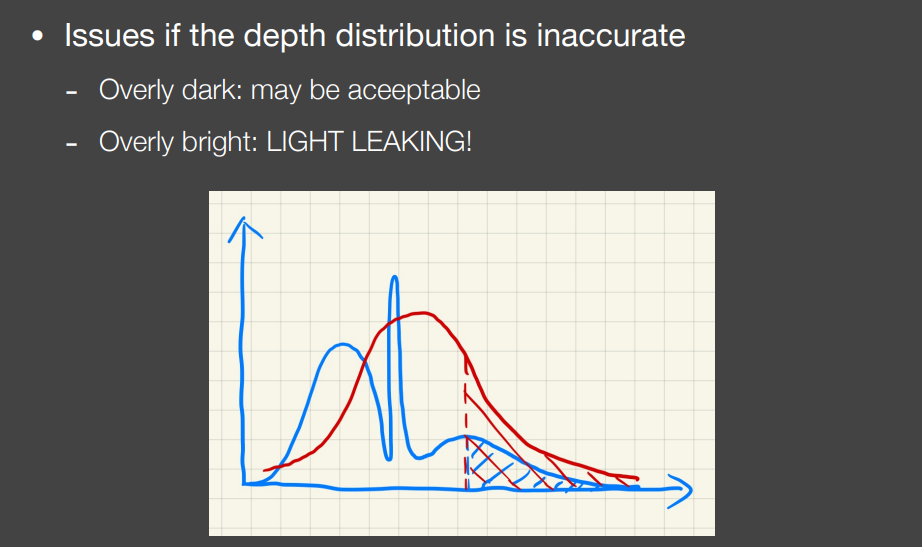

我们看下图中小车可以发现，在车的底部阴影部分出现了一部分偏白的阴影，这是因为车是一个镂空的状态，如果从底部向light处看去会发现底板遮挡一部分,车顶附近会遮挡一部分,这就导致了不是正态分布情况,因此才出现light leaking这种情况：


因此人们为了避免VSSM中不是正态分布情况下的问题，就引入了更高阶的moments来得到更加准确的深度分布情况。想要描述的更准确，就要使用更高阶的moment(矩)，矩的定义有很多，最简单的矩就是记录一个数的次方，VSSM 就等于用了前两阶的矩。这样多记录几阶矩就能得到更准确的结果。


如果保留前M阶的矩，就能描述一个阶跃函数，阶数等2/M，就等于某种展开。越多的阶数就和原本的分布越拟合。一般来说4阶就够用：


总结Moment Shadow Mapping：

- 和VSSM的基本思路是一样的；
- 当generate shadow map的时候，记录$z,z^2,z^3，z^4$；
- 在blocker search的阶段恢复（restore）出CDF & 做PCF；

优缺点分析：


## 5.Distance Field Soft Shadows

### （1）Signed Distance Functions

首先我们来复习一下SDF。在games101里我们知道，Distance Function就是空间中任何一点，到某个物体的最小距离。Signed的意思就是加入规定负数代表在物体内部，正数则表示在物体外部。这样不止定义了距离,还定义了方向。


SDF大多用在与几何之类的方向上,比如我有两个物体的SDF,我们将两个SDF进行Blend操作,从而得到一个新的SDF,也就得到了一个新的几何物体,因为当距离为0时，即可认为是物体的边界，SDF可以很准确地反应物体的边界。几何转换SDF的时候，可以很好地把几何进行过渡。


### （2）SDF的应用

#### （a）Ray Marching计算光线交点


> 这里就是正常的Ray Marching，Shader Toy上面的很多花里胡哨的Shader都是基于这个思想去做的。注意如果在朝一方向trace非常远的距离但仍然什么都没trace到,此时就可以舍弃这条光线,也就是停止了.


#### （b）用SDF计算近似遮挡比例


将安全距离的概念进行延伸，在任意一点通过SDF可以获得一个safe angle。具体原理看下面这张图就懂了：


> 我们以o为起点,沿一个方向推进,仍然是ray marching的步骤,在p1点以SDF(p1)进行推进,其余点也是一样,此处主要是为了求safe angle,我们在起点o沿每个点的sdf为半径所形成的圆做切线,从而求出各个点的safe angle,**我们最后再取其中最小的角度作为总的safe angle。**
>
> 也就是我们在trace的每次过程中都求出一个safe angle,到最后进行相交操作时取最小的safe angle来用.

**那么我们该怎么去计算这个角度?**

从图我们可以知道,以p1点为例,从o点到p1的距离为斜边,sdf(p1)是直角边,因此我们用arcsin就可以求出safe angle了。不过arcsin的计算量其实是十分大的，因此在shader中我们不用反三角函数，而是使用近似的方法去做：


只要sdf长度除以光线走过的距离乘一个k值，再限定到1以内，就能得到遮挡值或者说是visibility，而k的大小是控制阴影的软硬程度。我们从图中右半部分可以看出来，当k值越大时候，就越接近硬阴影的效果，也就是它限制了可能半影的区域：

- k越小，半影区域越大，越接近软阴影效果；
- k越大，半影区域越小，越接近硬阴影效果；

也就是说，**可以的安全角度越大，阴影越软；否则越硬。**


**Conclusion:**

SDF是一个快速的高质量的软阴影生成方法(比shadow map快是忽略了SDF生成的时间)，但是在存储上的消耗非常大，而且生成SDF的花的时间也要很久，SDF是预计算，在有动态的物体的情况就得重新计算SDF。

------


# Lecture 5 Real-Time Environment Mapping

暂时针对本节来说，**在环境光照下做一点的shading时是不用去考虑shadow的。**首先我们复习一下什么是环境光照:

- 在games101中我们知道，环境贴图就是在场景中任意一点往四周看去可看到的光照，将其记录在一张图上这就是环境光照，或者也可以叫做IBL(image-based lighing)。这里我们认为看到的光照来自于无限远处，这也就是为什么用环境光照去渲染物体时会产生一种漂浮在空中的感觉，因为光照来自于无限远处。
- 通常我们用spherical map和cube map来存储环境光照.

如果已知环境光照，此时放置一个物体在场景中间，在不考虑遮挡时我们该如何去得到任何一物体上任何一shading part的shading值呢?

首先要先来看rendering equation:


由于我们在这里**不考虑遮挡**，所以舍去visibility项。通用的解法是使用蒙特卡洛积分去解，但是蒙特卡洛需要大量的样本才能让得出的结果足够接近。如果我们对每个shading point都做一遍蒙特卡洛，那样的话将会花费很多时间在采样上，太慢了。

> 一般来说shader中如果出来Sampling的话是不会用于RTR中的，但是由于这几年技术的提升,使得sampling在RTR中也有了可行性。

**能否避免采样？**


## 1.基本思路

由于我们不考虑visibility项，那么rendering equation就只是**BRDF项和lighting项相乘再积分。**

**brdf又分为两种情况:**

1. brdf为glossy时,覆盖在球面上的范围很小,也就是small support(积分域)；
2. brdf为diffuse时,它会覆盖整个半球的区域,但是是smooth的,也就是值的变化不大,就算加上cos也是相对平滑的；


由以上的两条原则可以联想到RTR当中的近似公式：


如果在渲染方程当中，我们认为light项是f（x），BRDF项是g（x），那么g（x）是符合上面这个公式的两个条件的，因此可以进行拆分：


从上图上面那个公式的思路出发，这就是Split Sum算法的思路。


## 2.Split Sum

### （1）First Stage

把light项拆分出来，然后将BRDF范围内的lighting积分起来并进行normalize，其实就是将IBL这张图给模糊了。

模糊就是在任何一点上取周围一片范围求出范围内的平均值并将平均值写回这个点上，滤波的核取多大取决于BRDF占多大，BRDF的区域越大，最后取得的图也就越模糊。


而这些模糊过的图是我们在进行rendering之前生成的，也就是pre-filtering。Prefiltering就是提前把滤波环境光生成，提前将不同卷积核的滤波核的环境光生成一系列模糊过的图（和mipmap相似），当我们需要时进行查询即可，其他尺寸的图则可以经过这些已生成的通过三线性插值得到。

之前提过,拆分就是为了做一个Pre-filtering,那么做pre-filtering是为了干什么?


- 左图为brdf求shading point值时，我们要以一定立体角的范围内进行采样再加权平均从而求出shading pointd的值。
- 右图为我们从镜面反射方向望去在pre-filtering的图上进行查询，由于图上任何一点都是周围范围内的加权平均值，因此在镜面反射方向上进行一次查询就等价于左图的操作，并且不需要采样，速度更快。


### （2）Second Stage

到此我们解决了拆分后的前半部分积分采样的问题,那么接下来我们处理BRDF项采样的问题：


接下来讲的方法并不是最优方法，现如今已经有更简单方便的方法了，但是本课我们主要是为了学习方法背后的思想。我们仍然可以用**预计算**来解决后半部分积分采样的问题，但是预计算的话我们需要将参数的所有可能性均考虑进去，包括roughness、color等。考虑所有参数的话我们需要打印出一张五维或者更高的表格，这样会拥有爆炸的存储量，因此我们需要想办法降低维度，也就是**减少参数量**从而实现预计算。

在微表面模型当中，我们有如下近似BRDF的式子：


**会在后面的Lecture当中对每一项进一步介绍。**

在这里可以暂时忽略掉G项，只看F项和D项（**此时暂时不考虑阴影**）。两者都可以近似展开成下面的式子：


> - Frenel term可以近似成一个基础反射率R0和入射角度的指数函数。
> - 法线发布函数（NDF）是一个分布函数，其中有两个变量，一个变量是α（粗糙度），另一个 是half vector和法线中间的夹角，可以近似成入射角度相关的数
>
> 这样就变成了3维的预计算。（**注：在实时渲染中，往往可以把半程角度（half vector和法线中间的夹角），入射角这两个看成同一个量**）。

至此我们有了三个变量：基础反射率r0，roughness α以及角度θ，但此时参数的维度依然是三维，**接下来就是想办法把参数量降为二维。**通过将Schlick近似带入后半部分的积分中，可以把R0项提取出来：


> 上式的推导如下（核心思路是把F显式地用Schlick公式写出来）：
> 

基础反射R0被拆出积分式，需要预计算的两个量就只有roughness α和角度θ，可以将预计算结果绘制成一张纹理，在使用时进行查询即可。


**通过Split sum方法，可以将预计算的结果打成一张表，可以大大节省实时IBL的计算时间。**使用Split Sum近似方法最后得到的结果也是很好的：


在工业界当中，很多时候也会用求和公式代替积分公式：


## 3.阴影怎么计算？

**在RTR中，计算IBL带来的实时阴影是十分困难的。**可以从两个角度来考虑：

- 1.many light问题：我们把环境光理解为很多个小的光源，这种情况下去生成阴影的话，需要在每个小光源下生成shadow map，因此会生成线性于光源数量的shadow map，这是十分高昂的代价。
- 2.sampling问题：在任何一个Shading point上已知来自正半球方向的光照去解rendering equation，最简单的方法是采样空间中各方向上的不同光照，可以做重要性采样，虽然做了重要性采样但仍需要大量的样本，因为最困难的是visibility term。由于Shading point不同方向上的遮挡是不相同的,我们可以对环境光照进行重要性采样，但一个sample周围的visibility项是未知的，因此我们只能盲目的去采样(我个人对盲目采样的理解是，为了确保准确性需要对sample各个方向的遮挡进行采样，因此仍然会生成大量的样本)。我们也无法提取出visibility项，因为如果是glossy brdf，他是一个高频的函数，且Lighting项的积分域是整个半球,因此并不满足smooth或small support，因此无法提取出visibility项。

**在工业界中，我们通常以环境光中最亮的那个作为主要光源,也就是太阳,只生成太阳为光源的shadow。**

下面是几篇关于生成阴影的文章：

【1】Imperfect shadow maps：[ISM_SIGAsia08.pdf (jankautz.com)](https://jankautz.com/publications/ISM_SIGAsia08.pdf)，做的是全局光照部分产生的shadow。

【2】Light cuts：[lightcuts.pdf (cornell.edu)](https://www.graphics.cornell.edu/~bjw/lightcuts.pdf)，解决的是离线渲染中的many lights的问题，核心思想是把反射物当成小光源，把所有的小光源做一下归类并近似出照射的结果。

【3】RTRT：Real time Ray Tracing，可能是终极解决方案。

【4】Precomputed radiance transfer：[Microsoft Word - shIllum_final24.doc (jankautz.com)](https://jankautz.com/publications/prtSIG02.pdf)，可以十分准确的得到来自环境光中的阴影。

> 除了PRT的话，其他的论文有时间再看看吧。

------


# Lecture 6 Real-Time Environment Mapping (Precomputed Radiance Transfer)

本节主要总结的内容如下：


## 1.知识储备

### （1）傅里叶变换

1. 傅里叶级数展开：任何一个函数可以写成常数和一系列基函数(不同频率sin和cos项)的线性组合,基函数数量越多越接近于原函数的形状：


2. 频率：在空间上图像信号数值的变化是否剧烈，如头发区域属于高频，因为是一根一根的，衣服、背景等变化不剧烈的属于低频。

   任何一张图(也就是二维函数)的频率，也就是频域上对应的内容可以用一张频谱表示出来。


频谱最中心处是低频内容，我们可以做一个filtering(滤波)，从而去除一系列频率上的内容，我们对这张图用一个低通滤波器，从而把高频的内容去除掉。

在spitial域上做卷积也就等于在函数上做一个卷积，就等于在频域上做一个 原图频谱 和 卷积核频谱 的乘积操作，我们可以看到卷积核的高频部分几乎是黑的，也就是0，做了乘积操作后原本的高频部分就消失了，逐点相乘后得到的结果在经过逆傅里叶变化之后就会得到模糊后的图。

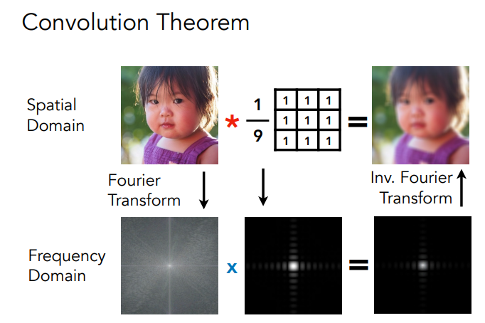


### （2）general understanding

本节课我们要记住的是：


> 对于任意的product integral(两个函数先乘积在积分)，我们将其认为是做了一个卷积操作，理解为spatial域上的两个信号f(x)和g(x)进行一个卷积，等于在频域上让两个信号相乘，如果两个信号有一个信号是低频的，那么频域上相乘后得到的结果也是低频的，最终相乘在积分的结果也是低频的。
>
> 可以总结为：**积分之后的频率取决于积分前最低的频率，即the frequency of the integral is the lowest of any individual’s**。
>
> 低频意味着变换更加地smooth或者有着slow的变化。


### （3）Basis Functions


> 把一个函数可以描绘成其他函数的线性组合,如f(x)可以描绘成一系列的Bi函数乘以各自对应的系数最终再相加在一起,这一系列的函数Bi就是基函数。


## 2.Spherical Harmonics

回归正题，我们要讨论的是如何在环境光照下生成阴影，先从最简单的开始，如果给了你环境光和一个diffuse的物体，在不考虑Shadow的情况下如何去计算shading值?

为了计算shading值，我们引入数学工具——>Spherical Harmonics(球谐函数)

在游戏渲染中，SH有很多应用。比如SH可以用来表示低频部分的环境光照，也可以用来提供light probe的烘培光照等等。


### （1）概念

SH是一系列基函数，系列中的每个函数都是2维函数，并且每个二维函数都是定义在球面上的。

- 它是一系列的基函数，可以以傅立叶变换为参考，与里面不同频率的cos和sin函数类似，只是全都是二维函数；
- 因为它是定义在球面上的，球面上会有不同的值，由于在球面上两个角度$\theta$和$\phi$就可以确定一个方向了，因此可以理解为是对方向的函数，通过两个角度变量从而知道这一方向对应在球面上的值。

下图是对SH的可视化，与一维的傅里叶一样，SH也存在不同频率的函数，但不同频率的函数个数也不同，频率越高所含有的基函数越多。

图中的颜色表示的是值的大小，l=0中，越偏白的蓝色地方值越大，越黑的地方值越小。而黄色中则表示偏白的地方表示其绝对值大，偏黑的地方表示绝对值小。也就是蓝色表示正，黄色表示负。

频率表示的就是值的变化，因此可以很清晰的从形状看出。


其中，$l$表示的是阶数，通常第$l$阶有$2l+1$个基函数，前n阶有$n^2$个基函数，m表示的是在某一个频率下基函数的序号，分别从从$−l$一直到$l$。每个基函数都有一个比较复杂的数学表示，对应一个legendre多项式，我们不用去了解legendre多项式，我们只需要知道基函数长这样，可以被某些数学公式来定义不同方向的值是多少就可以了。


#### 补充:SH可视化

【推荐这个】一个极好的SH可视化网站：[Spherical Harmonics (rreusser.github.io)](http://rreusser.github.io/spherical-harmonics/)

【原理推荐】https://en.wikipedia.org/wiki/Spherical_harmonics#，但是实在是太硬核了，不推荐看。

参考链接：[spherical-harmonics/gifs/ylm.gif at main · amanchokshi/spherical-harmonics (github.com)](https://github.com/amanchokshi/spherical-harmonics/blob/main/gifs/ylm.gif)（这个链接应该是只展示了一半的SH，差不多看看可视化效果就行）

以及可以参考PRT的原论文：[Microsoft Word - shIllum_final24.doc (jankautz.com)](https://jankautz.com/publications/prtSIG02.pdf)


### （2）操作

下面定义一些操作：

**投影**：由于一个函数 $f(w)$可以由一系列基函数和系数的线性组合表示，那么怎么确定基函数前面的系数，这就需要通过投影操作：

我们知道函数$F(x)$，通过对应的基函数$B(i)$进行投影操作，从而求出各基函数对应的系数$Ci$。

> 与以下操作是同一个道理：在空间中想描述一个向量，可以xyz三个坐标来表达，把xyz轴当做三个基函数，把向量投影到xyz轴上，得到三个系数就是三个坐标。

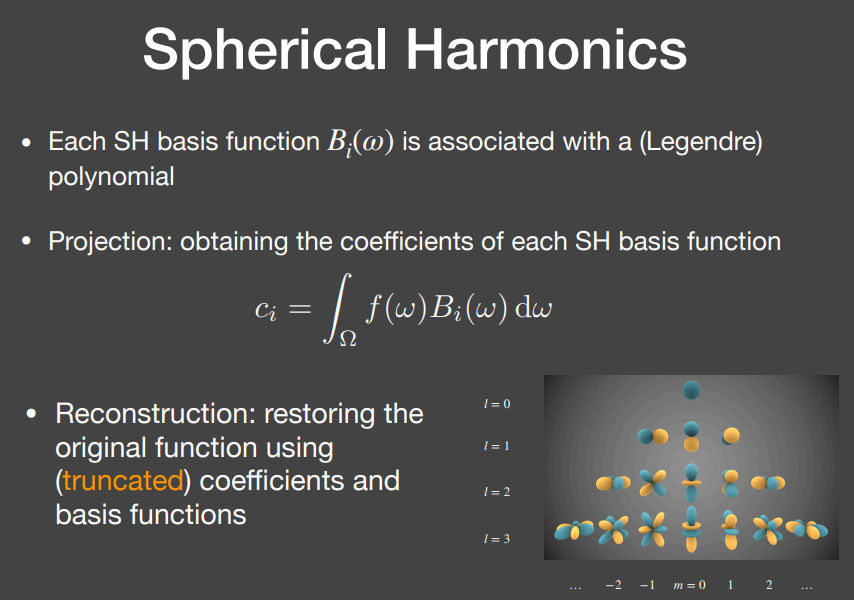

**重建**：知道基函数对应的系数，就能用系数和基函数恢复原来的函数。

由于基函数的阶可以是无限个的，越高的阶可恢复的细节就越好，但一方面是因为更多的系数会带来更大的存储压力、计算压力，而一般描述变化比较平滑的环境漫反射部分，用3阶SH就足够了；另一方面则是因为SH的物理含义不是特别好理解，高阶SH容易出现各种花式Artifact，美术同学一般都会认为这种表现属于bug。

在上面那张图中，$f(w)$可以是任何一个函数。基函数可以重建任何一个球面函数，**那么这里的$f(w)$就可以是环境光照。**由于环境光是来自于四面八方且都有值，所以环境光照就是一个球面函数，我们可以把它投影到任何一个SH basis上，可以投影很多阶，但是只需要取前三阶的SH去恢复环境光就可以恢复出最低频的细节了，这个在下文RAVI教授的结论有提到。


这里补充一些球谐函数的性质：

**正交性: 能够较简单地投影/重建、simple rotation。**


**simple rotation**

旋转是一个很重要的性质：**旋转一个基函数之后，得到的函数就不再是一个基函数(因为基函数有严格的朝向等限制)，但是旋转球谐函数等价于同阶基函数的线性组合。**


Ravi教授等人在01年左右做过一些实验发现，diffuse BRDF类似于一个低通滤波器，使用一些低频信息就可以恢复出原始内容。回忆一下，在之前的笔记内容中曾说过：“**积分之后的频率取决于积分前最低的频率**”。当diffuse BRDF使用低频信息即可恢复内容时，就意味着对于很复杂的光照项，其本应该用多高频的基函数去表示，但我们希望得到的是其与BRDF之积的积分，所以可以使用比较低频的基函数去描述灯光。下面的实验结果意味着，遇到diffuse的物体时使用前3阶的球谐基函数就可以基本重建出正确率99%的结果。

> 这部分的论文在这里：[envmap.dvi (ucsd.edu)](https://cseweb.ucsd.edu/~ravir/papers/envmap/envmap.pdf)


> 两行代码可以快速计算光照结果，**这个后面有需要再整理一下算法实现吧。**


到目前为止，这里只解决了如何根据环境光照进行shading，主要说明球谐函数的作用，**仍没考虑shadow问题，接下来我们要解决两个问题：**

- （1）将shadow考虑进去
- （2）我们仍然用基函数思路去考虑任何的BRDF，比如glossy的BRDF。

**解决的思路就是PRT**。


## 3.PRT

在实时渲染中，我们把rendering equation写成由三部分组成的积分：


光照项、visibility项和brdf项，这三项都可以描绘成球面函数，这里用的是cube map描述法，那么最简单的解这个方程的方法就是每个像素挨个去乘。假设环境光是`6*64*64`的map，则对于每个shading point来说，计算shading需要计算`6*64*64`次，这个开销是十分大的。

**因此我们利用基函数的基本原理把一些东西先预计算出来，从而节省开销。**


### （1）基本思想

PRT的基本思想:

- 我们把rendering equation分为两部分，lighting 和 light transport.
- 假设在渲染时场景中只有lighting项会发生变化(旋转,更换光照等)，由于lighting是一个球面函数，因此可以用基函数来表示，在预计算阶段计算出lighting。
- 而light transport(visibility和brdf，也就是说o方向是固定不变的)是不变的，因此相当于对任一shading point来说，light transport项固定的，可以认为是shading point自己的性质，light transport总体来说还是一个球面函数，因此也可以写成基函数形式，是可以预计算出的。

见下图：


这里需要分为两种情况，**diffuse和glossy。**


### （2）Diffuse Case

由于在diffuse情况下，BRDF几乎是一个常数，因此我们把BRDF提到外面。


由于lighting项可以写成基函数的形式，因此我们求和式把其代入积分中，对于任何一个积分来说，在Bi的限制下，$l_i$此时对积分来说是常数,可以提出来。


> 中间部分的推导用到了积分和求和的互换。在微积分里需要考虑什么时候能交换求和和积分的次序，**但在PRT这里并不需要考虑。**

对于积分中的部分来说，Bi是基函数，v和cos项在一起就是light transport，此时就是light transport乘以一个基函数，这就成了lighting transport投影到一个基函数的系数，接下来代入就能进行预计算了，**这样就只要算一个点乘就好了**。

之所以说是点乘,结果是个求和,我们要计算$l_1T_1+l_2T_2+....$,用点乘就能实现。

所以对于任何一个shading point我们去算他的shading 和 shadow，只需要计算一个点乘就可以了，十分方便。


#### 代价是什么？

**1.light transport做了预计算，因此visibility当了常量，此时场景不能动，因此只能对静止物体进行计算。**

**2.对于预计算的光源我们把它投影到sh上，如果光源发生了旋转，就相当于换了个光源；**

> 第二个问题由于sh函数的旋转不变性可以完美的解决。旋转光照 = 旋转SH的基函数。因为任何一个SH基函数旋转后都可以被同阶的SH基函数线性组合表示出来，因此根据这个性质，还是可以立刻得出旋转后的sh基函数新的线性组合。


用的阶数越多越接近与原始函数，下面第四张图是前26阶函数去重建原始函数，可以看到效果还不错。但我们在使用时用不到那么多阶。


在下图当中，可以把光线$L(i)$给分解到多个基函数上，可以存储每个$l_i$的值作为一个向量，就是下图SH space里面的向量。如果要重建原函数则只需要把这些系数乘以对应的基函数再加在一起即可。


> 我们可以把$B_i(i)$理解为lighting，也就是说每个basis所描述的环境光去照亮这个物体从而得到照亮之后的结果，预计算就是计算每个basis”照亮“得到的结果。（好像是把渲染方程的L替换成了B）

总结：


### （3）另一个角度看预计算

从另外一个角度重新来看，怎么对Light transport做预计算:

1. 理解一：按之前的操作，我们先把Light写成基函数的表示方法，把Light的系数拆分出去，然后剩下的部分看做把Light transport投影到基函数上得到系数，最后做一个点乘得到Shading result。
2. 理解二：直接把渲染方程中的lighting和light transport，都用sh基函数表示。**如下图**：


然后把两个都展开成求和，然后把求和符号拆出去，然后就变成了一个双重求和的结果，每个求和要乘两样东西:

- 对应的两个系数
- 积分值(**积分与实际场景无关,是两个基函数的product integral**)


> 这样就会发现这样推导的结果与上一节课的结果不太一样：（指的是计算复杂度），**怎么理解呢？**
>
> 如果基函数的个数为n的话,做一个向量点乘的复杂度应该是$O(n)$,为什么在这里是双重求和变成了$O(n^2)$了呢?
>
> 这是因为SH具有正交性,也就是当$p=q$时候，$B_p(w_i)·B_q(w_i)$才不为0，也就是这个二维矩阵上只有对角线上有值,因此只需要计算对角线上的值就行了，所以算法复杂度仍然是O(N)。


### （4）Glossy Case

Diffuse和glossy的区别在于，diffuse的brdf是一个常数，而glossy的brdf是一个4维的brdf(2维的输入方向，2维的输出方向)。

如果仍然按照上面的办法投影到sh上会出现一些问题，因为light transport包含visibility和brdf，brdf又是一个4维的函数(关于i和o的函数)，给一个o就会有一个不同的brdf。给定一个任意的观察方向o，light transport都会投影出一组完全不同的vector，且vector中的每一个元素都是一个o的函数。

> **或者直观一点来说，glossy物体有一个很重要的性质，它是和视点有关的。**diffuse的物体不管视角如何旋转改变，看到的Shading point的result是不会改变的，因为整个Diffuse shading和视角是无关的。但是glossy不是这样的，glossy是和视角有关的，不同的视角得到的shading result也是不一样的，因此o不一样，L(o)也不一样。所以即使light transport即使投影到了i方向上的基函数，所得到的仍然是一个关于o的函数而不是系数。


上图这样理解：

> 我们将4D的BRDF函数投影在2D上之后，虽然得到的是一个关于O的函数，但是现在这个函数也只是关于O了，因此我们在O的方向上将其投影到SH基函数上。因此，light transport上就不再认为得到的是向量了，而是一个矩阵，也就是对于任意一个O都会得到一串vector，最后把所有不同O得到的vector摆在一起，自然而然就形成了一个矩阵。
>
> 或者这样理解，我们最后得到的是不同方向上的radiance，自然而然是一个向量。我们将lighting投影到SH上得到的是一个向量，而只有向量 * 矩阵得到的结果才是向量，因此这里只能是**矩阵**。
>
> 可想而知,这样的话将会产生巨大的存储。


正常情况下人们会用多少阶的基函数呢？基函数个数：9个（三阶）16（四阶）25个（五阶）

我们以四阶为例:

- Diffuse 物体：每个点需要两个长度为16的向量点乘；(diffuse情况下一般三阶就足够了)
- Glossy 物体：每个点需要16阶向量与16*16矩阵乘。(一般需要高阶一点)

下图可以看到，Glossy渲染得到的结果还是不错的：


这里看出来PRT Glossy比Diffuse 效率要差很多，而当Glossy非常高频的时候，也就是接近镜面反射的情况的时候， PRT就没有那么好用，我们虽然可以采用更高阶的SH来描述高频信息，但是使用SH甚至远不如直接采样方便。

图二中脚下关于阴影的遮挡充分考虑了visibility（也就是考虑了阴影）效果就非常好；

图三考虑了多次光线Bounce的结果。


### （5）如何考虑多次bounce？

接下来是将多次bounce看作light transport的一部分的方案。我们可以用一系列的表达式来描述不同光线传播的路径都是一种什么类。

区分材质区分为三种：

1. Diffuse
2. Specular镜面反射
3. Glossy 介于两者之间


> 1. LE：Light直接到眼睛；
> 2. LGE：light打到Glossy物体然后到眼睛。
> 3. LGGE：多bounce一次，就是light先打到壶嘴，在bounce到壶身，最后到eye。(L->glossy->glossy->eye)
> 4. L（D|G）E：Light从光源出发，打到一个物体，可能是diffuse也可能是glossy，可以用*表示bounce次数，最后到达eye。
> 5. LS（D|G）*E：打到Specular面上，然后聚焦到Diffuse物体上,最后被眼睛看到。也就是caustics。
>
> 注：**这里可以使用正则表达式。**

从上面可以看出所有路径开始都是L最后都是E，因此我们在运用PRT时候，拆分为light和light transport之后,不管中间bounce几次，我们只需要预计算算出Light transport就行，不论多么复杂的bounce，我们只需要计算出light transport就能得出最后的shading result。

所以说，只要采用了PRT的思路，不管light transport有多复杂，bounce了多少次，只要把light和light transport进行预计算，渲染时实际跑的时候是很简单的，因为实际跑的时间是与transport的复杂度无关的。

**总之，上面这一页只是为了告诉我们,可以把任意复杂的light transport给预计算出来,只是light transport越复杂在预计算时花费的时间多而实际跑时候是很快的.**

**如何计算呢？**


- 理解方式1：把light transport和sh基函数做了一个**Product Integral**；
- 理解方式2：把light transport的预计算看作是一个在一些奇怪lighting下做的渲染过程。

如果我们把基函数看为lighting项,那么这就是rendering equation，我们把light transport投影到basis上，相当于用basis这个Lighting照亮物体，每个basis得到一个渲染图，最后我们进行重建从而得出最后的shaing值。

下图是不同BRDF的渲染结果:

- 各项异性的BRDF
- 普通的BRDF
- 不同位置BRDF不同的物体（BRDF维度增加）。


### （6）PRT总结

Sloan在02年提出的这个方法（即PRT），使用球谐函数估计光照和光线传输，将光照变成光照系数，将光线传输变成系数或者矩阵的形式，通过预计算和存储光线传输将渲染问题变为每个vertex/shading point：点乘（diffuse表面）、向量矩阵乘法（glossy表面）。

但该方法也有其缺点：

- 由于球谐函数的性质，该方法比较适合使用于低频的情况（可用于高频但不合适，有时即使使用了26*26阶的sh仍然得不到比较好的效果）
- 当改变场景或者材质时需要重新预计算light transport，此外预计算的数据比较大。

一些PRT的后续工作：


接下来我们会聚焦于更多的基函数这部分。


### （7）更多的基函数——Wavelet

基函数除了可以使用球谐函数外，还有很多选择，比如Wavelet、Zonal Harmonics、Spherical Gaussian、Piecewise Constant等。这里我们先介绍一下Wavelet小波函数。

这里以**Haar小波**为例，小波变换的过程就是投影过程，相比于球谐函数对低频内容友好（球谐函数使用少量的基去表示），**小波变换可以全频率表示，但是只有很少的系数是非零的。**


由于小波是平面上的函数，为了防止变换后在球面上出现缝隙，所以采用了Cubemap来作为环境光而不是sphereical map。

从下图中可以看到,小波变化是把每张图的高频信息留在这张图的左下,右上和右下三部分,而把剩余的低频信息放在左上角,左上角的信息可以继续进行小波变换,我们会发现高频的东西很少,对于绝大部分来说是0,不断地进行小波变换可以得到一个很不错的既保留了低频又保留了高频的压缩。


但是小波也有自己的缺陷：不支持旋转（使用球谐函数进行表示时，由于球谐函数具有**simple rotation**的性质，所以支持光源的旋转）。


# Lecture 7 Real-Time Global Illumination（In 3D）

全局光照是增强真实感的重要部分，因此也是十分复杂的一部分。

从下图中我们会发现，没有任何一处是全黑的看不见东西的，比如书本的下方，蜡烛内部等。也就是光线bounce了很多次才到达我们的眼里，在GAMES101中我们在Lambert模型中，假设ambient term认为来自四面八方的间接光照都是相同的，且最后的shading和normal是无关的，这样得到的结果是十分不真实的。

下图中的全局光照就不能这么假设了，大家可以看到书本下方各位置的亮度不同，还可以看到一些caustics等从金属球反射出的间接光，他们之间是不一样的，如果还做Ambient term那种假设从而只提升了一点亮度是无法得到图中的结果的。

**全局光照是十分复杂的。**


## 1.介绍

在实时渲染中，可以用**比直接光照多一次bounce的间接光照**来模拟全局光照。

> 本来全局光照=直接光照+间接光照，在RTR中为了方便可以用bounce一次的间接光照来作为全局光照中的间接光照项。

如下图中，光线弹射两次，先打到红色的墙壁上，再打到box面上，最后被camera/eye看到，这就是在rtr中要解决的所谓的"全局光照"。

我们希望他:

**①简单->实现起来不麻烦**

**②快速->因为全局光照非常难算**


**我们通过下面这幅图来理解什么是一次bounce的间接光照：**


> 在games101 lecture16中讲path tracing时说，在做tracing时，从camera出发打出一条光线到点P，P点又往场景中不同的方向发射光线：
>
> - 如果打到光源则表示接受的是**直接光照**；
> - 如果没打到光源而是打到了点Q，那么认为P点接收到的光照是从Q点反射到P点的Radiance,也就是Q点接收到的直接光照所反射出的光照打到P点上。
>
> 点Q接受的是直接光照, 此时认为这种接收到直接光照的表面可以被当作次级光源(Secondary Light Sourse)，他们可以用自身反射的光照来照亮其他物体。

比如说下图当中的太阳图案就是接受到直接光照的点，也就是次级光源，而点P的光照就是这些次级光源共同照亮的结果。


那么为了计算点P的shading需要知道什么？

- **（1）哪些表面会被直接照到？**
- **（2）如何计算每个surface patch对着色点p的贡献？**

这两个问题的答案会在RSM中得到解答。


## 2.RSM（Reflective Shadow Maps）

### （1）哪些表面会被直接照到？

这里可以使用shadow map，shadow map上每一个像素可以看成是一个小surface patch。


**假设：所有的反射物(次级光源)都是diffuse的。**

次级光源如果想照亮点P，因为观察方向是从P点去观察次级光源的，理论上对于不同的次级光源点来说出射方向是unknown的，这时无法计算P点的shading的。为了不依赖于观察方向，在RSM中我们假设，**所有次级光源(reflector)都是diffuse(这里是假设reflector，没有要求receiver也是diffuse)**，故outgoing radiance在所有方向上都是uniform的。


### （2）如何计算每个surface patch 对着色点的贡献？

考虑所有surface patch的贡献，进行求和；并且每个surface patch可以看成是一个area light。

在此我们需要复习一下GAMES101中的一些辐射度量学的知识：

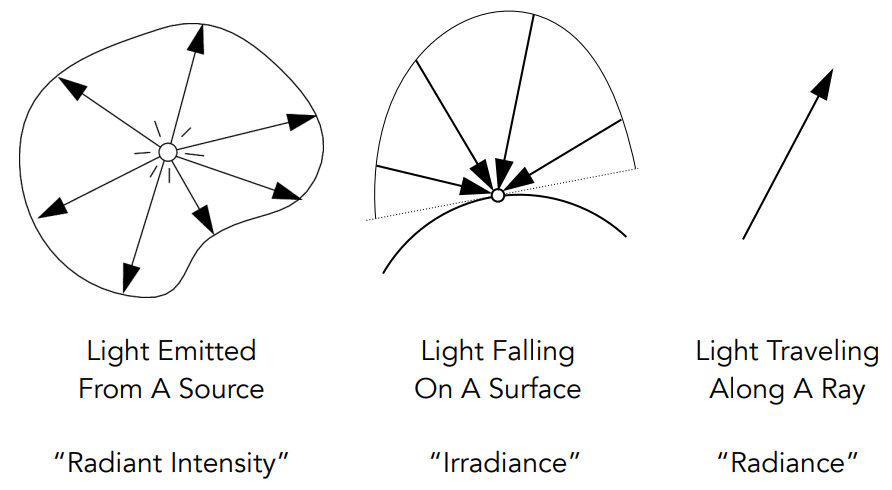

- **Radiant Intensity：一个单位立体角上对应的能量。(单位立体角上的光通量)**
- **Irrdiance：在一个单位面积下对应的能量。(单位面积上的光通量)**
- **Radiance：一个单位立体角下单位面积上的能量。(个人理解是，单位立体角上通过单位投影面积的光通量)**

回到问题本身，我们之前说过每一个小的patch都可能对照亮p点做出贡献，因此我们可以先计算出一个patch做出的贡献，之后用求和的形式将所有patch的贡献加在一起。


> 我们可以看到q是一个patch去照亮点p：
>
> q其实就是RSM中一个Texel所对应的patch，在games101中学过，原本计算q对p点的贡献，我们应该是对整个立体角进行采样，但是这样的话很浪费很多的sample，我们可以直接在light处采样然后去计算p点的shading值。

此时渲染方程可以改写成下面的式子：

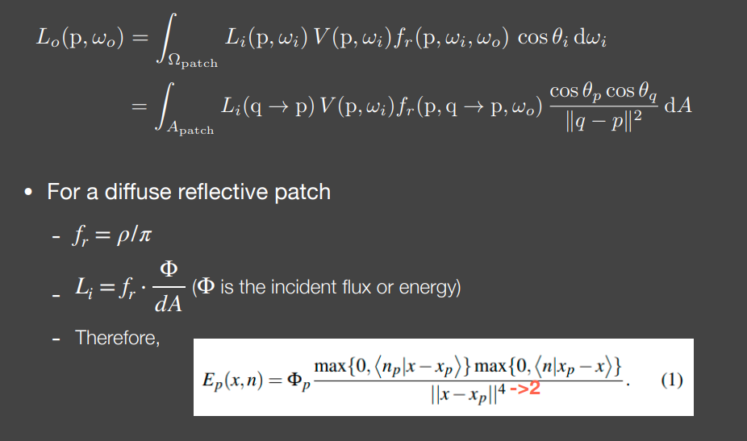

也就是把立体角的积分变成了对light区域面积的积分，如果当区域足够小的时候dA甚至不用积分，直接相乘后相加就行，现在我们要解的是patch在接受直接光照后反射出的radiance是多少，也就是从q点到p点的radiance，那么如何解呢？


公式求的是次级光源的光线贡献在着色点上的irradiance，Ep表示次级光源对着色点贡献的入射irradiance。（**上图里的那个4不用改成2**）

在此仍然存在一些问题:

**次级光源能否看到着色点？**

- 渲染方程中的V是指次级光源到着色点是否可见，如果想解决这个问题，需要为每个次级光源算一次shadow map，这个运算不好算也是很难算的。解决方案是**不解决。**
- 值得注意的是原文公式中的分母是4次方，这里paper没有错，因为在分子中有两个Xp-X的模，当把这两个与分母约掉后，分母结果就是平方，这里没有问题。

> 注：原论文是这样的（[rsm.pdf (klayge.org)](http://www.klayge.org/material/3_12/GI/rsm.pdf))：
>
> 
>
> 这里的`<A|B>`指的是点乘，可以看到$x-x_p$并没有归一化，所以分母上除以了两个$||x-x_p||$，相当于对点乘的两个向量做归一化处理，与上面PPT里推理得到的结果是等价的。


进一步，**如何加速？**


由于可见性、方向性以及距离的不同，对于某一个着色点，可以认为shadow map上所有的pixel不可能都有贡献：

- Visibility（仍然非常难算）；
- 方向：比如$X_{-1}$点在SM中记录的是桌子的表面，而且这个表面的点法线方向是朝上的，因此根本不可能照亮X点；
- 距离：因为远处的次级光源贡献很少，通常只要找距离足够近的次级光源就行了。

因此为了加速这一过程，我们认为在shadow map中着色点$x$的位置和间接光源$x_p$的距离可以近似为它们在世界空间中的距离。所以我们认为，**对着色点$x$影响大的间接光源在shadow map中一定也是接近的。**（这是一个大胆的近似）

于是我们决定先获取着色点$x$在shadow map中的投影位置$(s,t)$，在该位置附近采样间接光源，多选取一点离着色点近的采样点，**并且为了弥补越往外采样数越少可能会带来的问题，引入了权重，越近的权重越小，越远的权重越大。**那么对于一个shading point差不多找400个次级光源来计算是比较合适的。如下图所示。


### （3）数据存储

RSM在每一个像素$p$中都需要存储深度值，世界坐标，法线，反射光功率，如下图的可视化效果，四个map对应像素p的四个参数：


### （4）应用场合

RSM效果通常应用于游戏中手电筒的次级光照，如下图：


> 屋顶某个点亮了的区域就是手电筒直接照亮区域对屋顶那个点的贡献，屋顶的点在积分的时候积分域就是手电筒直接照亮的位置。


### （5）优缺点

**优点：**

- 易于实现

**缺点：**

- 性能随着直接光源数的增加而降低(因为需要计算更多的shadow map)
- 对于间接光照，没有做可见性检查
- 有许多假设：反射物需要是diffuse等
- 需要在质量和采样率上做一个平衡


### （6）其他资料（有时间再看）

https://zhuanlan.zhihu.com/p/357259069（这个是RSM复现，用C++）

https://zhuanlan.zhihu.com/p/424075274（在Unity SRP当中实现RSM）


## 3.LPV（Light Propagation Volumes）

LPV：在3D空间中去传播光线，从而利用它做出间接光照从而实现GI。

LPV历史：最早是在Cry Engine 3中被引入的，其初衷是用来做Crysis系列(孤岛危机)，其使用了下文要说的SSAO技术，而Cry Engine3中的一项主要技术是LPV。

LPV有两个不错的优点：

- Fast
- Good quality

RSM有他自己本身的问题，LPV可以很好的解决一部分RSM的问题。


**主要问题:**

- 如果我们能获得任何一个Shading point上来自四周的radiance的话，就可以立刻得到其间接光照。

**核心思路:**

- 我们假设光在传播过程中，radiance是uniform的。(irradiance会平方衰减)

**核心解法:**

- 将场景划分为若干个3D网格，每个网格叫做Voxel(体素)，在计算完直接光照后，将接受到直接光照的表面看作间接光照在场景中传播的起点。

**大致如下：**


- （1）找出接收直接光照的点（上图的红色箭头起点）；
- （2）把这些点注入(inject)到3D网格中作为间接光照(虚拟光源)的传播起点；
- （3）在3D网格中传播radiance；
- （4）传播完后，渲染场景；

接下来会对每一个步骤进行更详细的描述。


### （1）步骤1：Generation


- 与RSM一样，首先通过Shadow Map找出接受直接光照的表面或物体；
- 对得到的光源数量可以通过采样一些进行简化从而降低次级光源数量，最后获得一系列虚拟光源；


### （2）步骤2：Injection


- 预先把场景划分为若干个3D网格（体素）；
- 把虚拟光源注入到其对应的格子内；
- 一个格子内可能包含许多不同朝向的虚拟光源，把格子内所有虚拟光源的不同朝向的radiance算出来并sum up从而得到一个往四面八方的radiance；
- 由于是在空间上的分布，也就可以看作是球面函数，自然可以用SH来表示（工业界用两阶SH就可以表示各个方向上的radiance初始值）


### （3）步骤3：Propagation


- 由于是3D网格，因此可以向六个面进行传播(上下左右前后)。由于radiance是沿直线传播的，我们认为radiance是从网格中心往不同方向进行传播的，穿过哪个表面就往哪个方向传播，比如穿过右表面的radiance，就传播到右边的格子里(不考虑斜角，比如右上方向，我们认为是先到右边格子，再到上面格子)；
- 每个格子计算收到的radiance，并用SH表示；
- 迭代四五次之后，场景中各voxel的radiance趋于稳定；


### （4）步骤4：Rendering


- 对于任意的shading point，找到他所在的网格
- 获得所在网格中所有方向的Radiance；
- 渲染。


### （5）问题

LPV也有自己的问题，**那就是和VSSM一样的问题：漏光**。

由于我们认为radiance是从格子正中心向四周发散的，当遇到上图所示的情况的时候，按理说点P反射的radiance是无法照亮墙壁的背后，但是由于我们的假设，会导致墙壁后面也被间接光照照亮，也就是所谓的漏光现象。比如下图：

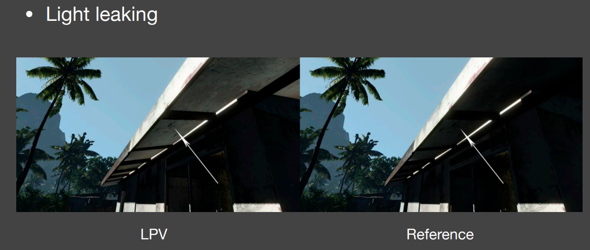

如上图，桥梁的下面本不应该被照亮，但由于使用了LPV导致了light leaking现象。

> 我们是可以解决漏光现象的，那样需要划分的格子足够小，会导致存储量增多，而且传播过程中传播的格子量增多，也就导致了速度慢。
>
> 对于两个格子之间的可见性也进行了假设，假设相邻格子都能看见，同时工业界会用不同大小的格子也就是**Cascade层级加速结构**，来优化LPV的方法。

LPV的效果很稳定，对于动态的物体处理的也非常好。

**Q1:这是预计算吗?**

- 不是,这是实时的，在任意一帧都要去做这个计算。

**Q2:每个格子存储的是 light transport吗?**

- 可以这么理解。


## 4.VXGI (Voxel Global Illumination)

VXGI也是一个2-pass的算法（**todo：这个2-pass是不是指的是第一个pass找到次级光源，第二个pass做渲染？**），但是与RSM有一些区别：


**区别1：次级光源从RSM中的Pixel——>VXGI中的Voxel（格子）**

- RSM 中次级光源是像素中所包含的微小表面，这些表面是根据Shadow Map来划分的。
- VXGI把场景完全离散化成了一系列微小的格子，可以理解为场景是由一堆乐高堆起来的，如上图那些最细的层级也就是最小的格子，我们可以在这一层基础上去建立一层大点的格子，依此类推从而根据场景的不同划分建立出一个Hierachical树形结构的体素。


> 左图将场景划分为一系列的voxel，之后再划分成一个Hierachical树形结构，右图就是Hierachical的体素。

**区别2：光线从传播变为了追踪**:

- 在LPV中，我们将受到直接光照的点注入到场景划分的Voxel之后进行传播，只需要传播一次就可以知道场景中任何一个shading point收到间接光照的radiance。
- 而在VXGI中第二趟我们从camera出发，就像有一个Camera Ray打到每一个pixel上，根据pixel上代表的物体材质做出不同的操作，如果是glossy则打出一个锥形区域，diffuse则打出若干个锥形区域，打出的锥形区域与场景中一些已经存在的voxel相交，这些voxel对于Shading point的贡献可以算出来，也就是我们要对每一个shading point都做一个cone tracing。可想而知，这个速度比起LPV来说是很慢的，但是是可以优化的，暂且不提。

**具体的步骤见下。**


### （1）Pass 1

不管如何首先肯定是先要算直接光照找到哪些voxel会被照亮，那么我们要先从接收到直接光照的patch开始，不管是用RSM的方法还是别的，总之先找出接受直接光照的Patch。

**需要注意的是，**由于场景是由voxel来表示的，那么对于任何一个格子，跟LPV的注入很像，不过这里不再记录格子里表面的出射分布或者说认为表面是diffuse的半球分布，也就是不再像LPV一样将所有的radiance加在一起求各方向的初始值，那么也就是说**可以支持反射物(patch)也是Glossy的情况**。

如下图：


记录的是直接光源从哪些范围来（绿色部分），记录各个反射表面的法线（橙色部分），通过**输入方向**和**法线范围**两个信息然后通过表面的材质，来准确的算出出射的分布（**就是右侧图里那些叶状的分布**），这样就比LPV认为格子表面是diffuse再用SH来压缩的方法要准确，然后建立更高层级格子的这些特性。


### （2）Pass 2

从这一步开始考虑场景的渲染了。对于任何一个像素，知道了Camera Ray的方向：

（a）对于Glossy的表面，向反射方向追踪出一个锥形(cone)区域；


基于追踪出的圆锥面的大小，对格子的层级进行查询，就是对于场景中的所有体素都要判断是不是与这个锥形相交，如果相交的话就要把对于这个点的间接光照的贡献算出来(我们存储了体素的光照输入方向和法线方向,因此可以算出其输出的radiance,将cone区域内所有体素的radiance都算出来从而在shading point得到间接光照)，也就是根据传播出的距离远近找对应层级的体素，然后找覆盖的范围。

> **todo:看论文，看代码实现。**


（b）对于Diffuse的情况，通常考虑成若干圆锥，忽略圆锥Tracing时的重叠和空隙。


**总结：**

- LPV是把所有的次级光源发出的Radiance传播到了场景中的所有位置，只需要做一次从而让场景每个Voxel都有自己的radiance。但是由于LPV使用的3D网格特性，并且采用了SH进行表示和压缩，因此结果并不准确，而且由于使用了SH因此只能考虑diffuse的，但是速度是很快的。
- VXGI把场景的次级光源记录为一个层次结构，对于一个Shading Point，我们要去通过Cone Tracing找到哪些次级光源能够照亮这个点。


> 结果的质量非常好，与光线追踪的结果非常接近，但是开销还是太大，应用受到了限制。对于VXGI我们需要预先对场景体素化，也是一个非常大的问题，由于每一个Shading point都要做一些cone Tracing，操作已经非常像离线渲染了。
>
> 

Unity SRP管线下的VXGI方法：[Looooong/Unity-SRP-VXGI: Voxel-based Global Illumination using Unity Scriptable Render Pipeline (github.com)](https://github.com/Looooong/Unity-SRP-VXGI)


# Lecture 8 Real-Time Global Illumination（Screen Space）

首先归纳一下之前总结的几种方法都是什么类型的：

- （1）LPV和VXGI是属于在3D空间的GI
- （2）RSM是属于在图像空间的GI
- （3）SSAO和SSDO是属于屏幕空间的GI

那么首先需要知道 **什么是屏幕空间**？

1. 使用的所有信息都来自“屏幕”，也就是做全局光照之前屏幕上能看到的信息；
2. 也就相当于对这张图做一个后期处理，从而来“弄”出全局光照。
3. 为了与此区别我们把RSM与Shadowmap的方法称为图像空间，因为信息是来自从灯光看向的场景所获得的信息。

接下来会**先介绍SSAO再介绍SSDO。**


## 1.SSAO（Screen Space Ambient Occlusion）

在开始介绍的时候我们说过CRY ENGINE，SSAO最早应用的游戏是使用CRY ENGINE2做出来的孤岛危机一代。

### （1）AO


左边是进行了AO的，右边是没有进行AO的，之间的差别还是很明显的。AO可以通过一系列的**contact shadow**让物体与物体之间的相对位置表示的更明显，从而让**物体相对位置感更强**。

**AO is cheap to implement.**


### （2）AO数学上的理解

1. AO是一个对于全局光照的近似；
2. 在屏幕空间意味着从camera渲染场景得到的信息，而非是场景中的所有信息；

**SSAO**可以理解为是在屏幕空间对于全局光照的一种近似。

**三个重要的假设:**

- 由于不知道间接光照是什么，因此我们假设任何一个**shading point**上来自**任何方向**的**间接光照**(incident lighting)是一个**常数**；
- 虽然我们考虑了任何一个**shading point**上来自**任何方向**的**间接光照**是一样的，但并不是每个方向都可能接收到间接光照(incident lighting)，也就是不同位置的Visibility是不同的。
- 假设物体是Diffuse的，即使是一个glossy物体我们也以diffuse去渲染。


> 我们可以看到上面的左图：
>
> - 左边是任何一个shading point上来自任何方向的间接光照(incident lighting)是一个常数；
> - 右边是我们考虑了任何一个shading point上不同方向的visibility后得到的结果；
>
> **相当于在环境光一致的条件下考虑遮挡关系。**


#### （a）数学上的解释


> 上面公式的具体解释：
>
> - 蓝色方框中分母再将立体角$d\omega_i$拆成$sin\theta d\theta d\phi$之后再对$\theta$和$\phi$分别进行积分，得到的结果是$\pi$，整个积分结果我们称其为$k_A$ ，其实际意义是从一个点往所有方向看去按cos加权平均的平均visibility。
> - 橙色方框中积分的结果，由于我们假设了所有方向的间接光照是一个常数，假设了物体是Diffuse的，因此BRDF也是常数。因此最终结果就是漫反射系数×间接光照强度$L_i$,由于是间接光照强度$L_i$在AO里可以认为是一个常数，漫反射系数也是一个常数，因此就是橙色部分的结果**是一个常数。**

AO就是: shading point的加权平均visibility * 一个常值。


#### （b）更深入的理解

1.我们可以把**将$f(x)$整个积分中拆出来并归一化这个操作**，换成求`f(x)`在`g(x)`的覆盖范围(Support内)的平均值。由于brdf是diffuse的，是一个常数，间接光照也是一个常数，因此g(x)就是一个常数，所以AO做这么一个拆分是完全没问题的。


2.一个比较难的理解：在之前的公式中我们可以看到，并不是对$dw_i$进行积分，而是对$cosθ_idw_i$进行积分，那么我们是怎么把$cosθ_idw_i$都拆分拿出来的呢？


**这件事要这么理解：**

> 
>
> 立体角是单位球上的一个面积，关于cos中的θ，我们认为θ从北极开始到南极是180度，那么立体角 * cosθ 能够把**单位球上的面积投影到了单位圆上。**
>
> 此时对投影后的结果进行半球投影的积分，得到的结果就是$\pi$，如上图。


#### （c）最终简单理解

**SSAO终极简单理解：**

- 间接光照是常数—$L_i$为常数
- BRDF是Diffuse的—BRDF（*fr*）是常数*ρ/π*
- 因此这两项可以直接从积分里面拿出来，最后Rendering Equation就成了下面的形式，也就是算Visibility的积分。


但是将BRDF和lighting提出来后积分里剩下的部分由于缺少了分母归一化这个操作，所以得到的结果并不是加权平均的visibility，如果在一开始这么讲的话，会不理解kA的来源。（**但看上面这幅图和下面这幅图里的公式，会发现他们其实是等价的，只不过在kA当中分母$\pi$被显式地写进去了，相当于求平均的操作**）

> 补充:kA的定义在前面：
>
> 

那么接下来我们只需要去求得visibility部分就可以了，也就是算加权平均的visibility，在世界空间下可以通过ray tarcing做，**但是在屏幕空间下面我们该怎么做？**


### （3）SSAO介绍


我们需要在shading point往不同方向trace判定究竟有多少方向被挡，但这样说其实是不准确的。我们以一个极端的例子来看，在一个封闭的屋子里，不管你从哪一个shading point去trace哪个方向，不论trace的光线会不会打到周围的物体，我们这跟光线不会出去这个封闭的屋子，也就是最后的结果只能是被遮挡住，所得到的Ambient Occlusion只会是0。

这是因为，反射光肯定是在有限的距离里反射过来的，也就是间接光照是从一定范围内来的，不可能是从无限远处，因此如果我们做tracing肯定也是在一定范围内的，这样就解决了tracing无限远的话一定会被遮挡住这个问题。

但是出现了新问题，就是超出这个范围的光照就被我们忽略了，也就是我们忽略了那些在距离外的间接光照。如果我们限制范围太大，那么所有东西都有可能遮挡住；如果范围太小，我们会忽略大部分的incident lighting。因此我们限制在一定范围内。**这是一个trade off**，通常会选一个合适的范围，也就是找一个合适的球的半径-R。

这个想法图示如下：


但是在**SSAO中我们不是这么去计算visibility的**，它做了很聪明的假设。SSAO并没有去往四周trace光线，因为很麻烦。SSAO是这样做的：

- 任何一个Shading Point在以shading point为圆心,半径为R的球的内部随机撒一些点，然后判断这些点能不能被Shading Point直接看到。
  - 从camera出发渲染，肯定是可以得到深度图的，并且深度图Z-buffer可以看成是场景的一个简单近似，也就是我们从camera看到的下图中的白线，球内部的点是可以投影到Camera然后找之前记录的深度，如果深度更深，则表示在物体内部，被遮挡；反之则未被遮挡。


上图中蓝色区域部分表示的是场景物体，也就是说蓝色区域外的绿点是可以被shading point直接看到的。

但是我们可以看到中间这幅图的一个红点出现了问题，因为我们从camera看过去，这点会被判断为看不到，但实际上应该是能看到的。同时并没有考虑cos项，也就是没有考虑法线，没有进行加权。因此这个假设并不是物理准确的，但是在实时渲染中看起来问题并不太大。

因为Rendering Equation通常只考虑法线所在的那半边，因此做这个判断也只判断法线所在的那半边也是没有问题的，也就是后面那个半球的的采样点没有用处。而由于SSAO的时代并不能获得场景的法线信息，因此SSAO采用了另一种方法来替代，也就是在整个球采样红点过半的时候才开始考虑AO问题（**后面可以获得法线了自然可以对法线正半球内进行采样**）。


> 以中间的为例，半边一共五个点，两红三绿，因此其visibility就是0.6，不过注意这是未加权平均的visibility。

SSAO也有一些**效果错误**的时候，比如下图：由于是在场景深度上做的，因此在地板上由于临近屏幕空间中凳子的遮挡，此时就会出现错误的AO。


另外，SSAO也有一些采样上的问题，比如：

- 选Sample数量与PCSS一样，也就是越多的Sample效果越好，但是这也会越慢；
  - 可以用少量的Sample，得到一个noisy的结果,然后再这个noisy的结果上进行一个denoising来实现降噪，这些降噪的模糊和噪声在和场景中其他效果与光照叠加后就会变得非常不明显，从而获得比较好的综合效果。（**算是工业界的常见套路了**）


## 2.HBAO（Horizon based ambient occlusion）

在传统的SSAO中，并没有法线方向的参与。当有了场景normal之后，我们就知道去采样哪半球，就可以只去算半球的情况了，同时也可以对不同的方向来加权（靠近中间大，靠近两边小），也就是Horizon Based ambient occlusion——HBAO。

HBAO的效果明显要比SSAO效果要好一点，有效的减少了错误遮挡的情况（柱子后面尤为明显），但是要多存一个屏幕空间的法线。


HBAO的更详细原理介绍可以看这篇：[HBAO(屏幕空间的环境光遮蔽) - 知乎 (zhihu.com)](https://zhuanlan.zhihu.com/p/103683536)


# Lecture 9 Real-Time Global Illumination（Screen Space cont.）

这一章主要讲述剩余的两种Screen Space的GI算法思路：**SSDO和SSR。**

## 1.SSDO（Screen Space Directional Occlusion）

### （1）SSDO介绍

**什么是SSDO?**

- 对SSAO的一个提高/升级；
- 比起AO考虑间接光照是一个常数，在DO里我们更精确的考虑了间接光照。


> 通过AO和DO的对比我们可以看到，AO能够产生变暗的效果，使得物体相对感更强烈；但AO并不能做到Color Blending（不同颜色的Diffuse会互相照亮）。如上图红框框起来的部分，我们可以看到蓝色面上会接收到一点黄光，黄色面上也会有一点蓝光，而并不是像AO一样简单的遮蔽位置整体暗一点，因此DO是更加精准的获得全局光照的一种方法。


**关键思路**

- 我们不去假设间接光照是固定不变的；
- RSM中我们用shadow map去找到接收直接光照的点当作间接光照，为其他的Shading point提供光照，也就是说**我们在一定程度上已经可以得到间接光照的信息。**
- **在SSDO中，我们要用直接光照的相关信息，但不是从RSM中获得，而是从screen space中得到。**


### （2）SSDO做法


SSDO的做法与path tracing很像，假设在Shading Point的P点，随机的往某一个方向打出一根光线：

- 如果光线没碰到物体，则认为P点这里接收直接光照；
- 如果碰到了一个点Q，那么算出Q点接受的直接光照打到P点的贡献，从而求出P点的间接光照；


### （3）与SSAO的对比


我们可以发现,SSAO和SSDO是完全相反的两个假设:

- AO：在AO中我们认为红色的框里能接收间接光照，黄色框里无法接收间接光照，然后求出加权平均的visibility值,也就是**假设间接光照是从比较远的地方来的**；
- DO：在DO中,我们认为红色框里接收的是直接光照,而黄色框里才是接收到的间接光照。因为红色框里的光线打不到用来反射的面，因此这些方向上就不会有间接光照，黄色框里的光线能打到物体上，P点接收到的是来自红色框的**直接光照**+黄色框里的**间接光照**，也就是**假设间接光照是从比较近的反射物来的。**

**其实这两个假设都不是完全正确的，物理真实的情况是这两种的混合：近处的是DO，远距离是AO，因此AO与DO也并没有矛盾。**


### （4）从渲染方程考虑

回到渲染方程上，将没有遮蔽的与遮蔽的方向上的光照分开考虑，那么对于DO如何解Rendering Equation：

- 当V=1时是直接光照，而DO的计算是计算间接光照的，因此这个我们完全不用去计算与考虑；
- 当V=0时也就是间接光照的情况，这个是我们需要关注与计算的。


从一个pixel或者patch计算间接光照在lecture07的RSM部分中已经有所提及。SSDO的核心是要找哪些patch会被挡住，也就是对点P提供间接光照贡献的是哪些点，做法是与AO完全一样的。


> 看上图，我们同样考虑点P法线部分的半球，判断从P点往A、B、C、D四个方向看会不会被挡住，由于是屏幕空间的算法,因此这里我们同样不考虑在3D场景中A,B,C,D四点会不会与P连成光线,只考虑从camera看去A,B,C,D与P连成的光线会不会被挡住。
>
> 这里A/B/D这三个点的深度比从camera看去的最小深度深，也就是说PA,PB,PD方向会被物体挡住，**因此会为P点提供间接光照。**然后依据之前用在RSM中的计算间接光照的方法这些点对P的贡献加起来。

从计算量上来看与SSAO差不多。但是不同之处是，判定会被挡住的时候，**会额外计算被挡住的小片的贡献，质量非常接近离线渲染。**


### （5）SSDO的问题

SSDO**也会出现一些问题**，如上图最右侧那幅子图是假设与实际不同的情况。因为我们是在屏幕空间处理的，因此在A点虽然不会被camera看到，但是AP之间是不会挡住的，实际上A点需要提供间接光照给P点，但在SSDO算法中则无法计算出这点提供的间接光照。对于B点也有问题，B点在camera看过去是不会发生遮挡的，但实际上有所遮挡。


P点对于半球上的点可见性是通过Camera对这些点的可见性来近似计算的，存在**屏幕空间中丢失信息的问题**，上图是一个很明显的例子，当黄色的面朝向屏幕的时候地面的SSDO信息是正确的，而当旋转过去之后，就看不到SSDO的信息了。


另外，SSDO只能解决一个很小范围内的全局光照。下图是接近正确的情况，而如果使用SSDO来计算，方块右边是追踪不到远处绿色的墙的，方块上也就不会有绿色的反光。


## 2.SSR（Screen Space Reflection）

补充一个SSR在Unity URP管线下的实现：[JoshuaLim007/Unity-ScreenSpaceReflections-URP: SSR solution for Unity URP (github.com)](https://github.com/JoshuaLim007/Unity-ScreenSpaceReflections-URP)，有时间可以看一下。

### （1）SSR介绍

- 仍然是一种在RTR中实现GI的方式；
- 是在屏幕空间做光线追踪；
- 不需要知道3D空间中的三角形、网格、加速结构等3D信息，只需要屏幕空间中已有的信息，也就是从camera看去场景的得到的这样一层“壳”；

SSR的两个基础任务：

- 由于我们认为它是screen space raytracing，我们考虑的是**任何光线**(不单单是反射光)与场景中这层壳去做求交；
- 找到交点后，算出对shading point的贡献值；

以下是一些这种效果的实例：

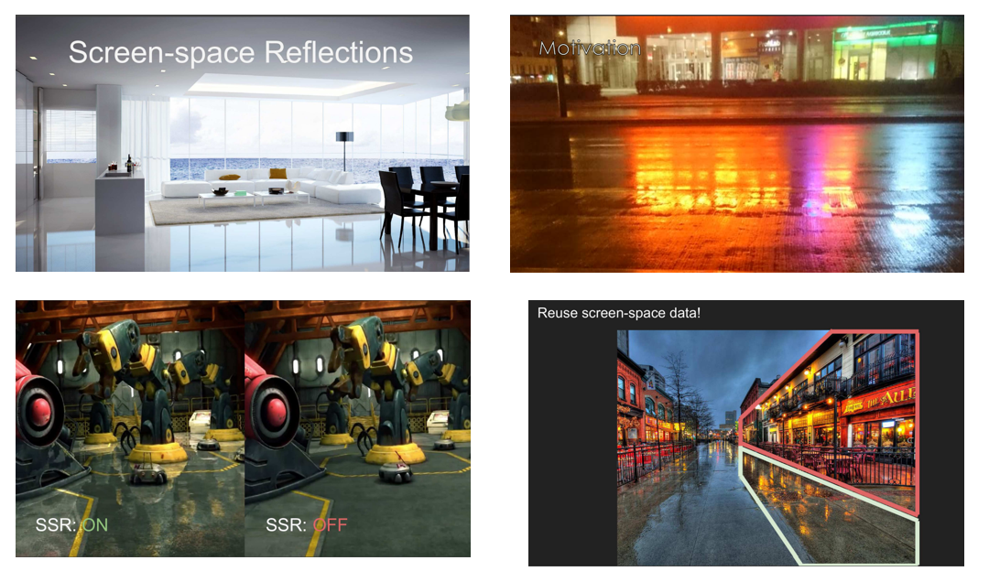

> 看右下角那幅图，白框里反射的是红框内的场景信息,也就是说我们并不需要3D场景的什么信息,而是从屏幕空间里已有的信息得到,也就是**反射的绝大多数信息是屏幕内已有的信息，这就是屏幕空间反射的核心思路。**


### （2）基本的SSR算法——Specular

假设场景中已经渲染出来了下图上面的部分，对于地面还没有进行渲染，如何把反射的信息加进去？

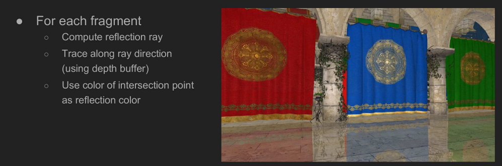

对于任何一个像素：

- 知道shading point的观察方向后，可以得出其反射方向；
- 从Shading point点沿着反射方向延长找到与屏幕的“壳”的交点（使用depth buffer）；
- 将交点的颜色作为反射的颜色记录到shading point中。


### （3）Glossy的做法

SSR除了可以做specular反射，**还可以做glossy反射**。


如果说specular反射只需要反射一个方向的话，那么对于一定粗糙度的材质来说，我们要根据其BRDF的Lobe来考虑：如果lobe比较细，则需要很少的光线，如果lobe比较越大，像diffuse那种的话我们需要射出很多根光线。这样即使是地面凹凸不平，也就是在地面的各法线方向不一致的情况下，仍然可以得到反射的结果。

**也就是说，在知道几何和法线信息后，SSR可以做任何的光线追踪。**


### （4）SSR思路总结

总结一下SSR的思路。

**specular反射:**

- 我们有一个还没有进行反射的场景，如shaded scene上的地面还并没有得到反射的结果；
- 得到图中的normal信息和深度信息；
- 进行SSR，我们想要的是对于地面的每一个pixel，我们都想计算出其反射到场景中的得到的值是多少；
- 得到反射的值后，将结果加到场景中去，也就是在地面上的黄点反射到场景的壳上的绿色，进行求交算到的结果加入到黄点中；
- 得到一个镜面反射的效果；

现在有一个问题，**如何计算追踪的反射的光线与场景的交点？**


### （5）Linear Raymarch

**这是一种简单的求解光线与场景物体求交的方法。**

如下图，黄色是shading point，虚线是反射光。假设camera在右边。


我们是为了找到反射光与场景“壳”的交点：

- （1）沿着反射方向以一个固定的步长逐步前进，并将每次前进后的深度与场景记录的深度进行比较：如果浅于场景深度，则继续前进；更深的话则停止求交,也就是我们用**深度**来进行**可见性判断**；
- （2）Linear Raymarch的质量取决于步长的大小，步长小越精准，同时计算量也越大，因此步长太大太小都不行。注意在没有SDF的情况下，步长只能是一个定值。

由于步长是由我们来决定的，太长太短都有其各自的问题，因此我们引入另一种**动态决定步长**的方法。


### （6）Hierachical Ray Trace


可以看到右边那条红色的箭头指的是反射光。我们认为一个像素是一格，此时在只trace一根反射光线的情况下，如果按一格一格的走，每一个fragment shader都要做深度比较，那么八格就是八次，很浪费时间。而且在这个图上，我们就算第一次走四格都不会与物体相交。**因此一个好的优化方法是快速知道一次可以往前走多少格的信息。**

为了能得到这个信息我们需要做一个准备工作，把场景的深度图做一个mip-map，但这个跟平常的mip-map不一样：


**高一级的Mipmap存的并不是周围四个像素的深度平均，而是四个像素中深度的最小值。**（可以想到，对深度图直接取区域平均做mipmap并不是make sense的，所以这里取最小深度。）


#### （a）为什么要做深度图mipmap？

- 在3D空间做光线追踪时，为了加速光线与场景求交，我们通常会做一个加速的层次结构（BVH/KD-tree）；

- 在屏幕空间同样做一个类似加速结构，可以快速跳过不可能相交的像素；

- 如果用最小值操作的mip-map会得到一个保守逻辑：
  - **如果一根光线与mip-map中的上层结点不相交，那他肯定也不会与这个结点的子节点相交。**


> 在上图中，mip-map是一个2维的东西，这里先用1维的表示，一个格子表示一个像素，一共有八个格子。
>
> - level 0：每格进行一次判断；Level 1:每两格进行一次判断；level 2：每四格进行一次判断。

伪代码如下：

```c++
level = 0;
while(level > -1){
    step through current cell;
    if(above Z plane) ++level;
    if(below Z plane) --level;
}
```

举一个实际的例子：


（4）步之后发现还有交点，接下来的步骤如下：


**停下来的两个条件**：

- 找到了交点
- 一直没找到交点


#### （b）深度mipmap的问题

Mipmap可以做范围查询，可以做正方形查询，但是**做不了准确的起点不在2的K次方上的深度的查询**，比如下图：


比如粉色框里的最小深度，因为起点并不在2的k次方，因此硬要算的话就要在两层mipmap中算出最小深度，然后插值得到框内的最小深度。


### （7）SSR的问题

先来回顾一下：

- 由于我们不知道以一个多长的固定步长来逐步前进求与场景的交点，因此先用分级的深度Mipmap存周围像素中深度的最小值来动态的决定步长，从而可以快速的求任何光线与场景壳的交点。

SSR仍然有屏幕遮挡的问题：


> 不在屏幕中这层“壳”的信息是不会被反射的，丢失正常的反射信息。我们可以看到手指那边得到了一个错误的结果。这就是SSR的问题。其只会反射出camera所能看到的。

另外还有一个问题就是屏幕边缘信息的缺失问题：


> 如上面那张图的红色框部分，由于其反射光会打到”屏幕外面“，因此无法得知其反射光的信息，就会出现信息缺失的问题。**工业界的常见方案是做一个Fading**，可以根据反射光走的距离做一个衰减，减少违和感，如上面右下角那幅图。


### （8）SSR如何做Shading？

**至此我们完成了屏幕空间光线追踪的部分，但是还没整理如何计算shading。**

- 这部分**与路径追踪的方法完全相同**，仅仅是把光线与场景求交变成了光线与“壳”求交，因此路径追踪的算法在这里是可以直接使用的。
- 对于任何一个shading point，看到的radicance就是对半球进行积分。如果是specular的物体，那么相当于光线打到物体的哪里，就用它所发出的radiance就可以。


如果是glossy情况下，同样的用蒙特卡洛多采样几根光线，此时打到的物体反射过来的radiance，一定就是shading point点接收到的incident radiance。

**这里我们同样需要假设反射物/次级光源是Diffuse的情况，而地板之类的接收物可以是任何材质的物体。**


问题：

- （1）是否存在平方反比衰减的问题？
  - 不存在，这里做的是BRDF sampling，并不是某个指定次级光源到shading point，因此并不存在平方反比衰减的情况。
- （2）是否能够处理好次级光源与shading point的可见性的问题？
  - 由于是路径追踪Tracing计算出来的，看到的一定是能够看见的，因此是没有这个问题的。


> 屏幕空间反射中的自然特殊现象:
> 由于结果是tracing出来的，因此很多现象是自然就能做到的，并不用做trick，类似很多模糊等现象可以直接实现。
>
> 
>
> 


### （9）一些优化策略

- （a）实际上对于glossy的lobe，并不需要均匀的随机采样，只要有正确的PDF能够拟合这个lobe就行，更多倾向于选择lobe中间的即可。
- （b）空间上的hit point的复用：


如上图， 本来地面上左侧的点trace出的光线是从左往右数第一根光线，地面上右侧的点trace出的光线是从右往左数第一根光线。使用一些BRDF变换的方法可以得到hit point点对其他shade point的贡献值，就好像**hitpoint得到了复用。这里的技术上是比较高深的，可能要在离线渲染再做补充了。**

- （c）类似于Split Sum的思路，做一个Prefiltering。这样在Prefilter之后的结果沿着镜面反射方向做一次sample，得到的结果就好像是glossy的采样结果。不过这里肯定不能是简单对深度图做一个滤波（**之前说了直接对深度图做滤波没有意义**），而是可能用类似联合双边滤波这种去做的。**todo：后面知道怎么做了再补充吧。**


### （10）SSR优缺点总结

优点：

- 可以很快的做glossy与specular的反射；
- 质量很好；
- 没有spikes（todo：这个不知道是什么artifact）与遮蔽的问题；

缺点：

- 在Diffuse 物体上并不是非常高效；
- 丢失屏幕外的信息。但这个是屏幕空间的局限性，而不是光线追踪的问题；


# Lecture 10 Real-Time Physically-Based Materials (surface models)

这一章的内容有：

- **Microfacet BRDF(**微表面模型)
- **Disney Principled BRDF**


## 1.Real time physically-based materials

我们首先来看一下Physically-Based Rendering的字面意思：**基于物理的渲染。**

- 渲染内的任何话题都应在PBR范围之内；
  - 例如材质(materials)、光照(lighting)、相机(camera)、光线传播(light transport)等等
- 因此PBR在概念上来说不只限制在材质上，但是在RTR中我们提到PBR指的就是PBR材质。

实时渲染在材质方面的丰富程度要远远落后于离线渲染：

- 一方面是**种类**，例如离线渲染中artist可以找出几百种材质，而在RTR中则有十几种，因为要考虑到速度和研究透彻的程度；
- 另一方面是**准确度/质量**比起离线渲染较差，因为为了让这种材质快速的被渲染，我们需要牺牲较大的质量效果。比如：毛发的渲染。毛发由于它的超级复杂性，一是毛发根数众多，如果模拟每根毛发的light transport那将是一个巨大的计算量，会拖慢渲染速度；**实时渲染是在保证速度的前提下，尽可能的提升质量。(RTR中速度是首要！)**
- "PB”在实时渲染中由于做了大量的简化来保证速度，因此严格来说基本都不是基于物理(Physically-Based)的；


### （1）实时渲染中的材质分类

#### （a）基于物体表面上定义的材质（绝大多数材质）

**基于物体表面又分为两种：**

- Microfacet models微表面模型（有时候并不是完全基于物理的）；
- Disney Principled BRDF计算量比较轻量级，虽然产生初衷是为了能够用于离线渲染，但也可以运用在实时渲染中。这套材质种类多，效果也很不错，不过也不是非常严格的PBR，是基于artist的角度来考虑的。


#### （b）基于体积上定义的材质

由于光线会进入到云、烟、雾、皮肤、头发等体积里，在RTR中基于体积上要比基于表面的困难许多，我们大部分考虑的还是光线在这些体积中作用一次(single)和多次(multiple)的分离考虑方法，这个放在后面再去学习吧。


总的来说RTR中的材质：

- 对于PBR材质来说，在RTR中并没有什么新理论，我们所用的都是离线渲染中仍在使用的，但是放在RTR中就会变得开销巨大；
- 因此在RTR中我们更多的是考虑用来解决问题的Hacks方法。还是那句话，RTR中速度是首要的，我们要在保证速度的前提下去尽可能提高渲染质量；


## 2.Microfacet BRDF

首先回顾一下Games101中的Microfacet BRDF的知识点：


> 什么是微表面BRDF?
>
> 我们认为在宏观上看上去是平的，但是在微观上看去会看到各种各样的微表面，这些微表面的朝向，也就是法线各不相同。这些微表面法线的分布导致的渲染出的结果各不相同。
>
> 微表面BRDF中有几个至关重要的项：


### （1）菲涅尔项

**F项：菲涅尔项**，表示观察角度与反射的关系(从一个角度看去会有多少的能量被反射)

有多少能量被反射取决于入射光的角度，当入射方向接近grazing angle掠射角度的时候，光线是被反射的最多的，也就是当你的入射方向与法线几乎垂直时候，反射的radiance是最多的。

由于光路的可逆性，我们可以认为眼睛看过去的方向是光线入射方向。

> **菲涅尔项告诉我们有百分之多少的能量会被反射出来。**这里导体和绝缘体是不同的曲线（详见Games101的笔记），导体会有一定的反常现象。
>
> 菲涅尔项的推导时要考虑光线的S极化和P极化效果，公式比较复杂,因为要考虑不同介质,如从空气到物体表面,各自的折射率和入射角折射角，最终推导出下图中的公式：
>
> 
>
> RTR中通常考虑上图红框里的近似公式：
>
> - 当θ->90度,cosθ=0,则R(θ)=1;
> - 当θ->0度,cosθ=1,则R(θ)=R0;
>
> 其中R0(基础反射率)取决于物体,不同物体的R0各不相同.


### （2）Normal Distribution Function (NDF)

决定这一项的是不同微表面朝向的法线分布。当朝向比较集中的时候会得到Glossy的结果，如果朝向特别集中指向时认为是specular的。当分布杂乱无章的时候，认为表面也非常复杂，得到的结果也就类似diffuse的。

当NDF变得十分复杂时，我们可以这么理解：从glossy变为diffuse的过程，可以认为是把glossy物体微观的高度场拉大的过程，这样会导致微观上的表面们变得倾斜(做了一个scale)，从而让其之间的沟壑变深且法线分布朝向被改变，如下图：


- 我们把为表面法线分布的函数定义为Normal Distribution Function（NDF)；
- 有很多不同的模型来描述法线分布：
  - 常用的Beckmann，GGX等等模型；
  - 闫神自己的一系列模型(2014,2016,2018)；

接下来主要介绍Beckmann和GGX这两个NDF函数。


#### （a）Backmann NDF

其目的为了描述法线分布，因此肯定是一个关于法线方向h的函数，而h是半球上的任意一个方向，然后描述这一方向对应的值是多少，这就是NDF。

举个例子，给定向量h，如果我们的微平面中有35%与向量ℎ取向一致，则法线分布函数或者说NDF将会返回0.35。

我们来深入理解一下这个函数:

- 这个函数可以描述不同粗糙程度的表面，不同粗糙程度的意思是NDF中lobe是集中在一个点上，还是分布的比较开。

我们想一下高斯函数中用$\sigma$来控制胖瘦,也就是标准差,同样对应到D(h)中有：

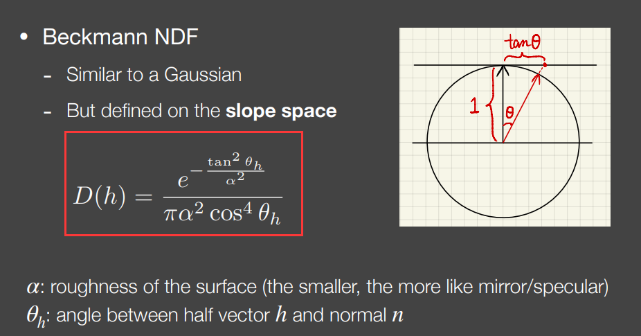

- $\alpha$描述的是法线粗糙程度，粗糙程度这个值越小，表面就越光滑；
- $θ_h$：微表面半程向量法线与宏观表面法线方向n的夹角;

到现在为止发现定义只与*θ*有关，与*φ*无关，**因此表述的是各向同性的结果，也就是沿着中心旋转是相同的结果。**

> **Q：分子上面为什么用$tanθ_h$，而不直接用$θ_h$？**
>
> A：
>
> 因为是定义在Slope space 坡度空间上的，见上图右侧的图。
>
> tanθ与$θ_h$ 关系如上图右侧所示，一维中tan*θ*就是法线延长到切线的交点到宏观法线顶端的距离，二维中则是与切表面的交点到宏观法线顶端的距离。
>
> 由于高斯函数的定义域是非常大的，但在过了3σ之后会缩减到非常小但不是0，为了满足这一性质将其**定义在坡度空间**，此时即使距离非常远（tanθ极大），但是一定对应着单位球（圆）上一个有限的角度，从而保证在slope space中无论如何也不会出现面朝下的微表面。


#### （b）GGX模型（TR模型）

GGX模型与Backmann的NDF模型相比有一个明显的优点：**长尾性质。**

> 会很快衰减，但是衰减到一定程度的时候衰减速度会变慢，可以看到即使到了grazing angle(90度)时仍不为0。
>
> 这会带来两个好处：
>
> 1. Beckmann的高光会逐渐消失,而GGX的高光会减少而不会消失,这就意味着高光的周围我们看到一种光晕的现象；
> 2. GGX除了高光部分,其余部分会像Diffuse的感觉；


Beckmann模型与GGX模型的实际效果对比如下图。

- 相同的粗糙程度下GGX的效果更加自然,因为long tail性质导致高光到非高光有一个柔和的过渡状态,而非Beckmann的高光到达grazing angle后戛然而止,我们希望的是像GGX一样更加好的效果。


#### （c）GGX模型的扩展

GTR（Generalized Trowbridge-Reitz），多了参数γ，根据γ不同可以调节拖尾长度；

- 包括了本身GGX，当γ=2时候就是GGX，当γ超过10会接近Beckmann；
- 具有更长的拖尾。


### （3）G项：Shadowing-Masking

Shadowing-Masking有另外一个名称，即Geometry Term，这也是缩写为G的原因。解决的问题就是微表面之间的自遮挡问题，尤其是在角度接近grazing angle时。如下图：


如图，由于在微观上有不同的微表面，因此虚线部分本该入射的光被遮挡了。由于光线时可逆的，因此不只是看过去被遮挡，往外看时也被遮挡。

分为两种情况:

- 左边这中从light出发发生的微表面遮挡现象叫做Shadowing；
- 右边这种从达到eye的过程中发生的微表面遮挡现象被称为Masking；

我们之所以引入G项就是为了考虑由于遮挡产生的darkening现象，在接近grazing angle时遮挡现象最大，G项接近于0，垂直看向表面时无遮挡，G项是1。

> 为什么引入G项是很重要的？
>
> 考虑Microfacet BRDF的公式：
>
> 
>
> 当视角方向与法线几乎垂直的时候，BRDF的分母会变成0，此时如果没有G项那么算出的BRDF值会非常大，造成边缘发白的现象。因此需要引入G项来规避这个问题。


#### （a）Smith Shadowing-Masking项

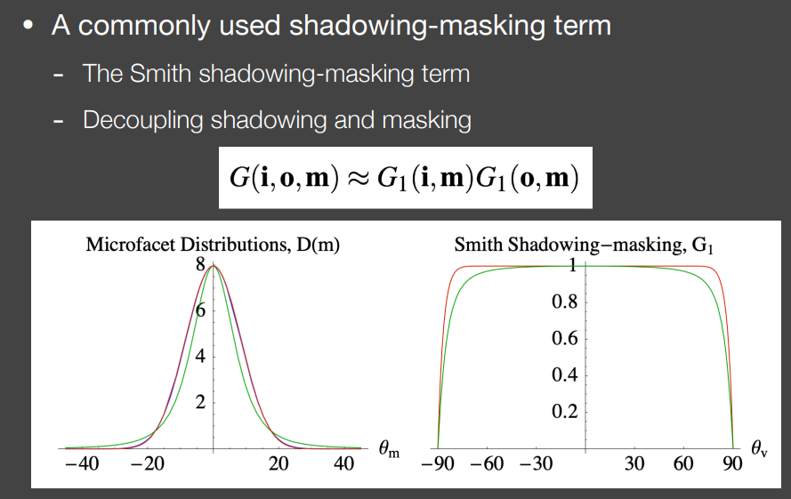

在The Smith Shadowing-Masking中，把shadowing和masking分开考虑，如上图当中的公式。上图中绿线是GGX，红线是Beckmann。

- 在两种不同NDF下预测出的G项有一些细微差别，但其实相差不大。
- 垂直入射的时候Shadowing-Masking不起作用，在grazing angle时，G项变得非常小接近于0，从而我们解决了分子除以分母导致函数结果过大，整体发白的问题。


### （4）此时存在的问题

即使正确考虑了前面的DFG三项，渲染得到的结果还是有一些问题的：


在这个图中没有发现任何grazing angle的问题，但是随着粗糙程度变大，渲染得到的结果却越来越暗。即使认为最左边是抛光，最右边的是哑光，这个结果也是错误的，因为再怎么哑光也不能让白金变成跟石头一样的效果。

上图下侧是在uniform的环境光照下得到的结果，可以看到正常来说即使物体再粗糙我们再这样的光照下得到的结果也应该都是接近于背景的一个颜色，而上图的结果显然**能量不守恒**。

> 原因：
>
> 这是因为由于没有考虑光线在表面上的多次弹射，只考虑了微表面遮挡的情况，当粗糙度越来越大的时候，能量是不守恒的，因此才导致了粗糙度增大引起了能量损失这一现象。
>
> 当表面越粗糙的时候，反射光更容易会被表面挡住，同时越粗糙的表面在表面之间弹射的次数越多（此时粗糙表面应该更亮），此时当只考虑一次弹射的时候，越粗糙的表面损失的能量就会越多，就会产生上图这个现象。

**因此我们需要把丢失的能量补回去。**

在离线渲染中，我们去考虑多次bounce，在微表面做一个类似光线追踪的东西，结果准确但速度很慢，这种是没有办法用在RTR当中的。在RTR中有自己的方法去补足丢失的能量，**其核心思路是将**反射光看作两种情况：

- 当不被遮挡的时候，这些光就会被看到；
- 当反射光被微表面遮挡的时候，认为这些被挡住的光将进行后续的弹射，直到能被看到；


工业界中使用的解决方法是 **Kulla-Conty Approximation**。


## 3.Kulla-Conty Approximation

> 作者的原PPT有更多的介绍，详情可以参考[Revisiting Physically Based Shading at Imageworks (fpsunflower.github.io)](https://fpsunflower.github.io/ckulla/data/s2017_pbs_imageworks_slides_v2.pdf)，这里就先整理Games202课堂上讲解的内容。

这种方法是通过经验去补全多次反射丢失的能量，其实是创建一个模拟多次反射表面反射的附加BRDF波瓣，利用这个BRDF算出消失的能量作为能量补偿项（Energy Compensation Term），需要考虑两件事：

1. **在反射时有多少能量丢失了？**
2. **最后反射出的能量有多少?**

首先先来算**最后反射出了多少的能量**：

下面的式子是把BRDF（这里的BRDF指的是考虑了Shadowing-Masking的BRDF）、Lighting、cos在一起在整个半球上进行了积分，来计算射出的总能量：


**这里非常复杂：**

- 我们认为任何方向入射的Radiance是1，也就是rendering equation中的Lighting项是1（因为是1所以式子中没有出现）；
- 同样假设BRDF是各向同性的，也就是与i、o无关的；
- 因此最终积分的结果意义是，在uniform的lighting=1的情况下，在经历了1 bounce之后射出的总能量 $E(\mu_o)$；

> 补充一下推导这个式子的过程：
>
> 

由于得到的射出的总能量$E(\mu_o)$是在0-1之间的，因此可知：

- 有多少能量被遮挡就是$1-E(\mu_o)$；
- 不同方向积分出来的值是不同的，因此如果不同观察方向损失的能量$1-E(\mu_o)$可以求出来，就只需要加上这一部分能量就解决问题了。

所以**核心的目标就是拟合一个BRDF项，使得其积分出来的结果正好是损失的能量，也就是$1-E(\mu_o)$。**

由于BRDF的可逆性，因此除了考虑o方向，还要考虑i方向（也就是要考虑入射丢失的和出射丢失的），同时要乘一个归一化的量c（可以是常量或函数）得出一个BRDF也就是：
$$
c(1-E(\mu_i))(1-E(\mu_o))
$$
这个BRDF其实也可能可以构造成别的形式，不过Kulla-Conty这里考虑了对称性之后是这么构造的（毕竟这么构造比较简单）。通过这个BRDF积分后得到的结果要等于消失的能量，即$1-E(\mu_o)$。

经过一番推导，结果如下：


因此上图求解出来的$f_{ms}(\mu_o, \mu_i)$就是我们要求解出的BRDF。不过目前还有一个问题，就是**$E_{avg}$很难求解，因为其中$E(μ)$已经是一个二重积分了，计算是非常困难的，因此计算仍然比较复杂。**但是对于一个很复杂的、不一定有解析解的积分可以通过预计算或打表格的方式来解决。由于考虑到存储的开销，对于这个积分，维度不能太高，这就取决于这个积分依赖的参数。

原PPT中有一页是这样论述的：


作者根据$μ_0$和粗糙度打出一张表格:


> 这一部分还是挺难的，如果后面有需求、时间或者兴趣，可以更细致地看一下原PPT和论文。

最终得到的效果还是不错的：


### （1）单次反射的BRDF有颜色怎么办？

- 有颜色就意味着，物体发生了能量吸收的情况，也就是有额外能量损失，也就是单次反射的积分结果不是1；
- 因此我们可以先考虑没有颜色的情况，然后再去考虑他的颜色是什么。

此时令$F_{avg}$是平均菲涅尔项。目标是计算出**不管入射角多大，平均每次反射会有多少能量反射**。因此平均菲涅尔项的计算就是计算在所有角度下，菲涅尔项的平均值。


之前的$E(\mu_o)$是固定方向上看，整个出去的能量是多少，也就是说这些能量是不会参与到后续多次的反射中的，因此在后续需要的能参与到后续bounce的是$1-E(\mu_o)$。此时就可以将能量分成很多种类型：


把0次到k次弹射的结果相加后，能够得到一个无穷级数，最终得到的就是上图黑框里的式子。这个颜色项需要直接乘进没有颜色的BRDF中从而得到有颜色的时候除去吸收能量外应该补足的能量。

作者的原PPT中是这样叙述的：


增加了颜色项后的结果如下图所示。


## 4.吐槽错误的hack


# Lecture 11 Real-Time Physically-Based Materials(surface models cont.)

## 1.LTC(**Linearly Transformed Cosines**)

LTC是为了解决microfacet models的shading问题，但是它有一些限制 :

- 主要是针对GGX模型，不过对于其他模型原理也算适用；
- 做的是不考虑shadow的shading；
- 光源是多边形光源，且发出的radiance是uniform的。

简言之，**LTC就是在多边形光源的照射下快速求出在GGX模型上不考虑shadow的任意一点的Shading。**

LTC是在多边形光源照射下求出微表面模型上一点的shading值。


> 如果没有LTC这个方法，就如上图所示，我们需要在多边形光源上取很多采样点，并且与shading point连线。
>
> - 如果不考虑shadow的话就不用考虑连线是否与场景有交点；
> - 如果需要考虑shadow还需要做一下shadow test。
>
> 此时不论如何都需要采样，那么不可避免地会使速度变慢，因此为了不采样产生了LTC这个方法。

回忆一下split sum方法，split sum做的是环境光下的shading，而LTC做的则是多边形光源下的shading。


### （1）方法

**核心思路：**

（a）在固定入射方向后，我们将出射的lobe(brdf的lobe)转变为一个余弦函数。**球面的所有方向**经过这个**线性变换**后使得brdf的lobe朝向向上。


左边我们固定了入射方向，知道了反射方向的lobe。通过一个线性变换，我们将lobe内的所有朝向转变为右图中，其朝向向上的范围，并且它的覆盖是从正中间是最大值，依次向周围衰减，也就是像余弦函数一样。


（b）**在转换BRDF的lobe时，将多边形光源也进行变换。**

以图的四边形光源为例，将四边形光源的四个顶点与shading point相连得到四个方向(向量)，让这四个向量也进行相同的线性变换，从而形成新的四边形光源，此时我们发现：原光源与BRDF结合去照亮shading point = 新光源与cos函数结合去照亮shading point。


（c）**于是就将shading point点任意BRDF的lobe在任意多边形光源下积分求shading的问题转变为在一个固定cos函数下对任意的多边形光源积分求shading的问题。**

我们要积分的东西是cos函数，积分的范围虽然各不相同，但可以保证这个范围是一个多边形，而且在这个范围内积分是有解析解的，因此可以帮助我们快速求出shading。


> 原paper认为是任意一个cos lobe可以变换为BRDF的lobe，因此BRDF变为cos函数则需要的是逆矩阵。

我们需要：

- 把任意BRDF的lobe变为固定的cos lobe
- 需要对所有的方向ωi进行变换，变为新的ωi，从而使得BRDF的lobe变为固定的cos；
- 原本的多边形光源所覆盖的方向也需要进行变换，从而产生新的多边形光源覆盖的区域，然后我们再新的区域内对cos函数进行积分求出shading值。

接下来进行简易的推导。**先从渲染方程开始：**


> 由于我们认为多边形光源内的任意radiance都是uinform的，因此lighting项可以拆出来。我们把剩下的BRDF和cosθ合在一起记作$F(ω_i)$,我们需要把$F(ω_i)$通过某种线性变换把所有的ωi变为新的方向ωi',从而使$F(ω_i)$的形状变成cos函数。
>
> 上图右上角的公式意义在于：假设在单位球面上有一点我们经过了线性变换后，新的点可能不在单位球面上。也就是将一个方向经过单位变换后，它的长度可能会发生变化，因此如果像仍然让他是一个方向就需要进行归一化处理。
>
> 由于我们是按照paper中来说的，paper中BRDF是经过M的逆变换得到的，因此新的方向ωi'经过M才是ωi.（原论文认为从cos函数转为任意BRDF的矩阵是M）。

**对于上图最后一行的推导，倒数第二行做完变量替换后会发现解不了积分，此时需要将$d\frac{Mw_i’}{||Mw_i’||}$转换为dwi',此时需要引入Jacobi项J。**从而我们得到了在P'范围内对cos的一个积分，而这个积分是有解析解的，这就是LTC方法的基本思路。

todo：这里的雅各比矩阵是个什么东西？后面看懂了回来补充吧。


可以看到LTC方法得到的结果是不错的：


## 2.Disney‘s Principled BRDF

### （1）意义

因为微表面模型是由一些问题的：

- **1.微表面模型的效果虽然很好，但是不能表示出所有的材质，比如真实材质就无法表示：**
  - 微表面模型大多都不diffuse。
  - 举个例子，有一个木头桌子，我们知道木头是diffuse的，在桌子的表面刷一层清漆，桌子就变成了多层材质:清漆 + 木头。清漆是无色的。由于清漆是平坦的，因此在光线打入时，一部分反射出去产生了高光现象，而另一部分打入内部并打到桌子上，以diffuse发散出去，因此理论上我们应该会看到高光和diffuse。这是微表面模型无法做到的，**因为微表面模型最多解释一层材质，而无法解释多层材质**。

- **2.微表面模型对艺术家来说并不好用。**
  - 我们知道PBR都是基于物理的。以金属反射率来说，金属反射率是一个复数 n - ik，这里要么理解成n - ik，要么理解成反射率由n和k这两个参数定义。对于物理学家来说，他们知道如何去选择n和k的范围，但是对于artist来说，这种不知道是什么的参数是灾难性的。

因此除了PBR材质，还有artist friendly材质，他的代表就是Disney's principled BRDF。

- Disney's principle BRDF诞生的首要目的就是为了让artist使用方便，因此它并不要求在物理上完全正确。
- 但是在RTR中我们认为Disney's principle BRDF也算是PBR材质。


### （2）重要的设计原则


> 暂时不会总结任何关于的公式，因为很复杂，而且有开放的源码，如果有兴趣的可以去深入了解一下。[wdas/brdf: BRDF Explorer (github.com)](https://github.com/wdas/brdf/tree/main)，可能是这个，不确定。


### （3）如何运作？


以下针对上图的每个参数进行简要介绍：

- （1）subsurface：次表面反射，为了在BRDF中给出一种比diffuse还要平的效果，可以看出当subsurface为1时与0相比像是被压扁了一样；
- （2）metallic：金属度，顾名思义看起来像金属的程度；
- （3）specular：控制有多少镜面反射的内容，0为完全没有镜面反射内容，即diffuse；1则表示全是镜面反射内容；
- （4）SpecularTint：镜面反射出的颜色无色(为0)，还是偏向于自己物体本身的颜色(1)；
- （5）roughness：粗糙度，为0表示全是镜面反射，为1表示没有镜面反射；
- （6）anisotropic：各向异性程度，当为1的时候会有一种像是被刷过一样的效果；
- （7）sheen：可以理解为，在物体表面法线方向上长了绒毛，这让在grazing angle(外圈)处看起来有一种雾化的感觉；
- （8）sheenTint：绒毛造成的雾化效果颜色是无色，还是偏向物体本身的颜色；
- （9）clearcoat：透明层的明显程度，0时表示没有透明层，1则表示有一层透明层(涂了一层清漆)；
- （10）clearcoatGloss：透明层的光泽层度，为0就像被磨砂了一样，为1则表示完全光滑。

所有的属性可以混合在一起使用。


### （4）优缺点

**Disney's principle BRDF的优点：**

- 1.容易理解和使用各参数(属性)
- 2.参数的混合组合使得可以在一个模型上显示出很多不同的材质.
- 3.开源

**Disney's principle BRDF的缺点:**

- 1.并不是完全基于物理的
- 2.巨大的参数空间使得拥有强大的表示能力，但是会造成冗余现象；


## 3.NPR渲染

**NPR思路:**

**1.我们要先得到真实渲染的结果**

**2.通过观察，把Photorealistic变为Non-Photorealistic**


> 左上角是什么游戏？有时间了解一下。:happy:

NPR的角色渲染也算是比较熟悉了，以下还是主要整理一下技术。


### （1）Outline Rendering

首先说明一下，平常所说的边缘指的是contours：整个人物轮廓外围的一圈。而Outline的概念范围很大，contours是outline的子集。


如图,将一个盒子细分为各种类型的"边缘"：

- 1.Boundary/border edge->物体外边界上
- 2.Crease->折痕,通常是在两个表面之间的
- 3.material->材质边界
- 4.Sihouette edge->必须是在物体外边界上且由多个面共享的；

至此知道了描边的各种类型，接下来进行描边操作。描边有两种总体做法：着色和后处理方法。


#### （a）基于法线的着色


#### （b）基于几何的描边


#### （c）基于图像的后期处理


除了在最后做图像处理，还可以对中间的深度图和法线图这种做边缘提取再结合起来。


### （2）着色

这一部分的技术感觉不用整理了，可以看看NPR角色渲染整理的文档，里面介绍的应该挺详细的。


### （3）Strokes Surface Stylization


我们知道在素描上,往往越暗的地方需要更多的涂抹,我们把它理解成小格子,越暗的地方格子越多也就是密度越大,因此我们把格子密度与明暗度联系在一起

TAMs方法是一种实现类似手绘素描风格渲染的方法，主要分为两步：

- 第一步是关于不同明暗设计不同的纹理
- 第二步是对于不同明暗的纹理设计其密度不变的mipmap，利用密度不变来保证距离远近不改变纹理的明暗,因为如果物体开始远离camera,由于纹理是贴在物体上的,由于距离越远导致图变小了,也就是密度变小了,为了让距离不影响到贴图,所以使用mipmap.

如下图所示：


### （4）总结

- NPR是一个art driven问题；
- 我们要做出什么样的效果是artist们决定的，要思考和实现的是如何做出这种效果:比如边界
- NPR做的效果好与坏，其实根本上取决于photorealistic模型，而不是后期的各种处理；


# Lecture 12 Real-Time Ray Tracing 1

一些不会提到的知识点，后面可以额外学习做补充：


## 1.RTRT(Real-Time Ray Tracing)

RTRT is the future.

我们先来介绍一下RTX：

> RTX其本质上只是硬件的提升，并不涉及任何算法部分，其本身是作为硬件上的一个突破，在显卡加装了一个用来做光追的部件。由于光线追踪做的是光线与场景的求交，结合games101我们知道光线要经历BVH或者KD-tree这种加速结构，也就是做一个树的遍历从而快速判断光线是否与三角形求交，而这部分对于GPU来说是不好做的，因此NVIDA设计了专门的硬件来帮助我们每秒可以trace更多的光线。


每秒可以trace 10 Giga的rays，也就是100亿根光线。看起来虽然多，但是要对每个像素都trace因此先要除以分辨率，比如1K或者2K，除以几千万之后得到的结果还是很多，还要除以每秒的帧数，并且又不能全部的时间都用于渲染，还有gameplay的时间，所以最后能留给实时渲染的只有**1 sample per pixel了。**（随着硬件的不断发展，可能后面可以支持多sample per pixel的情况，不过后面的内容先都是基于1 sample per pixel的）

> 1 sample per pixel就是每个像素采样一个样本，从而得到最后的光追结果。


### （1）1 sample的含义

**那么什么样本是一个光路的样本呢?**


至少要有四条光线才能构成一个最基本的光路:

- primary hitpoint(从camera出发打出一根光线打到的交点)
- shadow ray(primary hitpoint 和光源之间连接进行light sampling并判断是否有遮挡)
- secondary ray(在Hitpoint根据材质采样出一个方向打出一根光线,他会打到一个物体上从而得到secondary hitpoint)
- secondary shadow ray(从secondary hitpoint与光源连接判断是否会被光源看到)

> 补充一下第一根光线：图中的第一步是rasterization(光栅化)是因为与primary ray做的工作是一样的。与其每个pixel去trace一条primary ray，不如直接将整个场景光栅化出来，**二者是等价的**。此时对每个shading point来说所包含的只剩下了三条光线：shadow ray,secondary ray和secondary shadow ray。

path tracing是一种蒙特卡洛积分的方法，本身会产生噪声，理论上采样的样本越多，其噪声越小。但是我们在games101中用64 spp都得不到很好的结果，何况1spp，因此直接用1spp最后会得到一个很noisy的结果，如下图：


顺便可以看到，RTRT当中降噪得到的结果还是挺猛的。注意实时光线追踪与path tracing相比，只是进行了一些算法上的些简化，算法的核心思路不变，它本身的突破是由于硬件的能力提升，且1 spp是在RTX 20系列时的特点，现如今的RTX 30系列可能会支持更多的spp。

从上图中我们可以知道，即使是1spp得到的这么糟糕的结果，通过降噪我们仍然可以得到一个很棒的效果，那么接下来就需要了解如何去降噪。


**首先我们需要知道在1spp下我们想要得到的结果:**

- filter之后的quality要好(no overblur不会糊成一片,no artifacts没有像裂缝这种可见的bug,可以保留所有的细节)
- 速度(降噪的速度要快,也就是要在小于2ms内完成降噪操作)

从上面来看我们会认为这是不可能的任务，在1spp下得到一个噪声那么大的结果，既要求降噪之后质量好又要要求速度快，此时对于以前的很多学术界的方法在这不适用：

- Sheared filtering serise (SF,AAF,FSF,MAAF,...)，Sheared方法不行
- Other offline filtering methods (IPP,BM3D,APR,...)，离线方法不行
- Deep learning series(CNN,Autoencoder,...)，深度学习不行

降噪的方法有很多，但是针对实施光线追踪的降噪方法很少，那么工业界是如何解决这个问题的呢？


## 2.工业界的去噪方案


**核心方法:**

- 首先假设整个看的场景的运动是连续的，就是camera以某种轨迹看向不同的物体，帧与帧之间有大量的连续性。
- **motion vector，它是用来告诉我们物体在帧与帧之间是如何运动的，也就是图中Current frame中的某个点在motion vector下可以知道在上一帧里对应的位置；**

这里有几点说明：

- 我们认为当前帧是需要去进行filtering，前一帧时已经filtering好的；
- 利用motion vector来知道当前帧某一点在上一帧的对应位置；
- 由于我们认为场景运动是连续的，所以认为shading也是连续的，上一帧得到降噪好的结果比如颜色之类的，可以在当前帧复用，相当于增加了spp。但并不是简单的上一帧1 spp+当前帧1 spp，由于是一个递归，因此上一帧也复用了上上一帧的结果，因此累计下来的spp其实是很多的，可以理解为一个指数衰减,每一帧都有百分比贡献到下一帧；
- 这种方法叫做**时间上的复用**，通过在找某一点在不同帧上的对应关系去复用已得到的结果，至于空间上的复用会在接下来的章节进行总结。

**这里的temporal我们根据motion vector去找对应关系。**


### （1）G-Buffers


在介绍具体细节之前，先引入G-buffers。G-Buffer，全称Geometric Buffer ，译作几何缓冲区。

在screen space我们可以得到很多的信息，比如之前的screen space ray tracing我们需要知道screen space每个点的深度，相当于从camera看去我们得到了一张深度图。同样也可以得到其他的信息，比如上图的法线和albedo信息。

**总结：G-buffer之存储的只是screen space的信息。（因为其记录的是camera能看到的信息）**


### （2）Back Projection


这里的frame i指的是当前帧，frame i-1指的是上一帧。我们要寻找的内容是**当前帧像素里包含的内容在上一帧哪一个像素里，**也就是我们需要知道的是透过当前帧(frame i)中蓝点这个像素我们所得到的点的世界坐标，投影到上一帧(frame i-1)中对应的是哪个像素。

依据上述思路：

- （1）首先要求出这个点的世界坐标：
  - 如果G-buffer中有世界坐标信息的图，可以拿来直接用；
  - 没有我们可以计算得到：
    - 这里参考其他一个PPT吧（https://slides.games-cn.org/pdf/Games2021179ZhengZeng.pdf）。todo：Games 202的PPT这里是MVP矩阵的逆矩阵，但是如果是转换到**世界空间**的话理论上应该是没有M矩阵的，这里看看代码实现这种应该就知道了。
    - 

到此我们求出了这一点的世界坐标。对于他在上一帧的哪里，由于我们知道整套渲染的流程，因此对于每一帧之间是怎么移动的肯定也知道，因此如果物体移动了的话，我们只需要用将当前帧世界坐标乘以帧移动的逆矩阵就得到了上一帧中这个点的世界坐标：


到此已经计算出了发生移动后的上一帧的点的世界坐标，接着将其变回屏幕坐标上，需要乘以VP矩阵和视口矩阵，由于我们掌控着渲染的整个流程，因此每个矩阵都是已知的：


todo：**还是那个问题，如果是从世界空间求出屏幕空间的坐标，那么理论上应该不需要M矩阵，这里后面看代码再说吧。**到此我们求出了frame i上的蓝点内对应的信息在frame i-1上的哪里，也就是我们通过Back projection方法求出了motion vector。


> 看起来motion vector指的是从**当前帧的屏幕位置指向上一帧对应的屏幕位置**的向量。


### （3）Temporal Accum./Denoising

在得到了motion vector之后，就可以把当前帧(noisy的图)和上一帧(没有noisy的图)结合在一起。最简单的方法就是**线性blending在一起**，比如上一帧的结果 0.8 + 这一帧的结果 * 0.2得到新的结果。

先在此定义:

- **~** : unfiltered 表示没有filter，噪声较多的内容；
- **-** : filtered 没有噪声或者噪声比较小的；


这个是时间上的降噪，做了一个线性的blending，认为上一帧已经是降噪好了的。上图中的α指的是平衡系数，表示当前帧的贡献，值在(0.1-0.2)之间。

**也就是说，时间上的降噪过程如下：**

- （1）如果在进行rasterization(primary ray)时得到了世界坐标信息的图存储在G-buffer中则直接得到世界坐标；
  - 如果没有其信息，则在当前帧的像素通过逆视口变换和逆VP变换得到世界坐标；

- （2）已知motion矩阵，将世界坐标逆motion得到上一帧的世界坐标；

- （3）将上一帧的世界坐标进行正VP变换和视口变换得到当前帧中的像素在上一帧中的屏幕空间位置；
- （4）将两个值线性blending起来从而得到当前帧最后的结果；

**注意，滤波本身并不能让一张图变亮或者变暗。**


### （4）失败的情况

**（a）Failure case 1:switching scenes (burn-in period)**

突然切换场景的话，由于上一帧并没有新场景的任何信息，因此得到的结果肯定不准确。再比如切换光源的场景，假设在迪厅中场景中任何物体都不变换，只是将红灯忽然变为绿灯，此时由于上一帧中的信息，光源会呈现红色，因此如果复用会导致我们得到的结果偏红而不是偏绿，即Temporal的方案效果不好。

因此需要一个缓冲时间也就是burn-in period，用来累计新场景的几帧信息以供后续进行复用。


**（b）walking backwards in a hallway (screen space issue)**

假如camera从离门最近开始倒退，我在倒退的时候周围的信息会不断的增多，此时当前帧新出现的物体无法在上一帧的屏幕空间内找到相对应的点，这肯定会带来影响；


**（c）suddenly appearing background(disocclusion)**


左边为上一帧，右边为当前帧。可以看到本来箱子后的内容是被遮挡住的，但是推走后变成未被遮挡，此时我们去求箱子后遮挡部分的两帧屏幕对应位置会发现，右边的蓝点所显示的对应位置为左边的蓝点。这里是没有出错的，因为在屏幕空间确实对应的是蓝点，只是无法显示遮挡后的内容，这是屏幕空间带来的问题。此时**如果进行线性blending的话肯定会出问题**，这就是disocclusion(不遮挡)问题。

由于对上一帧的结果参考了80%及以上，所以会出现比较明显的拖尾现象。**工业界对此一般有两种解决方案：Clamping和Detection。**


**shading出现的错误**

其实大部分情况下是shading的问题。

以下面这个场景为例，光源从左到右移动，而场景几何并不发生移动。由上可知任何一个像素的motion vector是0，但是由于我们一直在复用未移动的帧结果，就会导致拖影的阴影出现。


还有其他的问题，比如**glossy reflected images**，因为是glossy的，所以motion vector可能比较难找。


### （5）工业界针对拖尾的解决方案

clamping和detection，可以分开单独使用也可以二者一起使用。

#### （a）Clamping


对于clamping方法来说，是把上一帧拉到接近当前帧的结果。以刚才的黄色箱子和白色墙壁为例：正是因为当前帧里取了80%黄色箱子的值才导致了残影的出现。这时我们只要在任何时候都把上一帧的结果，先给拉近当前帧的结果，就会使得二者之间的颜色很相似，从而弱化了这一不正确的现象吗。

> 也就是说，我们先把上一帧对应的黄色拉近到这一帧的白色结果，再做线性blending，这样得到的结果就会更接近白色。

**关于Clamping方法的进一步介绍，可以参考后面。**


#### （b）Detection


detection的思路是我们要判断是否仍要使用上一帧的结果。仍然以黄色箱子和白色墙壁为例，当做完motion vector之后，增加一步操作来判断所对应的是不是同一个物体，在工业界的渲染有时可以认为每个物体都有自己的编号，如果编号不同，认定此时motion vector就不再靠谱了。

- 因此对α进行调整，此时不再用80%或者更多了，可以认为是非0即1，0%上一帧，100%这一帧。但如果差的不是很多，可以再调整比例系数。

**注意到一个问题**，之所以引用上一帧是因为认为其没有噪声，这时如果100%相信这一帧相当于重新引入了噪声。一个解决方案是可以将当前帧的filter变大一点，让结果模糊一点但可以消除噪声的影响。


# Lecture 13 Real-Time Ray Tracing 2

在上面的章节中，我们学习到了real-time ray tracing的核心思路是降噪。虽然RTX加强了硬件从而允许我们做RTRT，但是只是1spp的path tracing（现在可能支持更多的spp了），结果是很noisy的，因此需要各种方法去增加spp或者复用从而得到更好的效果。

虽然RTRT的核心是降噪，但如果只依赖于当前帧的1spp结果去降噪的话结果仍然不是很好。因此可以通过temporal，即时间上的累积，通过motion vector找到当前帧的像素内包含的物体在上一帧的哪个像素上，从而将上一帧的结果和当前帧的结果线性blending，从而得到当前帧的最后结果。时间上的复用也有failure cases，比如:

- 突然切换场景或者光源会因为上一帧没有对应的信息从而出现错误的显示；
- 对于倒退的场景无法在上一帧找到对应的像素；
- 出现残影/拖尾现象；
- 场景不动的情况下 motion vector为0，如果shading改变会出现错误的显示；
- 对于地板上反射出场景的情况来说，由于地板是不动的，其上面的每一个像素点的motion vector为0。当我们移动物体时，地板上的投影会出现滞后现象。

**本章节聚焦于Spatial Filter和RTRT的两个具体的实现。**


## 1.Implementation of filtering

空间滤波的概念如下图所示：


可以看到得到了一个比较干净的结果。在这里使用的是低通滤波器，也就是只保留低频的信息，除掉高频的信息。随之而来的就有两个问题：

- **高频信息中就全是噪声吗？高频中不是噪声的信息被除掉会不会导致信息丢失？**

- **低频信息中就一定没有噪声吗？**

在给光线追踪由于蒙特卡洛产生的噪声降噪时，一般使用的是高斯的滤波器，其思路和算法伪代码如下：


**一些注意事项：**

- **不论是积分式还是求和式，平均写成sum_of_weighted_values/sum_of_weights是没问题的。**提到归一化，我们在之前将渲染方程中的visibility拆出来后要对visibility进行一个积分并除以一个空积分来进行归一化处理，也就是分子是一个加权的visibility求和，分母则是权的求和，即sum_of_weighted_values/sum_of_weights，道理跟上面是一样的；
- **高斯的滤波核下，sum_of_weights不会为0，但在其他的滤波核下可能会为0。**因此在进行归一化从而得到像素i最终的结果之前通常会判断sum_of_weights是否为0，如果为0则直接输出像素i的值为0；
- **像素j输入的值可能是一个多通道的值，也就是sum_of_weighted_values可以是一个多通道的值。**


## 2.Bilateral Filtering

高斯滤波的问题：通过高斯能够得到一个整体都被模糊的结果，但是我们想让边界仍然锐利，此时除了高斯需要其他的方法来帮助保留下边界的这些高频信息。

为此，引入一个新的滤波方法，即**双边滤波(Bilateral filtering)。**

根据观察**：我们将颜色变化特别剧烈的地方认为是边界。**

### （1）双边滤波的方法

根据上面的观察，一个思路是当$i$的相邻像素$j$与$i$颜色相差比较多的时候，就认为$j$的贡献比较小（因为此时认为是边界，不想让边界被模糊）。解决方案是在高斯核的基础上再加入一项：


当$I(i,j)$和$I(k,l)$的值相差较多的时候，计算出来的w值会比较小，此时贡献较小。双边滤波的结果如下图，还是不错的：


## 3.Joint Bilateral Filtering

通过上面的内容可以观察到：

- **Gaussian filtering:1 metric (distance) 高斯滤波核是通过判断两个像素之间的绝对距离来查找其需要贡献多少**
- **Bilateral filtering:2 metrics (position dist. & color dist.) 两个不同的标准，两个像素之间的距离，和颜色之间的距离从而在只保留低频信息时候保留了边界的信息。**

Bilateral filtering相当于在原本的核上加了一个新的核，那么也可以联合更多的参数来创建更多的metrics，这就是联合双边滤波的基本思想。


> 在渲染时候可以得到很多免费的信息并存储在G-buffer中，比如**世界坐标**、**法线、深度等信息。**这些信息都可以对滤波进行一个更好的指导。
>
> 更重要的是G-BUFFER有一个很好的特点: **完全没有噪声。**
>
> 因为我们在进行rasterization(所有像素的primary ray)时候，可以顺手把一些信息记录下来存到G-BUFFER中。因为只是光栅化的话不涉及多次弹射，因此不会出现噪声。

**注：**

- **联合双边滤波也不需要考虑核是不是normalize的，因为我们在代码中实现时最后会进行归一化操作；**
- **不一定必须要使用高斯，只要这个函数满足随着距离衰减，就可以使用如下图的几个例子：**


以下我们来举一个联合双边滤波的例子：


**联合双边滤波的本质就是在kernel里多算几组不同feature下的贡献，并将其相乘得到最后的结果。**


## 4.Implementing Large Filters

对于任何一个像素，需要考虑他周围N * N个像素的贡献值，加权平均之后写回这个像素上。

- 如果是small filter，比如7 * 7，我们把范围内的像素贡献值加权平均值后写回这个像素，这样做是OK的；
- 但是如果是large filter，比如64 * 64，就会使得filter变得特别慢。

因此**首要任务**就是让一个large filter的速度变快，那么该怎么去做呢？工业界有两种应用比较广泛的解决方法：

### （1）Separate Passes

现在我们先考虑2D的高斯filter，先不考虑双边和联合双边滤波。

对于任何一个像素，我们其实可以不去做一个N * N的filter。可以先将它在水平方向上filter一遍，之后再在竖直方向上filter一遍，也就是将本来一趟N * N的滤波，分成两趟来做，水平的1 * N和竖直的 N * 1。


#### （a）A deeper understanding


> 我们想要求一个像素周围一圈像素对自己的加权贡献，就相当于我们对2D函数F和高斯核在2D上进行一个卷积。由于2D高斯核可以拆分为两个1D的高斯核相乘，而这两个1D的高斯核分别与X和Y有关，因此先做对X的积分时，Y是不参与的，可以把与Y相关的先拿出去，也就是先对X积分得到X积分后的结果，再在这个结果上对Y进行积分。**这就是可以拆成Separate Passes的数学原理。**

注意，以上的Separate Passes的方法只适用于高斯滤波，而不适用于双边滤波。对于双边滤波，两个高斯相乘。X和Y不容易拆分出来。联合双边滤波要考虑的东西更多，包括深度、normal各种信息，此时拆分成X和Y的函数也是很困难的，这是因为他们的滤波核本身就很复杂。

实际上在工业界，**我们还是可以强行去用的。**只要范围不是太大，还是可以这样分成水平和竖直去做的。


### （2）Progressively Growing Sizes

同样的目的，我们不希望对于任何一个像素进行N * N次的纹理查询，因此在方法2中，是用一个逐步增大的filter：比如先用一个小的filter，然后用中号的filter，最后是大号的filter。通过多趟的filter得到N*N的filter得到的结果。

特别的，有一种方法如下：


对于任何一个像素在通过该方法进行filter时，我们通过多passes操作代替$n*n$的filter。此时我们认为第一趟是i=0,第二趟i=1，依此类推。不同趟数的$5*5$的filter中间是有间隔的，比如i=0时，每隔$2^0$，也就是1个间隔采样一个；i=1时，$2^1$，即间隔采样一个，但filter大小仍旧是5*5的。在第i趟时，样本之间的间隔是$2^i$，具体如上图所示。

> 注：感觉应该是$65^2$，是因为1（中间的黑点）+$2^4$（每个黑点间的距离）*4=65，但应该问题不大。

这样我们用了5次，每次做25个纹理查询，一共125次纹理查询，比优化之前的65*65次纹理查询要好得多。


#### （a）A deeper understanding


- Q1：为什么使用逐渐增大的filter size？
  - A1：看上面左图，用更大的filter == 除掉高频信息。可以看到，在第一趟时候，我们通过一个小范围的filter，将频谱上的高频信息，也就是蓝色区域除掉了。依次类推直到最后一趟，会逐渐除掉相对高频的信息；

- Q2：为什么可以跳过某些样本间隔采样？
  - A2：采样 = 重复的搬移频谱。第一趟filter我们将左图的高频信息也就是蓝色区域除掉之后，我们剩下的就是右边蓝色段的信息。在第二趟pass时候，我们相当于在9 * 9的filter里做了一个采样，采样出5*5的filter（相当于把右侧蓝色段的频谱不断复制粘贴）。采样的间隔对应到频谱上正好是右半图的蓝色部分，也就是在第一趟除掉高频信息后的区域的2倍(tips:频谱是左右对称的，todo：这里的2倍有依据么？还是理解一下就行)，正好是尾对着下一个频谱的首，避免了走样现象。

> 这里复习一下Games101的相关知识点：
>
> 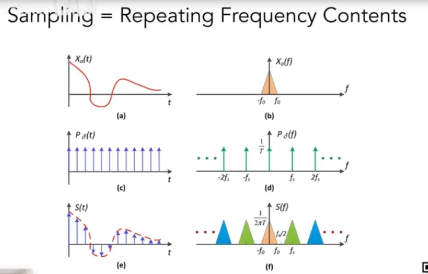
>
> 我们来复习一下，a是时域上的，如果想对a进行采样，也就是乘上一个冲激函数，从而得到了一系列离散的点，这就是采样；
>
> 通过傅里叶变换我们知道，时域上的乘积 = 频域上的卷积，而b是频域上a的频谱，d则是频域上的冲激函数（仍是一个冲激函数，只是间隔不同）。那么b和d做一个卷积我们得到了f，我们可以发现采样实际上就是在对频谱以一定的间隔做一个重复的搬移。
>
> 那么之所以会出现走样现象是因为当我们的采样比较稀疏，也就是采样点之间的间隔比较大的时候，我们知道时域和频域上很多关系是相反的，因此采样点间隔大就意味着频谱之间的间隔小，此时会产生频谱重叠的现象从而发生走样。如下图：
>
> 


## 5.Outlier Removal


只是使用滤波的话也会有问题，比如上图。平常我们在使用蒙特卡洛方法渲染一张图时，得到的结果会出现一些点过亮或者过暗，这些过亮或者过暗的点经过filter后可能会导致一整片区域变亮或者变暗。**解决方案是在filter之前处理掉这些过亮或者过暗的点。**

### （1）Outlier detection and Clamping

首先是对于这些异常点，也就是outlier的检测和修复。这里就很简单地使用如下方法：


注意，如果找到了outlier的点，就把这个点的值给**clamp到接近范围的值(也就是clamp到合理范围内)**。虽然叫做outlier removal，但是并没有直接舍弃这个像素，而是用clamp进行了处理。


## 6.补充一下Temporal Clamping


回顾一下： 

- $\widetilde{C}$：没有filter过的帧；
- $\overline{C}$：filter过之后的帧；
- $C$：noisy-free，也就是已经经历过temporal累积后的帧；

上一章中有提及，当motion vector为0导致的残影现象。当前帧与上一帧中对应的信息差异过大时，可以把上一帧中的信息值给clamp到接近当前帧的信息值，这个思想本质上与空间上的clamp是一致的。具体在操作上，当前帧在spatial filter之后，我们在对应点周围找一个很小的范围，找出他们均值和方差，仍然认为 $[\mu-k\sigma, \mu+k\sigma]$ 是有效范围。如果上一帧对应的值超出这个范围，则把他clamp到范围内，再和当前帧做线性blending，从而得到当前帧noisy-free的结果。

> temporal clamping是一个介于noisy和残影之间的tradeoff。


## 7.Specific Filtering Approaches for RTRT

### （1）SVGF（Spatiotemporal Variance-Guided Filtering）


- SVGF的方法与在时空上降噪的方法差不多；
- 但是，加了一些variance analysis和tricks；


#### （a）Joint bilateral filtering

一共有三个指导filtering的重要因素：

##### （i）Depth


分析一下上图公式当中的各个部分：

- 整体公式返回的是$e^{-x}$的形式，因此$\LARGE \frac{|z(p)-z(q)|}{\sigma_z |\bigtriangledown z(p)·(p-q)|+\epsilon}$越大，$w_z$的值越小；
-  **$\epsilon$的作用是因为我们filter时候考虑一个点Q周围所有的点P，也包括这个点Q自己。因此它是有可能为0的，为了避免分母为0的情况，以及比如两点足够接近会导致最后的数值太大问题，加上一个$\epsilon$项 **；
- $\sigma_z$是一个用来控制指数衰减的快慢的参数，或者理解为控制深度的影响大还是小；
- 关于$|\bigtriangledown z(p)·(p-q)|$，可以结合上面的例子理解（以下分析中的贡献指的是$w_z$项，下同）：
  - A和B两点在同一个平面上，颜色也相近，所以理论上A和B会贡献不少给彼此；
  - 但是由于这一面是侧向面对我们的，因此A和B是有很大深度差异的。此时如果用深度来判断A和B对彼此的贡献时候，会发现它所给出的是A和B之间不应该有特别大的贡献，这明显是不合理的。
  - 因此简单的用深度来判断贡献值是不行的。那么我们考虑A和B在平面法线方向上的深度变化，比如图中的A和B虽然在实际深度差异很大，但是在法线方向上的深度差异几乎没有，因为二者几乎在同一个平面上。深度的梯度就是往某一方向上的变化率，因此当知道A和B之间的距离之后，用 **深度梯度 X 距离 = 实际深度变化量**，就得到了这个式子：$|\bigtriangledown z(p)·(p-q)|$。**(垂直于平面法线上的变化 \* 距离 = 实际深度变化量)** 

> 如果实际深度变化量也很大，那么这个平面是侧向我们的。在这种情况下来看公式，虽然分子深度差异大，但是分母中的梯度也大，二者一除值就没那么大了，此时EXP()得到的值就大了。

总结来说，通常情况下不会简单的用二者之间的深度差异来判断贡献值，而是在他们所在的面的法线方向上投影出来的深度差异来判断，或者说是在它们所在平面上的切平面上的深度差异。

tips：平面的切平面等于平面本身。


##### （ii）Normal


我们用两个点法线向量求一个点积，由于求出来的值有可能是负值，因此使用max()把负的值给clamp到0。如果两个向量相同则点乘结果为1，点乘结果为负时则为0，点乘结果为正时则使用这个结果。

至于$\sigma_n$是用来判断点乘的这个cos函数从1到0是快还是慢，$σ_n$越大，从1到0就越快，也就可以判断法线之间的差异的严格程度。

另外，如果场景中运用了法线贴图来制造凹凸效果，我们再判断时**运用平面原本的法线**，而不是为了制造凹凸效果而改变过的法线。


##### （iii）Luminance


在考虑颜色差异时，最简单就是应用双边滤波提供的颜色差异来考虑。比如我们将RGB转换为grayscale（灰度），这种颜色我们称其为luminance。任意两点间比较颜色差异，如果颜色差异过大，则贡献值会比较小。

**不过这里可能会有一个问题**，例如B点虽然在阴影里，但是可能刚好选择的点是一个噪声，也就是其特别亮，此时A特别亮，B也特别亮，那么A和B就会互相贡献，但是这样是错误的现象。

解决这个问题，就要用到SVGF的核心思想之一——V：Variance。

> 为什么要考虑variance（方差）：我们先去看A，B两点间的颜色差异，并且思考filter的中心点的variance，当variance比较大时，我们不应该去过多的相信两点间的颜色差异。这就是为什么会去除以一个标准差。

不过又引发了新的问题，即filter中心点附近的variance如何求解才是合理的？这里给出如下的可行方案：

> - （1）在点的周围取一个7*7的区域算出区域里的variance；
> - （2）同样的操作在时间上累积下来，所谓累积也就是在时间上平均下来，它可以去找上一帧中对应点的variance，从而通过motion vector在temporal上把variance信息给filter下来。这样先spatial filter求出variance之后，再随时间平均从而得到了一个比较平滑的variance值；
> - （3）最后在使用variance时如果不放心，我们再在周围取一个3*3的区域做一次spatial filter得到variance。这就对应上图公式里面的$g_{3×3}(Var(l_i(p)))$
>
> **也就是进行 spatial filter ——> temporal filter ——> spatial filter 从而得到B点精准的variance。**


SVGF的结果总体还是不错的，但还是有一点点的噪声，并且也有无法很好处理的情况。比如当一个场景固定，我们只移动光源时候，阴影会随着光源的移动而变化，而当前帧会复用上一帧的阴影，但由于没有发生任何的几何变换，因此motion vector等于0，此时复用上一帧时会产生“残影“现象，这是SVGF无法解决的一个问题。（**其实应该挺多Temporal Denoising的方法都无法解决这个问题的。**）


### （2）RAE（**Recurrent AutoEncoder**）

RAE是指Recurrent AutoEncoder，用RAE这么一种结构对蒙特卡洛路径追踪得到的结果进行reconstruction，也就是对RTRT做一个filter从而得到一个干净的结果。

- 是一个后期处理降噪的方法，将一个noisy的图输入最后输出一张干净的图；
- 会用到一些G-buffer上的信息，因此是与noisy的图一起作为神经网络的输入；
- 神经网络会自动将temporal的结果累积起来；

之所以不使用motion vector也可以将temporal的结果累计起来是因为两个设计原则：

- （1）AutoEncoder是一个漏斗形的结构，确切的说是一个UNet，其适合去做一些图像上的各种操作；
- （2）之所以可以利用历史的信息是由于每一层神经网络是卷积神经网络，但是有一个recurrent连接，也就是每一层神经网络不仅可以连向下一层，也可以连回自己这一层。因此假设神经网络一直在跑，跑完当前帧后，会有信息遗留在神经网络里面，每一层信息又可以连向它自己，因此在跑下一帧图时候，可以用神经网络自己学出来的方法去复用上一帧遗留下的信息而不是通过motion vector。

上述两点可以通过网络结构图更好地进行理解：


### （3）比较SVGF和RAE


单纯的RAE效果可能不如SVGF，但神经网络的思想在硬件条件得到提升后还是比较有参考价值的，感觉也有一些前景。


# Lecture 14 工业界实时渲染的部分解决方案

最早temporal的思路是用来解决Anti-Aliasing的，先有TAA的巨大成功才会有RTRT里的应用，因此首先在这部分中介绍一下TAA。

## 1.TAA（Temporal Anti-Aliasing）

- 复习：为什么要做反走样？
  -  **一个像素中的样本数量不足；**
  - **终极解决方案就是用更多的样本，也就是101中的SSAA等方法；**

**Tmeporal AA的思路也是需要用更多的sample，只不过是当前帧会复用上一帧的sample，使得这一帧仍然用1SPP，但是无形中通过时间上的复用，增加了SPP。它的思路与RTRT中如何运用temporal的思路一模一样。**

Temporal AA尝试用在避免性能损失的情况近似Super Sampling AA的结果。它的做法一句话总结就是，把样本分布到过去的N帧中去，然后每一帧从过去的N帧中取得样本信息然后Filter，达到N倍Super Sampling的效果，如下图。


考虑一个静止的场景，TAA提供了一个叫Jittered sampling的方法去复用上一帧的sample，假设当前帧1我们都像图中一样将样本分布在像素的左上角，上一帧的在左下角，上上一帧在右上角，上上上一帧在右下角，我们可以认为连续的四帧之间有一个移动的pattern，他们在时间上各不相同，基本上就类似这样从1，2，3，4这样的转。

假设我们在当前帧每个像素里只有左上角黄色这个点，我们就可以复用上一帧每个像素中绿色部分这个点，由于是一个递归的过程，因此又可以复用再上一帧像素中的点，等于我们把temporal的这些样本都考虑进去了，由于我们的场景是静止的，就等于把之前各自样本的结果在一起做了一个平均。这样就好像我们在当前帧中做了一个2*2的upsampling，两个结果是很接近的。**也就是通过将前N帧内的样本点的结果加权求和，其效果与在当前帧内增加样本点的效果一样。**

> Q1：为什么不做随机点采样？
>
> A1：之所以不随机采样点是因为随机的效果不一定好，因为在temporal中可能会引入额外的高频的信息，因此使用规定好的样本点，如上图每四帧一个，这样固定样本点位置避免了分布不均匀的情况。
>
> 
>
> Q2：场景是在运动的情况下怎么办？
>
> A2：当场景是运动的情况下，原本在静止情况下我们是在一个像素里找sample的结果并复用上一帧中的样本点的结果，在运动场景中，将当前帧几何的位置通过motion vector找到上一帧中对应的位置，并复用其结果。如果temporal的信息不太可信时，使用clamping方法，也就是把上一帧的结果拉到接近当前帧的结果。**这个本质与之前上一章的去噪是类似的。**


## 2.SSAA/MSAA/SMAA

这一部分只是简要概括一下其他的一些AA算法，**具体的可以看反走样算法的相关专题。**

**首先是一个重要说明：G Buffer是绝对不能够用反走样技术的！**（主要还是反走样会有各种取平均的操作，这些在GBuffer中是没有明确意义的）

### （1）MSAA vs. SSAA

SSAA可以看作是将一个场景按照几倍的分辨率先渲染后再降采样，把几个像素的结果平均起来，思路是完全正确的，就是开销比较大。

MSAA则是在SSAA的基础上做了一个近似从而使得其效率提升开销没那么大。如果我们用4X的MSAA时，帧率不会掉的太多，但如果是SSAA，帧率会掉的十分严重。

- MSAA：an improvement on performance，假设一个像素里有四个感知样本：
  - 对于同一个primitive（几何体）中，每个样本只做一次shading，如下图，有四个sample，两个primitive。只做两次shading，第一次在三角形中的1号样本做shading，第二次在0,3,2号样本点找一个平均位置（具体策略可以看MSAA的具体实现）做shading。如果使用SSAA的话，此处需要做4次shading，所以MSAA相当于提升了效率。
  - 
  - MSAA允许进行sample reuse，这个不是时间上的reuse而是空间上的。如下图，在1和2两个像素内，在两个像素的连接处有两个采样点，这两个采样点既可以贡献给像素1也可以贡献给像素2，因此实际上等于通过reuse在6个采样点的情况下得到了8个采样点的结果，减少了采样点的数量，提升了效率：
  - 


### （2）SMAA

有一种反走样是**基于图像的**，先渲染出有锯齿的图然后通过图像处理的方法将锯齿给提取出来并替换成没有锯齿的图，这种方法叫image based anti-aliasing solution：

- 比较流行的方法叫SMAA（Enhanced subpixel morphological AA）
  - History:　FXAA——>MLAA (Morphological AA)——>SMAA


以下是一个极简化的概括，具体的后面反走样相关文档再总结吧：

> 图1可以知道，这是有锯齿的，其想要的结果应该是一条斜着的直线，图像方法会先去识别它然后通过各种匹配的方法找到它正确结果的样子，图2是MLAA的方法，从而得到它应该变成的样子，然后通过其边界在各个像素内占的百分比进行shading。


## 3.Temporal Super Resolution

- Super resolution (or super sampling) 低分辨率变成高分辨率
  - 字面理解：为了增加图像的分辨率；

DLSS就是这么一种技术，将一张低分辨率的图输入最后得到一张高分辨率的输出：

- **Source 1 (DLSS 1.0):out of nowhere / completely guessed**
  - DLSS1.0的思路是通过数据驱动的方法来做的，效果并不是很好。因为其只在当前帧中进行，不依靠temporal的累积，等于没有任何的额外信息来源。将低分辨率硬拉成高分辨率，如果不想让最后的结果模糊，必须需要一些额外的信息，DLSS1.0是通过猜测来提供额外信息的，也就是针对于每个游戏或者场景单独训练出一个神经网络，其会去学习一些常见的物体边缘从而在低分辨率拉成高分辨率之后将模糊的边缘换成不模糊的边缘，这就是DLSS1.0的思路。

- **Source 2 (DLSS 2.0):from temporal information**
  - DLSS2.0则摒弃了通过神经网络猜测的结果，而是更希望去利用temporal的信息，核心思想不在DL上了而在temporal上。DLSS2.0的核心思路在于TAA，更多的去结合上一帧的信息运用到当前帧中，仍然是temporal reuse。对于静止场景中的TAA而言，连续四帧我们使用不同的感知sample点，当前帧使用上一帧的信息就等于是变相的提升了分辨率，这样想是对的，但是DLSS2.0中要面临一些问题。
    - （1）如果有temporal failure时，我们不可以再使用clamping的方法来解决，也就是对temporal的信息利用要求更加严格。
    - （2）因为我们最终要的是一个增大了分辨率的图，如下图，分辨率提高也就是像素点增多，那么我们需要知道新增加的小的pixel的像素值是多少，如果此时只是用上一帧的结果盲目的clamping，势必会使得一些小的像素的值是根据周围的点的颜色猜测出来的，而且猜测的值很像周围的点，此时就会得到一个高分辨率的图但是很糊。总结来说由于DLSS真正的提升了分辨率，因此我们要求新产生的像素的值是要与之前有本质的不同的，否则就会得到一个糊掉的结果。


因此我们需要一个比clamping更好的复用temporal信息的方案，基本思路如上图右侧所示，左边中的蓝色代表上一帧，绿色代表当前帧，绿点是当前帧给了一个采样信号得到的值，在上一帧也就是蓝色曲线中我们可以从另一个信号采样出来值，最后我们要把二者综合在一起得出一个当前帧**增加了采样点后的值。**DLSS2.0中的神经网络没有输出任何混合后的颜色，而是**输出了如何将上一帧找到的信息和当前帧结合在一起。**

> 关于DLSS 2.0的其他细节，可以后面再整理进来。


关于DLSS 2.0的一些总结：

- An importance practical issue
  - 如果DLSS每一帧需要消耗30ms，那DLSS就太慢了，因此训练出这个网络之后要去提升inference性能，针对NVidia的硬件进行优化。但具体如何做的并不清楚。
- 其他公司的”DLSS“算法：
  - By AMD：FidelityFX Super Resolution
  - By Facebook：Neural Supersampling for Real-time Rendering [Xiao et al.]


## 4.延迟渲染

Deferred Shading是一个节省shading时间的方法，是为了让shading变得更高效更快。

- 传统的光栅化过程：
  - Triangles -> fragments -> depth test-> shade ->pixel（todo：存疑，shade和pixel是什么过程？还有应该不同管线有不同实现方式）
  - 这可能会出现每一个fragment都需要shading的情况，比如需要从远处到近处渲染时，需要将每一个fragment都进行shading；
  - 此时的复杂度为：O(#fragment * #light) 因为每一个fragment都要考虑light
- Key observation
  - 很多fragment在渲染过程中会通过depth test，但最终可能会因为被后续的fragment所覆盖而不会被看到，因此这些在过程中被shading的fragment浪费了很多的资源。
  - 那么能不能只去渲染可见的fragment呢？
- 解决思路：
  - 将场景光栅化两次。Just rasterize the scene twice
  - Pass 1: 在第一次光栅化中得到fragment之后我们不做shading，所有的fragment只对深度缓存（depth buffer）做一个更新。
  - Pass 2：由于在Pass1中我们已经写好了depth buffer并且知道了最浅深度，因此在pass2中只有深度等于最浅深度的fragment才可以通过depth test并进行shading，从而实现了只对visible fragment着色。
  - Implicitly,this is assuming rasterizing the scene is way faster than shading all unseen fragments (usually true) ——>光栅化场景的开销是小于对所有fragment着色的开销的。
  - 复杂度从O(#fragment * **#light) -----> O(#vis.frag, \*** #light)

至此我们把shading延迟到了pass2中进行，并且把fragment的数量降低到了可见的fragment的数量。

- Issue：
  - 由于依赖于depth buffer(属于G-buffer),所以pass1和pass2都无法做anti-aliasing；
  - 但是不是什么大问题，我们可以通过TAA或者是imaged based AA来解决。因此延迟渲染现在是工业界的主流操作；


## 5.Tiled Shading


Tiled shading是建立在Deferred Shading的基础之上，将屏幕分成若干个小块，比如一个小块是32 * 32，然后对每个小块单独的做shading。如上图，由于是俯视因此是个平面图，看起来是分成了若干个小条，圆圈代表的是光源的范围，每个圆代表一个光源。每个小条里面的数字是这个tile被多少个光源影响。

- Key observation

  - 可以节省每个小块要考虑的light数量。每个切出来的小块代表场景中3D的区域，并不是所有的光源都会跟这片区域相交。

  - 我们在做light sampling时知道光照强度会随着距离的平方衰减，因此面光源或点光源的覆盖范围是很小的，我们根据其随距离平方的减少找出最小值，也就是设定一个范围，光源的覆盖范围看做一个球形。因此我们在渲染时，只需要找会影响到区域的光源即可，不需要考虑所有的光源。

  - 复杂度：O(#vis.frag. * **#light)->O(#vis.frag. \*** avg #light per tile)

在此之后，又有人对其进行了一个复杂的优化。


## 6.Clustered Shading


在刚才的基础上，我们不仅将其分成若干个小块，还要在深度对其进行切片，也就是我们将整个3D空间拆分成了若干个网格。

- Key observation
  - 如果只分成若干个小块区域的话，区域内的深度范围可能会十分大，因此光源可能会对这个小块区域有贡献，但不一定会对根据深度细分后的网格有贡献。所以再划分过后我们可以发现每个网格内的光源数量更少了。
  - **Complexity:O(#vis.frag. \* avg #light per tile)->O(#vis. frag. \* avg #light per cluster)**


## 7.LoD（Level of Detail）

- **Level of Detail (LoD) is very important**
  - texture的mip-map就是一个LOD，在high level时detail少一点，但可以很快的计算出一个区域的平均值；
  - LOD的核心思路就是为了在任何计算过程中能够快速准确的找出一个正确的level去进行各种运算。
- 在工业界中运用LOD方法或者在不同情况下选用不同层级的思路称之为”cascaded方法“。
- **Example**
  - **Cascaded shadow maps**
  - **Cascaded LPV**


### （1）Cascaded Shadow Maps

我们知道在生成shadow map时我们需要给shadow map一个分辨率，当shadow map上的一个texel离camera越近，其在屏幕中所覆盖的内容越多，反之离camera越远，其所覆盖的内容越少，因此我们可以知道从camera出发看向场景，离camera远的我们可以用粗糙的shadow map。

但我们是无法拥有一个会变化的shadow map的。因此在实际操作过程中，我们通常会生成两种或以上不同分辨率的shadow map进行使用的，如下图，红色区域是一个高分辨率的shadow map，蓝色区域是覆盖范围更大但分辨率相同也就是更粗糙的shadow map。此时根据物体在场景的位置可以选用不同的shadow map,远处的就用粗糙的，近处的就用精细的。从图中也可以看到会有重叠区域，这是因为在突然切换层级时会有一个突变的artifact，为了有一个平滑的过渡，在这个区域内我们通过距离将两层shadow map的结果blend起来，从而产生平滑的过度。


### （2）Cascaded LPV

同样的，先在细小的格子上，之后随着距离的增加到大一点的格子，再远就更大，从而省去了很多的计算量。如下图所示（具体的后面再补充吧）：


### （3）其他关于LoD的内容

**Key challenge**

- 在不同层级之间的过渡是一个难点；
- Usually need some overlapping and blending near boundaries；

**Another example：geometric LoD**

- 如果有一个精细的有许多三角形的模型（高模），我们可以将其减化，减少其三角形使其变成一个低模，我们可以生成一系列的低模。
- 我们根据物体离camera的距离，来选择放什么层级的模型进去（高模还是低模），并且一个物体的不同部分也可以做不同的LOD，只需要提供一个标准，比如说这个标准是保证任何时候三角形都不会超过一个像素的大小。这样可以保证一个模型可以根据camera在哪，从而动态的告诉渲染管线需要渲染什么层级的模型或者部分。
- 但是这样会出现popping artifacts，因为transition是最困难的，如果camera推进，在推进过程中由于是突变的，会出现突然变化几何的现象，也就是popping artifacts，但是我们不用去管它，TAA可以很好的解决这个现象。
- **This is Nanite in UE5**（but of course,Nanite has way more）

**FYI（for your information，供您参考）,some(strongly) technical difficulties**

- Different places with different levels,how about cracks?
- Dynamiclly load and schedule different [levels. how](https://link.zhihu.com/?target=http%3A//levels.how) to make the best use of cache and bandwidth,etc.?
- Representing geometry using triangles or geometry textures?
- Clipping and culling for faster performance?


## 8.Global Illumination Solutions

通过这门课，我们可以学到：

- （1）Recall,when would screen space ray tracing (SSR) fail?
  - 前面的笔记对此有更详细的解释；
- （2）没有任何的GI解决方法可以将所有的情况都给解决掉，除了RTRT（实时光线追踪），因为他理论上一个是一个正确的path tracing，肯定可以解决各种情况。但是RTRT在现如今只适用于部分，如果整体都是用RTRT那么帧率自然而然会下降，因为RTRT太costly。因此工业界经常使用hybrid solutions，也就是将许多中方法结合在一起。
- （3）举个例子，一个可能可行的GI方案可能包括：
  - 选做一遍SSR，得到一个近似的GI；
  - 基于SSR上，我们对于SSR无法得到的结果，专用其他的ray tracing方法
    - 用硬件 (RTRT) or software(?)去做tracing
      - Software ray tracing：
        - **（1）近处:在任意一个shading point，在他周围的一定范围内的物体我们用一个较高分辨率或称为较高质量的SDF，SDF可以让我们在shader中快速的tracing；**
        - **（2）远处：我们则用一个稍低质量的SDF将整个场景覆盖，至此不论近处还是远处我们都可以通过SDF得到最终光照打到的结果。**
        - **（3）如果场景中有强烈的方向光源或者点光源，也就是手电筒之类的光源，我们则通过RSM来解决。**
        - （4）如果场景时diffuse的我们则通过DDGI来解决。Probes that stores irradiance in a 3D grid (Dynamic Diffuse GI, or DDGI)，todo:这里的知识点后面再去总结
      - Hardware ray tracing
        - **（5）Doesn't have to use the original geometry,but low-poly proxies**：我们没有必要去使用原始geometry，在RTRT中我们可以从任何一个shading point去trace整个场景，但是这样是没必要的，我们要算的是indirect illumination，没必要那么准确，因此我们可以用一些简化了的模型去代替原始模型从而加快trace的速度，这样RTRT就十分快了。
        - （6）Probes (RTXGI)，用RTRT的思路结合Probe的思路，叫做RTXGI。

上述四条加粗（1，2，3，5）的结合在一起就是UE5的lumen思路。

> 更多的关于UE5 Lumen和Nanite的内容可以在Games104当中的最后两节中学习。

