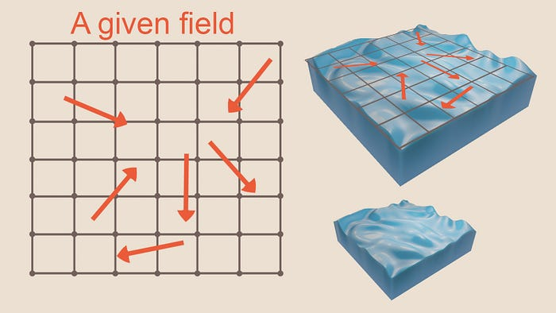
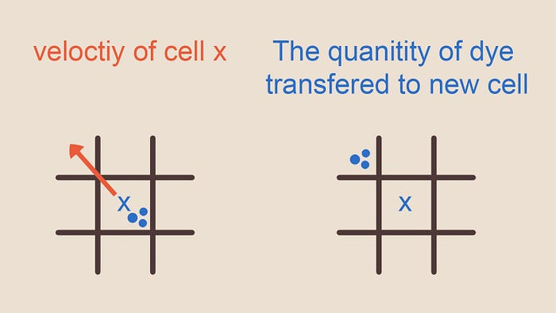
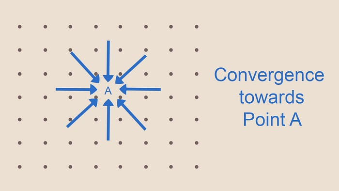
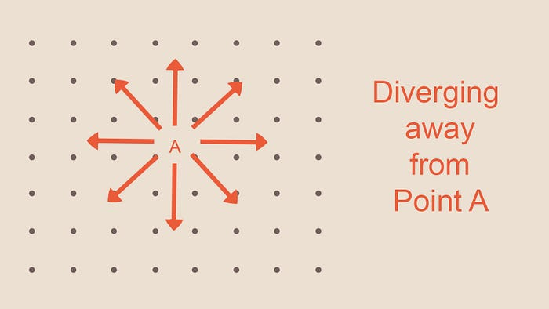
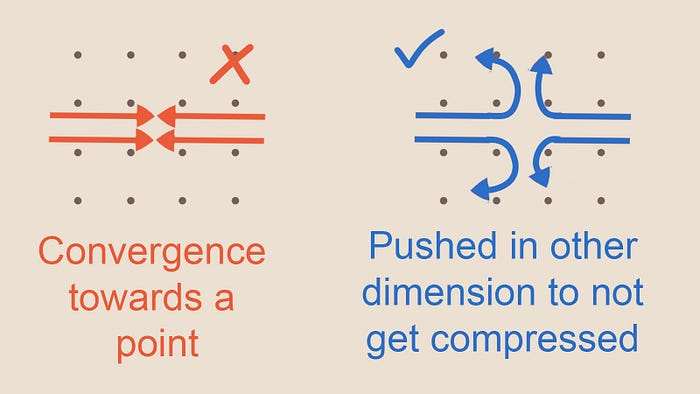
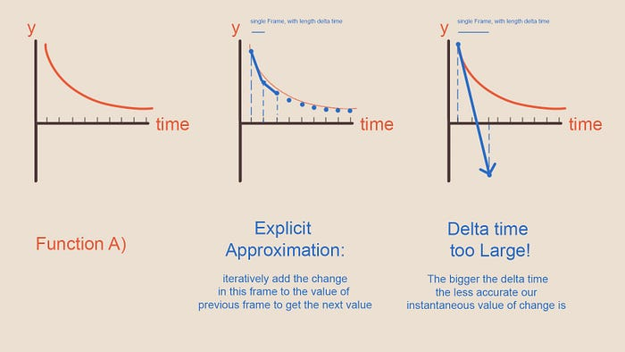
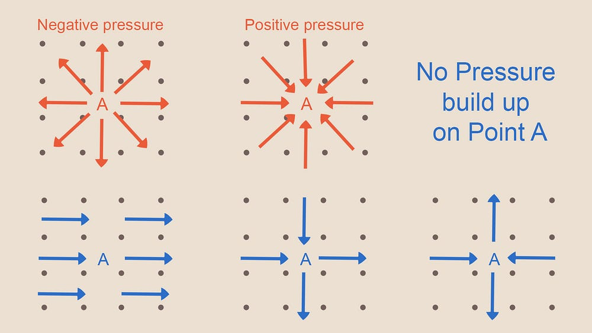
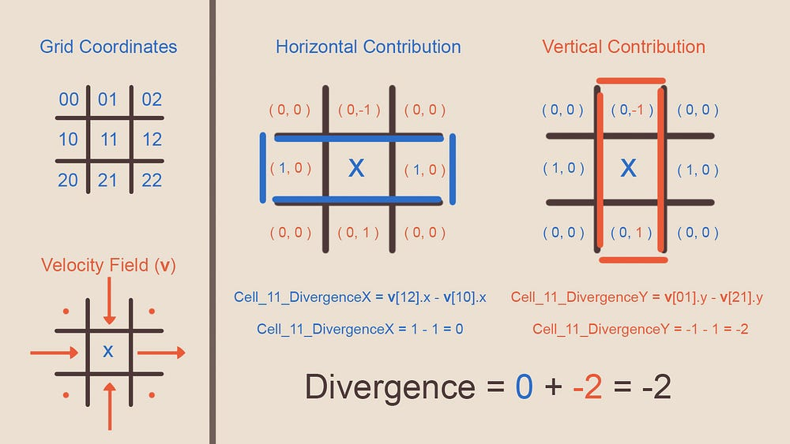
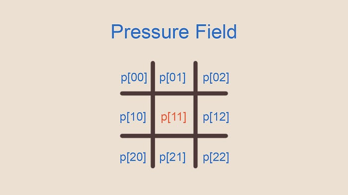
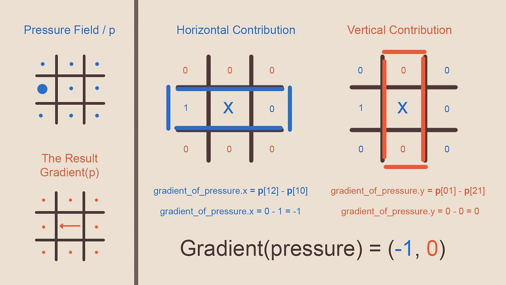

# Compute Shaders 效果学习

# Unity流体模拟

【1】首先，学习一下这篇博客：https://shahriyarshahrabi.medium.com/gentle-introduction-to-fluid-simulation-for-programmers-and-technical-artists-7c0045c40bac

## 1.流体模拟基础原理（GPT翻译，但应该不影响阅读）

​	流体模拟的资源可能会让人望而却步。我还记得第一次读到相关论文并看到纳维-斯托克斯方程（ Navier Stoke equations）时，感到非常吓人。随着时间的推移，我意识到这个主题本身并不复杂。事实上，如果你被分配任务编写自己的流体模拟器，你可能会依靠对流体运动直觉的理解，最终实现类似的东西。如果你看了看斯托克斯方程并说：“啊，我明白了，有道理”，那么你可能会更快地完成流体模拟的实现，通过阅读文章末尾引用的论文资源。在这里，我尽量慢慢地解释事物。

​	快速总结此篇文章。在开始时，我们将忽略现有的斯托克斯-纳维尔方程，并尝试设计我们自己的流体模拟实现。请记住，这第一个实现将是一个有缺陷的天真实现。尽管如此，一旦我们添加复杂性来对抗这些缺陷，你将理解为什么这些缺陷存在，并能窥视到核心实现的复杂性。还要记住，我在这里提供的许多解释旨在用简单的术语解释现象，并为你提供直观的理解。这些表述既不是描述不同元素最准确也不是最有效的方式，但足以编程实现一个可信的效果。


### （1）流体的特点

首先，让我们从现实世界中观察一些参考资料。倒一杯水，玩弄一下，并看看需要模仿哪些水的视觉特征，使其被感知为真实的水体。在其中滴入一滴酱油，观察当您在水中移动手指时它如何移动，或者保持静止。 您可能会注意到以下三点： 

- 第一，即使您不摇动或搅拌玻璃杯，如果您在其中滴入一滴墨水或酱油，酱油也会自然地扩散并在水中均匀分布。
- 其次，您可以搅动水。如果您将手指放入玻璃杯中并移动它，您将产生一系列的运动和速度，即使在您将手指从水中移出后，这些运动仍将继续存在并相互影响。因此，您对水体施加的力会在水中产生一些运动。一个人可以向这个系统中添加力或墨水。还要注意一段时间后速度似乎也会扩散并分散开来。
- 第三，根据您施加在表面的力的方向，染料、墨水或酱油将被水体带动四处流动。因此，水体具有速度，其中的物质通过该区域水分子的运动被转移/传输。 

休息一下，并思考如何编写上述元素。请记住，任何给定时间，您玻璃杯中的不同部分具有不同的酱油密度和随时间变化的不同速度。

解决这类问题通常有两种方法。

- 第一种是通过表示水分子集合的粒子来模拟现象。
- 第二种是模拟网格，其中每个单元格表示水体的某个部分的状态。该单元格的状态包括不同的字段，如速度、温度、染料数量等，这些字段随系统运动而变化。当然，您也可以结合这两种方法。**在本文中，我使用了网格。**


此外，我将一切建模为二维，因为这样更容易解释。一旦您理解了核心思想，将其扩展到三维并不困难。

我们有一个二维网格，其中每个单元格代表该区域的流体状态。这些单元格在空间上是有限的，意味着它们仅参考该水体区域，而不是实际的水分子。分子将通过这些单元格移动，并携带像染料或它们自己的速度这样的量。我们的目标是在每个单元格中计算流体的状态，每帧都要这样做。因此，在每一帧中，模拟会根据前一帧的结果以及该帧中发生的任何事件推进。




 Based on our three observations, you will find the quantity of the field you are interested in for each cell, based on these three factors:

```c++
AmountOfSomethingInThisCell = 
    What was spread from neighbouring cells + //从隔壁的cells 扩散过来的
    what was carried over from elsewhere due to the motion of the water +  //由于水的流动性，从某些地方流过来的
    what was added in that frame by the user to that cell //user在当帧添加到这个cell当中的
```

也就是说：

```c++
FluidStateForFieldX = Diffusion_of_X + Advection_of_X + X_Added_by_the_user
```

我们只需在每一帧中编写每个不同因素的程序，并将它们应用于我们流体的每个字段，更新下一帧的字段并渲染结果。（上面公式当中的Advection的意思是平流：字典说的是**（液體流動引起的物質或熱量的）移流**）。


### （2）Naïve Implementation, Diffusion

​	如前所述，滴入的酱油会扩散并在加入水体的地方周围传播开来。如果您仔细思考，这是一个简单的交换过程。对于任何给定单元格，在每一帧中，染料会向相邻单元格渗透，而相邻单元格的染料也会渗透到该给定单元格。随着时间的推移，染料将在网格的各个位置扩散，整个网格的染料量将达到一个均匀值，就像我们参考的视频中展示的那样（参考视频就是把酱油滴入到水里）。


​							Figure -2- Grid A, field marked x is the cell currently being processed

​	So given the grid (A) let the amount of dye of this frame be **d** and amount of dye previous frame **d0**, to calculate the amount of dye on any given cell for the current frame (**d**) is:（当前帧的dye的含量是d，上一帧的dye的含量是d0）

​	`d_X= d0_X + diffusionFactor * deltaTime (d0_01 + d0_02+ d0_03 + d0_04 - 4*d0_X)`

​	这个逻辑的背后是，每个cell释放出4份它所拥有的染料，并从每个相邻cell接收一份染料，或者一个相等的陈述是对于cell接收的每四分之一部分染料，它会释放出一个完整的cell。请记住扩散因子（由我们设定的常数）和时间增量使扩散部分变得非常小，因此cell实际上不会释放出其自身染料数量的4倍（那在物理上是不可能的），这些数字只是比率。

​	到目前为止，这个方法足够简单，可以在GPU或CPU上实现。

> 注：**我的理解是这里就是一个基础实现，看上面的公式应该很好理解。**


### （3）Naïve Implementation, Advection（平流）

​	Advection（平流）也可以非常简单地实现。每一帧，你需要读取正在评估的单元格的速度量，并考虑该单元格中的分子将以该速度向速度方向移动，并携带水中的任何物质。因此，我们可以读取该速度，读取我们感兴趣的单元格的场密度，并使用该速度将其沿网格移动到根据当前帧和下一次评估该场的时间间隔（即下一帧）它本应该到达的位置。这种方法使用速度将场投影到未来状态。

```c++
Field_amount_for_target[cellPosition + current_cell_velocity * timestep] = field_amount_for_current_cell
```

​	

​								（上图指的就是Advection）


### （4）Implementation, User Input

​	这是我们的第一个实现部分，也将是最终的实现。只需计算每个正在评估的单元格的用户输入量，并将其添加到该单元格的场的现有值中。您可以通过不同的方式进行计算，例如通过鼠标输入、恒定的输入流、动态输入、噪声、图像等。

```c++
Amount_of_field_X += user_input_for_this_cell
```


### （5）What’s So Naïve About This?

​	如果您实现了上述内容，可能会发现某些类似于流体行为的东西（例如扩散部分会使其看起来像水彩撞击纸张），并且甚至可以在CPU上实现而不会有太多问题，只要事情保持单线程。然而，当前的实现存在三个主要缺陷：流体是可压缩的，不适合多线程，并且对于较大的时间步长不稳定。

#### （a）问题1：流体实际上不具备可压缩性

​	流体的一个关键特征就是当您在水中移动手指时，会出现那些美丽的卷曲（curls）。问题是，为什么会出现这些卷曲，而我们的模拟中却没有呢？

​	考虑以下情景。在下面的网格中，所有相邻的网格都具有指向单个单元格的速度。如果所有这些分子在下一帧被带到这个单元格，它们将如何适应其中？它们会被压缩吗？



​												Figure -4- Water molecules getting compressed

​		或者考虑另一种情况，速度始终指向远离中心单元格。随着时间的推移，这些分子将从哪里来？物质是从虚无中创造出来的吗？



​											Figure -5- substance being constantly carried away from a point

​	

​	上述情景指出了我们的模拟缺少的一些内容，即流体不能被压缩（或者至少这是一个足够好的假设，以便进行可信的流体模拟）。在我们当前的模拟中，我们没有补偿这样一个事实：我们无法无限地将水推向空间的某一部分而没有任何后果。

​	流体的不可压缩性是为什么流体体中会出现美丽的卷曲的原因。直观地说，你可以这样想，如果你在向前推动某物体，它实际上是无法被无限推进的，那么它会侧向移动，形成卷曲。我们通过投影来修正这一点，我们将在讨论完其他两个问题后立即涵盖。



​							Figure -6- fluid moving to where it can because it cant get compressed										


#### （b）缺陷2：不适合GPU实现

​	让我们再次看看我们的平流（advection）计算。每个单元格查看它当前的速度，然后根据该速度将其所具有的任何场量传输到速度在给定时间步长内到达的位置。**换句话说，每个单元格并非将数据写入自己的内存，而是写入某个未知的位置。这种访问模式称为散射操作（scatter operation）**。

​	如果考虑多线程（CPU或GPU），我们会遇到问题。如果将每个线程映射到一个单元格，那么线程将会写入内存位置，而其他线程可能也想要写入相同的位置。这会导致竞争条件。

​	理想情况下，我们希望设置一个线程映射到一个单元格，并且每个线程只向其分配的单元格的内存写入，同时只从相邻的单元格读取。这将是一个聚集操作（**gather operation**）的例子。GPU非常适合进行聚集操作。


#### （c）缺陷3：不稳定性

​	这是一个很难解释的问题，超出了本文的完整内容（可以参考https://en.wikipedia.org/wiki/Explicit_and_implicit_methods）。

> 这里做出一点补充：其实就是Games104中王希老师讲过的类似于显式欧拉的问题，可能会一直增长。

​	在我们当前计算平流和扩散的方式中（advection and diffusion），我们根据速度的值在过去（上一帧）、过去和现在之间经过的时间步长（帧时间差），以及在上一帧中这个值是如何变化的（根据我们从参考和推断中得出的某些函数定义），来定义将来速度的值。任何给定时间点的值都是通过这些因素明确定义的。

​	问题在于，如果这个时间步长（或者在扩散的情况下，时间步长和/或扩散因子）变大（大于平流中单元格大小或扩散中单元格内染料的数量，例如），由于平流/扩散公式中的某些项，解决方案将变得不稳定并且会振荡（每帧在正数和负数之间切换，或者在更小和更大的答案之间切换），最终可能会增长到非常大的数值。**因此，稳定性在这里并不是关于结果的准确性，而是关于结果是否会随时间收敛到稳定值。**

​	让我们构建一个简单的理论案例。我们通过每帧更新值来迭代地推进我们模拟的状态。这充其量是一个估计。想象一下，您希望迭代地重现函数（A），在任何给定时间，您取您在之前帧中已知的函数的现有值，并添加该点处函数的斜率来推进您对函数的估计。然而，这个斜率是瞬时斜率，对于时间上的大跳跃，它将完全超出函数的预期，如下图所示。请注意，即使是小的时间步长，蓝色点（问题的近似解决方案）也不完全位于红线上。我们的近似总会有误差。



​				Figure -7- Too large delta time lead to values blowing up. Each step has a local error which compounds over time to very large values

​	我不会深入讨论细节，因为在我们从散射操作（scatter operation）切换到聚集操作(gather operation)，并重新构思我们的扩散计算以消除此问题后，平流中的问题将自动消失。在新的扩散设置中，**单元格的值通过它们对每个其他单元格字段值的依赖隐式定义**。尽管时间步长过大时，这种方法仍可能导致值不准确。这里的权衡是，我们必须解方程系统来找出我们的新值（下文详述）。不稳定性困扰了一些基于物理的模拟，你可能从物理仿真中的关节失控和疯狂移动中了解到这一点，在每帧中，骨骼都被移动到某个其他位置。

> todo：是切换到了隐式欧拉的拟合方式么？后面有时间的话可以复习一下。


### （6）Projection

​	我们想在计算中实现以消除压缩问题的过程称为投影。命名背后的原因是，您将您的场（field）投影到一个新的向量基上，其中一个基具有卷曲（curls），另一个具有散度（divergence），尽管我将尝试用更简单的非数学术语来解释这一点。**投影是将我们的速度场进行调整的行为，以便流体在任何地方都不会被压缩。**

​	首先让我们建立对此的直观理解。一种不能被压缩的物质不能有高低压力区域。当我们以某种方式推动水体以建立一种瞬时的压力（例如上图4所示），被推动的粒子试图从高压区域移动到低压区域，以避免被压缩。这些粒子会不断从高压到低压区域移动，直到整体粒子密度相等。如果我们能计算由这种压力差引起的速度（由流体体内的运动引起），并将其添加到我们现有的速度中，我们将得到一个速度场，其中没有压力积聚的区域。因此，这是一个速度场，其中没有发生压缩。另一种看待这个问题的方法是，我们通过改变场的速度来补偿不能推向或从中取走水的区域。

```c++
velocity_field + velocity_due_to_pressure_difference = new_velocity_with_no_pressure_difference
velocity_field = new_velocity_with_no_pressure_difference - velocity_due_to_pressure_difference
```

Later in the article (figure 11), you will see the the relationship between difference in pressure and velocity induced by it is:

```c++
Difference_In_Pressure = -velocity_due_to_pressure_difference
```

Considering the above statement, our final formulation is:

```	c++
velocity_field = new_velocity_with_no_pressure_difference + Difference_In_Pressure
```

​	技术角度来说，我们的速度场中存在散度（divergence），通过减去压力负责的部分，我们剩下的速度场分量就是没有散度的，因此是无散的。**下面的陈述等同于我们上面写的内容。不过这是一个从不同角度看问题的方式。**假设我们当前的速度场由两种不同类型的速度组成，一部分不会压缩流体，另一部分会。通过找出哪部分压缩了流体并从当前速度场中减去它，我们剩下的就是不会压缩的部分（这正是我们希望在每一帧结束时得到的）。

```c++
velocity_field = Difference_In_Pressure + divergence_free_velocity
divergence_free_velocity = velocity_field -Difference_In_Pressure
```

But how do we calculate the pressure build up in a cell? Consider the following diagram.



​							Figure -8- different scenarios and how they lead to pressure or lack of

​	看着上面的图表，您可能已经注意到，单元格上的压力积聚与其邻近单元格的速度有关。如果进入单元格的物质量（由速度引起）等于离开单元格的物质量，则不会有压力积聚。如果离开单元格的物质量大于进入单元格的物质量，则得到负压力；如果进入单元格的物质量大于离开单元格的物质量，则得到正压力。

​	在这个计算中，您需要考虑所有维度上的相邻单元格。因此不仅是水平方向，还包括上下方向。在图8中，看一下右下角的图表。虽然水平方向正在建立压力（两个向量指向A），但垂直方向压力正在减少（向远离A的方向移动的向量）。因此总体上那里没有压力积聚。

​	如果我们减去我们感兴趣的单元格右侧和左侧单元格的速度的X分量，我们得到一个数值，告诉我们这两个速度是否沿X轴同向运动，因此在该维度上的相邻单元格是否导致压力积聚。我们可以对上下单元格做同样的操作（但使用速度的Y分量），通过将这两个有符号的标量（沿水平和垂直轴的压力积聚贡献）相加，得到一个标量数值，代表有多少水正在汇聚到单元格中心，或者从中心散开。**这个数量恰好是给定单元格的速度场的散度（divergence）。**

 	

​							Figure -9- graphics and explanation to the Divergence operator

​	在第9图中，您可以看到所提供解释的可视化效果。如果将此计算放入函数中，您将得到一个散度函数，它接受一个向量场，并返回一个标量场。这个函数通常被称为运算符，它是一种可以对场进行的操作，就像您可以对它们进行加法或减法一样。

​	然而，散度并不是我们的压力。尽管它与压力有关，但有不同的解释方法可以解释它们之间的关系。数学上来说这很容易，但由于我希望提供更直观的理解，我会首先尝试一些不同的方法，这可能不是描述现象最精确的方式，但更能轻松地解释这两个概念如何相关。

​	让我们定义我们的压力为p。像速度一样，p也是一个场（每个单元格都有自己的压力值），但不同于速度是一个向量，压力只是一个标量。目前，我们不知道每个单元格的p值，但让我们看看是否可以创建一个方程，压力值作为未知参数。看一下图9，问一问自己，为了使场没有散度，中心单元格的压力与其邻居之间应该有什么关系？



​													Figure -10- Pressure Field around cell 11

​	每个场的压力作用于其4个周围的邻居，同时从每个周围邻居那里获得四分之一的贡献。因此，为了使场[11]处达到平衡，场[11]的压力需要等于所有邻居压力的总和，比例为1比4。另一种看待这个问题的方式是，中心场的压力需要等于其周围压力的平均值。看公式吧，如下：
```c++
1/4 * (p[10] + p[01] + p[12] + p[21]) = p[11]
p[10] + p[01] + p[12] + p[21] = 4 * p[11]
```

What happens when these two terms are not equal? Let’s calculate the difference between the left and the right side:

```c++
(p[10] + p[01] + p[12] + p[21])- 4 * p[11]
```

​	如果中心处的压力高于周围的压力，物质将会从单元格[11]推开，结果会是一个负值。如果周围的压力较高，物质将会被推向单元格[11]，结果将会是一个正值。您可能已经注意到，这正是散度，这也是我们的散度运算符正在计算的值，因此我们可以写成：

```c++
(p[10] + p[01] + p[12] + p[21]) - 4 * p[11] = divergence(velocity_field)
```

​	以上内容并非证明，我们做了相当多的假设，但重点是更直观地理解这两个概念如何相关。在尝试解决上述方程之前，我想提供另一种将压力与速度场联系起来的方法。 如果您在高压区域的周围区域内有低压区域，水将从高压流向低压。这有点像坐在火车上，一半车厢里挤满了人，另一半相对空旷。人们会从挤满的一侧移动到空旷的一侧，以获得更多空间。因此，可以合理地说，压力差异将导致由该压力诱导的瞬时速度：

```c++
difference_in_p => pressure_difference_induced_velocity
```

​	为了将上述相关性改变为某种方程式，可能会涉及到某种质量或密度的度量（记住f=ma）或某个常数。

​	如何测量沿主轴的场的压力变化？相当简单的操作，对于单元格[11]（图10），您从其右侧单元格的值中减去其左侧单元格的值，这成为压力差异的x分量，然后在垂直方向（上下）也是如此，这成为y分量。看看图11，作为一个例子。

​	下面的计算也是一个运算符，您可以将其写成一个函数。我暂时假装我知道压力场的值，以便解释这个函数。这个运算符称为梯度运算符。因为您计算压力沿每个轴的梯度。注意如何将标量场p转换为向量场。您可能已经注意到关于结果向量的方向及压力差异应诱导的速度之间的某些内容。如果左侧有高压，右侧有低压，我们的梯度运算符将创建一个指向左侧的向量（如图11所示）。然而正如前面所述，粒子将从高压区域流向低压区域，而不是反过来，因此我们最终的表述是：

```c++
difference_in_p = -pressure_difference_induced_velocity
```



​							Figure -11- Gradient Operator, calculating the pressure gradient / difference in each dimension

​	

How does that relate to divergence you might ask? At the beginning of the article, we defined this relationship:

```c++
velocity_field = Difference_In_Pressure + divergence_free_velocity
```

Which we can now write as:

```c++
velocity_field = Gradient(Pressure) + divergence_free_velocity
```

我们的目标是计算压力，尽管我们目前没有压力的值，但当前的公式涉及两个未知量：压力和无散速度场，而我们的最终目标是无散速度场。假设我们对方程左侧进行某些操作，我们也必须对右侧做同样的操作：

```c++
Divergence(velocity_field) = Divergence(Gradient(Pressure)) + Divergence(divergence_free_velocity)
```

根据定义，Divergence(divergence_free_velocity) 为0，因此它被取消了，现在我们只剩下一个方程和一个未知数！因此我们得到：

```c++
Divergence(Gradient(Pressure)) = Divergence(velocity_field)
(p[10] + p[01] + p[12] + p[21])- 4 * p[11] = Divergence(velocity_field)
```

​	这正是我们上面推导出的公式，如果进行计算的话。再次提醒，这里做了很多假设，比如将散度(A+B)拆分为散度(A) + 散度(B)。有趣的是，梯度的散度也是一个有自己名称的运算符。它被称为拉普拉斯算子，是你的场的二阶导数。你会在不同领域如几何处理、轮廓效果、计算视觉和特征检测等地方看到它的应用。

​	到目前为止一切顺利。现在我们有一个方程需要解，其中所有的压力 (p) 值都是未知的。让我们看看如何做到这一点！

```c++
(p[10] + p[01] + p[12] + p[21])- 4 * p[11] = Divergence(velocity_field)
```

