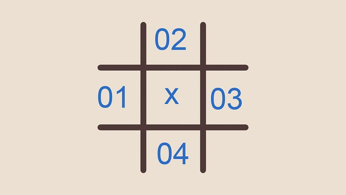
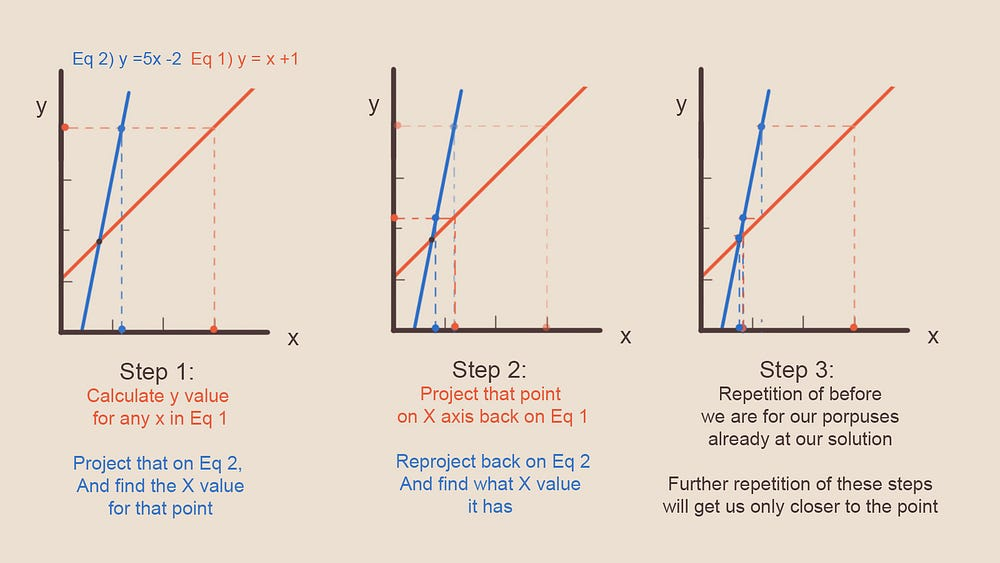
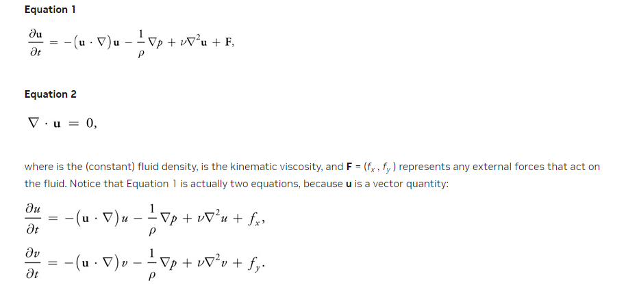
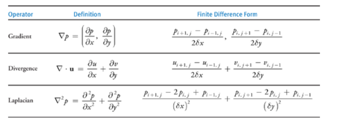
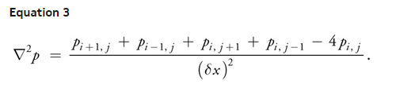

# Compute Shaders 效果学习

# Unity流体模拟

【1】首先，学习一下这篇博客：https://shahriyarshahrabi.medium.com/gentle-introduction-to-fluid-simulation-for-programmers-and-technical-artists-7c0045c40bac

【2】学习一下Unity的Compute Shader的基本知识：先看一下学习群里的”compute shader“这篇，


## 1.流体模拟基础原理（GPT翻译，但应该不影响阅读）

​	流体模拟的资源可能会让人望而却步。我还记得第一次读到相关论文并看到纳维-斯托克斯方程（ Navier Stoke equations）时，感到非常吓人。随着时间的推移，我意识到这个主题本身并不复杂。事实上，如果你被分配任务编写自己的流体模拟器，你可能会依靠对流体运动直觉的理解，最终实现类似的东西。如果你看了看斯托克斯方程并说：“啊，我明白了，有道理”，那么你可能会更快地完成流体模拟的实现，通过阅读文章末尾引用的论文资源。在这里，我尽量慢慢地解释事物。

​	快速总结此篇文章。在开始时，我们将忽略现有的斯托克斯-纳维尔方程，并尝试设计我们自己的流体模拟实现。请记住，这第一个实现将是一个有缺陷的天真实现。尽管如此，一旦我们添加复杂性来对抗这些缺陷，你将理解为什么这些缺陷存在，并能窥视到核心实现的复杂性。还要记住，我在这里提供的许多解释旨在用简单的术语解释现象，并为你提供直观的理解。这些表述既不是描述不同元素最准确也不是最有效的方式，但足以编程实现一个可信的效果。


### （1）流体的特点

首先，让我们从现实世界中观察一些参考资料。倒一杯水，玩弄一下，并看看需要模仿哪些水的视觉特征，使其被感知为真实的水体。在其中滴入一滴酱油，观察当您在水中移动手指时它如何移动，或者保持静止。 您可能会注意到以下三点： 

- 第一，即使您不摇动或搅拌玻璃杯，如果您在其中滴入一滴墨水或酱油，酱油也会自然地扩散并在水中均匀分布。
- 其次，您可以搅动水。如果您将手指放入玻璃杯中并移动它，您将产生一系列的运动和速度，即使在您将手指从水中移出后，这些运动仍将继续存在并相互影响。因此，您对水体施加的力会在水中产生一些运动。一个人可以向这个系统中添加力或墨水。还要注意一段时间后速度似乎也会扩散并分散开来。
- 第三，根据您施加在表面的力的方向，染料、墨水或酱油将被水体带动四处流动。因此，水体具有速度，其中的物质通过该区域水分子的运动被转移/传输。 

休息一下，并思考如何编写上述元素。请记住，任何给定时间，您玻璃杯中的不同部分具有不同的酱油密度和随时间变化的不同速度。

解决这类问题通常有两种方法。

- 第一种是通过表示水分子集合的粒子来模拟现象。
- 第二种是模拟网格，其中每个单元格表示水体的某个部分的状态。该单元格的状态包括不同的字段，如速度、温度、染料数量等，这些字段随系统运动而变化。当然，您也可以结合这两种方法。**在本文中，我使用了网格。**


此外，我将一切建模为二维，因为这样更容易解释。一旦您理解了核心思想，将其扩展到三维并不困难。

我们有一个二维网格，其中每个单元格代表该区域的流体状态。这些单元格在空间上是有限的，意味着它们仅参考该水体区域，而不是实际的水分子。分子将通过这些单元格移动，并携带像染料或它们自己的速度这样的量。我们的目标是在每个单元格中计算流体的状态，每帧都要这样做。因此，在每一帧中，模拟会根据前一帧的结果以及该帧中发生的任何事件推进。


 Based on our three observations, you will find the quantity of the field you are interested in for each cell, based on these three factors:

```c++
AmountOfSomethingInThisCell = 
    What was spread from neighbouring cells + //从隔壁的cells 扩散过来的
    what was carried over from elsewhere due to the motion of the water +  //由于水的流动性，从某些地方流过来的
    what was added in that frame by the user to that cell //user在当帧添加到这个cell当中的
```

也就是说：

```c++
FluidStateForFieldX = Diffusion_of_X + Advection_of_X + X_Added_by_the_user
```

我们只需在每一帧中编写每个不同因素的程序，并将它们应用于我们流体的每个字段，更新下一帧的字段并渲染结果。（上面公式当中的Advection的意思是平流：字典说的是**（液體流動引起的物質或熱量的）移流**）。


### （2）Naïve Implementation, Diffusion

​	如前所述，滴入的酱油会扩散并在加入水体的地方周围传播开来。如果您仔细思考，这是一个简单的交换过程。对于任何给定单元格，在每一帧中，染料会向相邻单元格渗透，而相邻单元格的染料也会渗透到该给定单元格。随着时间的推移，染料将在网格的各个位置扩散，整个网格的染料量将达到一个均匀值，就像我们参考的视频中展示的那样（参考视频就是把酱油滴入到水里）。



​							Figure -2- Grid A, field marked x is the cell currently being processed

​	So given the grid (A) let the amount of dye of this frame be **d** and amount of dye previous frame **d0**, to calculate the amount of dye on any given cell for the current frame (**d**) is:（当前帧的dye的含量是d，上一帧的dye的含量是d0）

​	`d_X= d0_X + diffusionFactor * deltaTime (d0_01 + d0_02+ d0_03 + d0_04 - 4*d0_X)`

​	这个逻辑的背后是，每个cell释放出4份它所拥有的染料，并从每个相邻cell接收一份染料，或者一个相等的陈述是对于cell接收的每四分之一部分染料，它会释放出一个完整的cell。请记住扩散因子（由我们设定的常数）和时间增量使扩散部分变得非常小，因此cell实际上不会释放出其自身染料数量的4倍（那在物理上是不可能的），这些数字只是比率。

​	到目前为止，这个方法足够简单，可以在GPU或CPU上实现。

> 注：**我的理解是这里就是一个基础实现，看上面的公式应该很好理解。**（直观理解，+的部分是流进来的，而-的部分（`- 4*d0_X`）则表示流出去的）


### （3）Naïve Implementation, Advection（平流）

​	Advection（平流）也可以非常简单地实现。每一帧，你需要读取正在评估的单元格的速度量，并考虑该单元格中的分子将以该速度向速度方向移动，并携带水中的任何物质。因此，我们可以读取该速度，读取我们感兴趣的单元格的场密度，并使用该速度将其沿网格移动到根据当前帧和下一次评估该场的时间间隔（即下一帧）它本应该到达的位置。这种方法使用速度将场投影到未来状态。

```c++
Field_amount_for_target[cellPosition + current_cell_velocity * timestep] = field_amount_for_current_cell
```

​	

​								（上图指的就是Advection）


### （4）Implementation, User Input

​	这是我们的第一个实现部分，也将是最终的实现。只需计算每个正在评估的单元格的用户输入量，并将其添加到该单元格的场的现有值中。您可以通过不同的方式进行计算，例如通过鼠标输入、恒定的输入流、动态输入、噪声、图像等。

```c++
Amount_of_field_X += user_input_for_this_cell
```


### （5）What’s So Naïve About This?

​	如果您实现了上述内容，可能会发现某些类似于流体行为的东西（例如扩散部分会使其看起来像水彩撞击纸张），并且甚至可以在CPU上实现而不会有太多问题，只要事情保持单线程。然而，当前的实现存在三个主要缺陷：流体实际上是不可压缩的，现在的算法不适合多线程，并且对于较大的时间步长不稳定。

#### （a）缺陷1：流体实际上不具备可压缩性

​	流体的一个关键特征就是当您在水中移动手指时，会出现那些美丽的卷曲（curls，旋度）。问题是，为什么会出现这些卷曲，而我们的模拟中却没有呢？

​	考虑以下情景。在下面的网格中，所有相邻的网格都具有指向单个单元格的速度。如果所有这些分子在下一帧被带到这个单元格，它们将如何适应其中？它们会被压缩吗？


​												Figure -4- Water molecules getting compressed

​		或者考虑另一种情况，速度始终指向远离中心单元格。随着时间的推移，这些分子将从哪里来？物质是从虚无中创造出来的吗？


​											Figure -5- substance being constantly carried away from a point

​	

​	上述情景指出了我们的模拟缺少的一些内容，即流体不能被压缩（或者至少这是一个足够好的假设，以便进行可信的流体模拟）。在我们当前的模拟中，我们没有补偿这样一个事实：我们无法无限地将水推向空间的某一部分而没有任何后果。

​	流体的不可压缩性是为什么流体体中会出现美丽的卷曲的原因。直观地说，你可以这样想，如果你在向前推动某物体，它实际上是无法被无限推进的，那么它会侧向移动，形成卷曲。我们通过投影（Projection）来修正这一点，我们将在讨论完其他两个问题后立即涵盖。


​							Figure -6- fluid moving to where it can because it cant get compressed										


#### （b）缺陷2：不适合GPU实现

​	让我们再次看看我们的平流（advection）计算。每个单元格查看它当前的速度，然后根据该速度将其所具有的任何场量传输到速度在给定时间步长内到达的位置。**换句话说，每个单元格并非将数据写入自己的内存，而是写入某个未知的位置。这种访问模式称为散射操作（scatter operation）**。

​	如果考虑多线程（CPU或GPU），我们会遇到问题。如果将每个线程映射到一个单元格，那么线程将会写入内存位置，而其他线程可能也想要写入相同的位置。这会导致竞争条件。

​	理想情况下，我们希望设置一个线程映射到一个单元格，并且每个线程只向其分配的单元格的内存写入，同时只从相邻的单元格读取。这将是一个聚集操作（**gather operation**）的例子。GPU非常适合进行聚集操作。


#### （c）缺陷3：不稳定性

​	这是一个很难解释的问题，超出了本文的完整内容（可以参考https://en.wikipedia.org/wiki/Explicit_and_implicit_methods）。

> 这里做出一点补充：其实就是Games104中王希老师讲过的类似于显式欧拉的问题，可能会一直增长。

​	在我们当前计算平流和扩散的方式中（advection and diffusion），我们根据速度的值在过去（上一帧）、过去和现在之间经过的时间步长（帧时间差），以及在上一帧中这个值是如何变化的（根据我们从参考和推断中得出的某些函数定义），来定义将来速度的值。任何给定时间点的值都是通过这些因素明确定义的。

​	问题在于，如果这个时间步长（或者在扩散的情况下，时间步长和/或扩散因子）变大（大于平流中单元格大小或扩散中单元格内染料的数量，例如），由于平流/扩散公式中的某些项，解决方案将变得不稳定并且会振荡（每帧在正数和负数之间切换，或者在更小和更大的答案之间切换），最终可能会增长到非常大的数值。**因此，稳定性在这里并不是关于结果的准确性，而是关于结果是否会随时间收敛到稳定值。**

​	让我们构建一个简单的理论案例。我们通过每帧更新值来迭代地推进我们模拟的状态。这充其量是一个估计。想象一下，您希望迭代地重现函数（A），在任何给定时间，您取您在之前帧中已知的函数的现有值，并添加该点处函数的斜率来推进您对函数的估计。然而，这个斜率是瞬时斜率，对于时间上的大跳跃，它将完全超出函数的预期，如下图所示。请注意，即使是小的时间步长，蓝色点（问题的近似解决方案）也不完全位于红线上。我们的近似总会有误差。


​				Figure -7- Too large delta time lead to values blowing up. Each step has a local error which compounds over time to very large values

​	我不会深入讨论细节，**因为在我们从散射操作（scatter operation）切换到聚集操作(gather operation)，并重新构思我们的扩散计算以消除此问题后，平流中的问题将自动消失。**（todo：存疑，这里没太看懂，到时候看完后面的再回来理解）在新的扩散设置中，**单元格的值通过它们对每个其他单元格字段值的依赖隐式定义**。尽管时间步长过大时，这种方法仍可能导致值不准确。这里的权衡是，我们必须解方程系统来找出我们的新值（下文详述）。不稳定性困扰了一些基于物理的模拟，你可能从物理仿真中的关节失控和疯狂移动中了解到这一点，在每帧中，骨骼都被移动到某个其他位置。

> todo：是切换到了隐式欧拉的拟合方式么？后面有时间的话可以复习一下。


### （6）Projection

​	我们想在计算中实现以消除压缩问题的过程称为投影。命名背后的原因是，您将您的场（field）投影到一个新的向量基上，其中一个基具有旋度（curls），另一个具有散度（divergence），尽管我将尝试用更简单的非数学术语来解释这一点。**投影是将我们的速度场进行调整的行为，以便流体在任何地方都不会被压缩。**

> 强烈建议这里看一下3B1B的视频：https://www.bilibili.com/video/BV19s41157Z4/?spm_id_from=333.999.0.0&vd_source=f0e5ebbc6d14fe7f10f6a52debc41c99
>
> 省流：
> 【1】在流体模拟中，向量场上某一点的散度，表示这种想象的流体在该点附近，向外发射或向内吸收的程度如何；往里流散度为负（压力为正），反之同理。
>
> 【2】对于真实（不可压缩）的流体来说，div F处处为0（**也就是每一处的散度值都应该为0**）
>
> 【3】旋度则表示流体绕着这一点旋转的趋势的大小。逆时针旋转时旋度为正，顺时针旋转时旋度为负。

​	首先让我们建立对此的直观理解。一种不能被压缩的物质不能有高低压力区域。当我们以某种方式推动水体以建立一种瞬时的压力（例如上图4所示），被推动的粒子试图从高压区域移动到低压区域，以避免被压缩。这些粒子会不断从高压到低压区域移动，直到整体粒子密度相等。如果我们能计算由这种压力差引起的速度（由流体体内的运动引起），并将其添加到我们现有的速度中，我们将得到一个速度场，其中没有压力积聚的区域。因此，这是一个速度场，其中没有发生压缩。另一种看待这个问题的方法是，我们通过改变场的速度来补偿不能推向或从中取走水的区域。

```c++
velocity_field + velocity_due_to_pressure_difference = new_velocity_with_no_pressure_difference
velocity_field = new_velocity_with_no_pressure_difference - velocity_due_to_pressure_difference
```

Later in the article (figure 11), you will see the the relationship between difference in pressure and velocity induced by it is:

```c++
Difference_In_Pressure = -velocity_due_to_pressure_difference
```

Considering the above statement, our final formulation is:

```	c++
velocity_field = new_velocity_with_no_pressure_difference + Difference_In_Pressure
```

​	技术角度来说，我们的速度场中存在散度（divergence），通过减去压力负责的部分，我们剩下的速度场分量就是没有散度的，因此是无散的。**下面的陈述等同于我们上面写的内容。不过这是一个从不同角度看问题的方式。**假设我们当前的速度场由两种不同类型的速度组成，一部分不会压缩流体，另一部分会。通过找出哪部分压缩了流体并从当前速度场中减去它，我们剩下的就是不会压缩的部分（这正是我们希望在每一帧结束时得到的）。

```c++
velocity_field = Difference_In_Pressure + divergence_free_velocity
divergence_free_velocity = velocity_field - Difference_In_Pressure
```

But how do we calculate the pressure build up in a cell? Consider the following diagram.


​							Figure -8- different scenarios and how they lead to pressure or lack of

​	看着上面的图表，您可能已经注意到，单元格上的压力积聚与其邻近单元格的速度有关。如果进入单元格的物质量（由速度引起）等于离开单元格的物质量，则不会有压力积聚。如果离开单元格的物质量大于进入单元格的物质量，则得到负压力；如果进入单元格的物质量大于离开单元格的物质量，则得到正压力。

​	在这个计算中，您需要考虑所有维度上的相邻单元格。因此不仅是水平方向，还包括上下方向。在图8中，看一下右下角的图表。虽然水平方向正在建立压力（两个向量指向A），但垂直方向压力正在减少（向远离A的方向移动的向量）。因此总体上那里没有压力积聚。

​	如果我们减去我们感兴趣的单元格右侧和左侧单元格的速度的X分量，我们得到一个数值，告诉我们这两个速度是否沿X轴同向运动，因此在该维度上的相邻单元格是否导致压力积聚。我们可以对上下单元格做同样的操作（但使用速度的Y分量），通过将这两个有符号的标量（沿水平和垂直轴的压力积聚贡献）相加，得到一个标量数值，代表有多少水正在汇聚到单元格中心，或者从中心散开。**这个数量恰好是给定单元格的速度场的散度（divergence）。**

> 散度（简单理解）：整体来讲往外出的话散度为正数；整体来讲往里压的话散度为负数。


​							Figure -9- graphics and explanation to the Divergence operator

​	在第9图中，您可以看到所提供解释的可视化效果。如果将此计算放入函数中，**您将得到一个散度函数，它接受一个向量场，并返回一个标量场**。这个函数通常被称为运算符，它是一种可以对场进行的操作，就像您可以对它们进行加法或减法一样。

​	然而，散度并不是我们的压力。尽管它与压力有关，但有不同的解释方法可以解释它们之间的关系。数学上来说这很容易，但由于我希望提供更直观的理解，我会首先尝试一些不同的方法，这可能不是描述现象最精确的方式，但更能轻松地解释这两个概念如何相关。

​	让我们定义我们的压力为p。像速度一样，p也是一个场（每个单元格都有自己的压力值），但不同于速度是一个向量，压力只是一个标量。目前，我们不知道每个单元格的p值，但让我们看看是否可以创建一个方程，压力值作为未知参数。看一下图9，问一问自己，为了使场没有散度，中心单元格的压力与其邻居之间应该有什么关系？


​													Figure -10- Pressure Field around cell 11

​	每个场的压力作用于其4个周围的邻居，同时从每个周围邻居那里获得四分之一的贡献。因此，为了使场[11]处达到平衡，场[11]的压力需要等于所有邻居压力的总和，比例为1比4。另一种看待这个问题的方式是，中心场的压力需要等于其周围压力的平均值。看公式吧，如下：
```c++
1/4 * (p[10] + p[01] + p[12] + p[21]) = p[11]
p[10] + p[01] + p[12] + p[21] = 4 * p[11]
```

What happens when these two terms are not equal? Let’s calculate the difference between the left and the right side:

```c++
(p[10] + p[01] + p[12] + p[21])- 4 * p[11]
```

​	如果中心处的压力高于周围的压力，物质将会从单元格[11]推开，结果会是一个负值。如果周围的压力较高，物质将会被推向单元格[11]，结果将会是一个正值。您可能已经注意到，这正是散度，这也是我们的散度运算符正在计算的值，因此我们可以写成：

```c++
(p[10] + p[01] + p[12] + p[21]) - 4 * p[11] = divergence(velocity_field)
```

​	以上内容并非证明，我们做了相当多的假设，但重点是更直观地理解这两个概念如何相关。在尝试解决上述方程之前，我想提供另一种将压力与速度场联系起来的方法。 如果您在高压区域的周围区域内有低压区域，水将从高压流向低压。这有点像坐在火车上，一半车厢里挤满了人，另一半相对空旷。人们会从挤满的一侧移动到空旷的一侧，以获得更多空间。因此，可以合理地说，压力差异将导致由该压力诱导的瞬时速度：

```c++
difference_in_p => pressure_difference_induced_velocity
```

​	为了将上述相关性改变为某种方程式，可能会涉及到某种质量或密度的度量（记住f=ma）或某个常数。

​	如何测量沿主轴的场的压力变化？相当简单的操作，对于单元格[11]（图10），您从其右侧单元格的值中减去其左侧单元格的值，这成为压力差异的x分量，然后在垂直方向（上下）也是如此，这成为y分量。看看图11，作为一个例子。

​	下面的计算也是一个运算符，您可以将其写成一个函数。我暂时假装我知道压力场的值，以便解释这个函数。这个运算符称为梯度运算符。因为您计算压力沿每个轴的梯度。注意如何将标量场p转换为向量场。您可能已经注意到关于结果向量的方向及压力差异应诱导的速度之间的某些内容。如果左侧有高压，右侧有低压，我们的梯度运算符将创建一个指向左侧的向量（如图11所示）。然而正如前面所述，粒子将从高压区域流向低压区域，而不是反过来，因此我们最终的表述是：

```c++
difference_in_p = -pressure_difference_induced_velocity
```


​							Figure -11- Gradient Operator, calculating the pressure gradient / difference in each dimension

​	

How does that relate to divergence you might ask? At the beginning of the article, we defined this relationship:

```c++
velocity_field = Difference_In_Pressure + divergence_free_velocity
```

Which we can now write as:

```c++
velocity_field = Gradient(Pressure) + divergence_free_velocity
```

我们的目标是计算压力，尽管我们目前没有压力的值，但当前的公式涉及两个未知量：压力和无散速度场，而我们的最终目标是无散速度场。假设我们对方程左侧进行某些操作，我们也必须对右侧做同样的操作：

```c++
Divergence(velocity_field) = Divergence(Gradient(Pressure)) + Divergence(divergence_free_velocity)
```

根据定义，Divergence(divergence_free_velocity) 为0，因此它被取消了，现在我们只剩下一个方程和一个未知数！因此我们得到：

```c++
Divergence(Gradient(Pressure)) = Divergence(velocity_field)
(p[10] + p[01] + p[12] + p[21])- 4 * p[11] = Divergence(velocity_field)
```

​	这正是我们上面推导出的公式，如果进行计算的话。再次提醒，这里做了很多假设，比如将散度(A+B)拆分为散度(A) + 散度(B)。有趣的是，梯度的散度也是一个有自己名称的运算符。它被称为拉普拉斯算子，是你的场的二阶导数。你会在不同领域如几何处理、轮廓效果、计算视觉和特征检测等地方看到它的应用。

​	到目前为止一切顺利。现在我们有一个方程需要解，其中所有的压力 (p) 值都是未知的。让我们看看如何做到这一点！

```c++
(p[10] + p[01] + p[12] + p[21])- 4 * p[11] = Divergence(velocity_field)
```


### （7）Solvers

​	一开始看起来解压力散度方程似乎是不可能的，因为我们有5个未知数和一个方程式。但事实上，我们在我们的场中每个单元格都有一个方程式。所以在一个N乘N的场中，我们有N*N个未知数和同样数量的方程式。这实际上是一个线性方程组。

​	简单回顾一下，一个方程系统可能看起来像这样：

```c++
Equation 1) y = x  + 1
Equation 2) y = 5x - 2
```

​	上述每个方程式都有自己的graph，而几何上这两个graph相交的点（如果存在的话），就是方程式的解。换言之，就是满足两个语句的x和y值对。
如果你还记得高中时的知识，一种解决这个简单系统的方法是通过代入法，即将第一个方程式代入第二个方程式，解出一个参数，然后将该参数的值代回任意一个方程式以获取第二个参数。大致过程如下：（这里就是解方程了）

```c++
Equation 2) y = (x  + 1) = 5x - 2 <= since y is also x +1
=>               x - 5x = -2 -1 = -3 
=>               x = -3/-4 = 3/4 
Insert back in Equation 1)
y = 3/4 + 1 = 7/4
X = 3/4 = 0.75, y = 7/4 = 1.75
```

​	然而我们的系统与上述方程式完全不同。在一个128x128的网格中，我们有16,000个未知数和方程式。没有办法想在CPU或GPU中编程上述方法。此外，我们的系统还有一个独特之处，即每个cell的压力值仅取决于其4个邻居，与其他16,000个未知数无关。因此，如果您写下其中一个16,000个方程式，您将看到每行中的99%系数都是零。因此，您也不想将其写成矩阵并将其求逆，因为大多数项都是零。有一种更快的方法！

​	在解释更快的方法之前，让我们在简单系统中进行一个魔术技巧。让我们重新排列这两个方程式，使其中一个有X在左侧，另一个有Y在左侧。

```c++
Equation 1) y = x  + 1
Equation 2) x = y/5 + 2/5 
```

​	现在，取任意初始值x和y（例如零），并将其插入右侧。您将得到：

```c++
Equation 1) y = 0  + 1 = 1（上式取x=0）
Equation 2) x = 0/5 + 2/5 = 2/5 = 0.4（上式取y=0）
```

​	现在，您有新的X和Y值，0.4和1。让我们重复上面的步骤，但不是使用零，而是插入我们的新值。

```c++
Equation 1) y = 0.4  + 1 = 1.4
Equation 2) x = 1/5 + 2/5 = 3/5 = 0.6
```

​	我们可以重复这些步骤数次，在每个步骤中，我们将前一个X和Y的值插入方程式中。让我们看看会发生什么！

```c++
步骤0) 输入(X, y) = (0, 0)，输出 = (0.4, 1)
步骤1) 输入(0.4, 1)，输出(0.6, 1.4)
步骤2) 输入(0.6, 1.4)，输出((1.4 + 2)/5 , 0.6 + 1 ) = (0.68, 1.6)
步骤3) 输入(0.68, 1.6)，输出((1.6 + 2)/5 , 0.68 + 1 ) = (0.72, 1.68)
步骤4) 输入(0.72, 1.68)，输出((1.68+ 2)/5 , 0.72 + 1 ) = (0.736, 1.72)
```

​	Magic！即使在四步骤后，我们几乎达到了解决方案。您可以重复这些步骤许多次，最后您将非常接近精确的解决方案。上述是迭代求解器（ **Iterative Solver**），具体来说是雅克比求解器**Jacobi Solver**。好消息是，这个解决方案同样适用于我们的系统，并且它在GPU中非常易于实现。我们只需要在每个迭代步骤中保存每个细胞的压力值（作为纹理或计算缓冲），然后将其插回下一个step中。

​	有很多不同的求解器，一些需要较少的内存使用，一些需要较少的步骤来达到解决方案，一些提供了更多的准确性（请记住，由于浮点错误，它确实很重要）。我在这里使用雅克比，因为其他求解器对于GPU的实现都是痛苦的，（Jacobi — Gauss Seidel — Successive Overrelaxation — Multigrid）。还有更多复杂的求解器您将在科学工程中遇到，但它们与我们的用例无关。

​	然而，还有一个问题：为什么这工作？虽然使用矩阵形式（雅克比矩阵的对角矩阵、Gauss Seidel的下三角矩阵、successive relaxation的特殊下三角矩阵、multi-grid的多网格）来解释求解器是最精确的方法，我们可以轻松地解释稳定性、准确性等，但我想避免这些，以免失去那些只想获得基本理解的人。

​	相反，我想使用Gauss Seidel来解释，而不是我们在实际实现中使用的雅克比求解器，因为它可以两倍快地达到结果。两个求解器之间的区别非常简单，在高斯-赛德尔中，您立即使用计算出的未知数值来计算下一个未知数，而不等待整个步骤。因此，在上面的例子中，不是使用0和0作为X和Y的值，您将使用0作为X，解决Y为1，然后在方程式2中使用计算出的Y值1，而不是使用0，这将给您0.6。然后，您将进入步骤2，并使用0.6作为X来找到新的Y（1.6），依此类推。注意您如何使用相同的解决方案，但只需要一半的步骤。太棒了！然而，**对于GPU和多线程来说，有一个问题，因为我们同时解决所有cell，所以不能使用这种技术，除非使用红黑访问模式（https://www.it.ubi.pt/17epcg/Actas/artigos/17epcg_submission_39.pdf， red-black access pattern），这将将步骤数减半，但同时double draw calls。所以这是一个边际收益。**

​	再次回到我们的简单系统，下面是两个方程式的图形。记住，这两个图形相交的点就是我们的解决方案。我们已经从解析解决方案中知道这个值，即X=0.75和Y=1.75。

```c++
方程式1) y = x + 1
方程式2) y = 5x - 2
```

​	我们的求解器实际上做什么？对于我们的起始值，让我们取3作为x（之前的起始值是零，但我们可以取任何值）。在步骤1中，我们找到图形1（对应红色的线）对应于X=3的Y值。然后，我们看到图形2（对应蓝色的线）对应于我们刚刚找到的Y值的X值。随着我们重复这些步骤，您可能注意到，我们正在将图形投影到彼此身上，反复地，因为这两个图形收敛到一个点，我们不断接近交点，就像一个球滚下山崖。



​	当然，这并不适用于所有方程式。两个图形可能不会收敛或有多个解决方案等。但是在我们的情况下，它确实有效。

​	要使用我们的求解器，我们将方程式重写，以便将中间的字段放在左侧，并对于任何给定的cell坐标i和j，我们有：

```c++
Solve(Velocity_Divergence)
{
	p_new[i, j] =((p[i+1,j] + p[i,j+1] + p[i-1,j] + p[i,j-1]) - Velocity_Divergence[i, j])/4
}
```

​	一旦这运行，我们可以执行：

```c++
CopyOldToNew()
{
	p[i, j] = p_new[i, j]
}
```

​	然后重复计算，以新的p值。我们重复这个过程大约30步，直到我们获得该帧的解决方案。对于第一个步骤，我们将p设置为零。

​	因此放在一起，将我们的投影看起来像这样：

```c++
Velocity_Div_field = Divergence(velocity_field); 
for(int i = 0; i < 30; i++) 
{
   Solve(Velocity_Div_field);
   CopyOldToNew();
}
deltaP = Gradient(p);
new_divergent_free_velocity = velocity_field - deltaP;
```

​	当然，以上是伪代码，您不会像那样编写compute shader管道。但是，您将创建所有这些缓冲区，并设置源/目标，然后调用内核。

​	请注意，在计算压力后，我计算了它的梯度，以便将其插入我们开始的速度场方程式中，并将其与我们想要结束的散度自由版本联系起来。

​	这就是投影的所有内容。在代码中，我将所有这些内容包装在一个名为`Project()`的函数中，您可以随时调用它。

------


### （8）Diffusion Implementation

​	首先，我们解决了通过投影来压缩性问题，现在我们可以解决通过显式公式引入的扩散计算函数的不稳定性。

​	如果您记得上面的内容，给定任何字段d，其中d0是前一帧每个cell的字段值，我们的显式公式是（这个是之前的版本）：

```c++
d_X= d0_X + diffusionFactor * deltaTime *(d0_01 + d0_02+ d0_03 + d0_04 -4*d0_X)
```

​	在扩散情况下，不难看到不稳定的来源，对于大delta时间或扩散率，如果来自邻近细胞的密度小于中心细胞离开的密度，并且diffusionFactor*deltaTime大于1，那么我们的密度值将变为负值，这是不合理的。

​	我们可以以不同的方式公式化扩散，以便在下一帧中将字段值向后推到初始值。因此：

```c++
d0_X = d_X - diffusionFactor * deltaTime * (d_01 + d_02+ d_03 + d_04 -4*d_X)
```

​	注意，我们不是扩散d0，而是扩散d，即下一帧的值。要理解上面的方程式，您需要理解扩散的作用。扩散查看中心cell中的某些东西与其周围的平均值进行比较，如果中心cell中有更多，它会从中拿走一些，如果中心cell少于周围的平均值，它会添加一些。这导致值随着时间的推移而平衡，达到均匀状态。由于我们假设时间向前推移时事情会平衡each other out，反之亦然，如果您向后看过程（向后推移时间）。在那里，反扩散发生，在密度高于其周围平均值的区域，吸收更多粒子。这是我们上面的方程式的第二部分。

​	但是，为什么这种公式更稳定或更好？如果您重新公式化上面的方程式（我们需要这样做），以便将新的d值放在左侧，您将得到：

```c++
d_X = (d0_X + diffusionFactor * deltaTime * (d_01 + d_02+ d_03 + d_04)) / (1 + 4 * diffusionFactor * deltaTime)
```

​	注意，与显式公式相比，这里只有加法。因此，不管delta时间或扩散率的大小，我们的新密度值都不会变为负值。因此，d_x将始终保持正值。**重要的是再次提醒，稳定性和准确性不同。对于大delta时间或扩散率，您不会得到有意义的数字。至少它不会爆炸了！**（把他理解成一个trick感觉就行）

​	您可能已经注意到，这个公式与我们之前的投影公式非常相似。代替`d_X`，我们计算中心cell中的压力。`d_01`到`d_04`是邻近压力值，`d0_x`是速度场的散度。

​	就像投影一样，这似乎不可能解决（一个方程式和5个未知数，d_x和d_01到d_04），但这也是一个线性方程式系统。每个细胞一个方程式，总共N*N个方程式。好消息是，我们可以使用我们已经有的求解器来解决它。

​	您可以为投影和扩散的求解器编写不同的内核/着色器，或者以更一般的方式重写方程式，以便通过设置某个参数，可以使用相同的代码来解决这两个方程式，这是我在代码中所做的。


​				By changing _rDiagonal and _centerFactor and switching _b_buffer to be divergnece(velocity) in one and d_x0 in the other, I 								can use the same solver for both equations（这里应该指的是Projection+Diffusion两个方程）

​	更细致的内容在第二部分代码实战部分会进一步进行分析。


### （9）Advection Implementation

​	Last but not least,我们需要修复我们的对流，以便使用gather操作而不是scatter操作。

​	我们可以使用我们在扩散实现中的一个学习来做到这一点。在扩散中，我们根据需要在时间上回溯的真实情况来公式化我们的方程式。相反，我们不再向前看（下一帧）并问自己我们的速度将如何对我们的不同字段进行对流（移动），而是向后看并公式化当前速度从前一帧的其他细胞携带过来的数量。

​	在这种设置中，我们的对流值将始终落后一帧，这对我们的模拟不是问题。根据图表，对于任何给定的细胞，在这个帧中计算对流部分：

```c++
field_amount_new_frame[cellPosition] += field_amount_old_frame[cellPosion-current_cell_velocity * timestep ]
```

> 依旧是一种隐式欧拉的思想，往以前看，而不是往后看。


### （10）Some Last Points

那就是主要流体模拟的全部内容。有了这些代码（代码很好地记录了）和Github上的文档，您应该能够运行一个您实际理解的模拟。

对于简单的模拟，您的设置将看起来像这样（我做了多次投影，因为那样看起来更好）：

```c#
using System.Collections;
using System.Collections.Generic;
using UnityEngine;

public class Simple2DFluidSim : MonoBehaviour
{
 // ------------------------------------------------------------------
    // VARIABLES
    //___________
    // public
    public  FluidSimulater    fluid_simulater;
    //___________
    // private
    private FluidGPUResources resources;
    // ------------------------------------------------------------------
    // INITALISATION
    void Start()
    {
        fluid_simulater.Initialize();
        resources = new FluidGPUResources(fluid_simulater);
        resources.Create();

        //--
        fluid_simulater.AddUserForce           (resources.velocity_buffer                                   );
        fluid_simulater.HandleCornerBoundaries (resources.velocity_buffer, FieldType.Velocity               );
        fluid_simulater.Diffuse                (resources.velocity_buffer                                   );
        fluid_simulater.HandleCornerBoundaries (resources.velocity_buffer, FieldType.Velocity               );
        fluid_simulater.Project                (resources.velocity_buffer, resources.divergence_buffer, resources.pressure_buffer);
        fluid_simulater.Advect                 (resources.velocity_buffer, resources.velocity_buffer, 0.999f);
        fluid_simulater.HandleCornerBoundaries (resources.velocity_buffer, FieldType.Velocity               );
        fluid_simulater.Project                (resources.velocity_buffer, resources.divergence_buffer, resources.pressure_buffer);

        fluid_simulater.AddDye                 (resources.dye_buffer                                        );
        fluid_simulater.Advect                 (resources.dye_buffer, resources.velocity_buffer, 0.992f);
        fluid_simulater.HandleCornerBoundaries (resources.dye_buffer, FieldType.Dye                         );
        fluid_simulater.Diffuse                (resources.dye_buffer                                        );
        fluid_simulater.HandleCornerBoundaries (resources.dye_buffer, FieldType.Dye                         );

        fluid_simulater.Visualiuse             (resources.dye_buffer);

        fluid_simulater.BindCommandBuffer();
    }

    // ------------------------------------------------------------------
    // DESTRUCTOR
    void OnDisable()
    {
        fluid_simulater.Release();
        resources      .Release();
    }

    // ------------------------------------------------------------------
    // LOOP
    void Update()
    {
        fluid_simulater.Tick(Time.deltaTime);
    }
}
```


## 2.代码解读

这篇Compute Shader有关的博客可以解决与后处理一起的问题：[Unity Compute Shader 个人理解 – 往事乐土 (chenglixue.top)](http://chenglixue.top/?p=143)，明天如果有机会的话一定要好好把相关功能实现一下。

这里参考的代码是https://github.com/cinight/MinimalCompute这里的`01_3_Fluid_2D`项目，在学完之后会放入到最终项目当中。核心代码用一个Compute Shader来实现。

### （1）`Fluid.cs`

- `Start`函数：主要是用来创建一些RenderTexture，并为对应的Compute shader指定参数（这个仓库里只用了一个compute shader来完成所有的计算）；
- `FixedUpdate函数`（修改后）：依据于玩家所在的位置，替换原来的鼠标坐标（范围是[-0.5，0.5]之间），这里把长和宽方向搞反了，研究了好久；
  - 主要就是依次Dispatch Compute shader当中对应的kernel。


### （2）`Fluid.compute`解析

#### （a）`Init`

```c#
[numthreads(16,16,1)]
void Kernel_Init (uint3 id : SV_DispatchThreadid)
{
	DensityTex[id.xy] = 0;
	VelocityTex[id.xy] = 0;
	PressureTex[id.xy] = 0;
	DivergenceTex[id.xy] = 0;
}
```

这个很好理解，就是将所有的RWTexture2D的值清空。

> 补充：如果想让DensityTex一开始有一个纹理的颜色（比如最简单的吞星之鲸周本里的底面），需要将胎海水的Texture2D赋值给Compute shader，此时可以这样写：
>
> ```c#
> Texture2D scaledTexture = new Texture2D(size, size);
> Graphics.ConvertTexture(showOriginTexture, scaledTexture);
> //DestroyImmediate(showOriginTexture);
> ```
>
> 其中的showOriginTexture就是输入的纹理（原始胎海水图），需要缩放到size * size不然Compute shader赋值的时候结果不对（因为其他的RWTexture的尺寸都是（size，size），Compute Shader中的Kernel_Init改写为：
>
> ```c#
> DensityTex[id.xy] = inputTex[id.xy];
> ```


#### （b）`UserInput`

把其他的功能全部注释掉，只保留UserInput：

```c#
void Kernel_UserInput (uint3 id : SV_DispatchThreadid)
{
	//mouse position
	float2 center = 0.5;
	float2 uv = float2(id.xy) / float(size);
	float2 sphereUV = ( spherePos + center ); //sphere world position to 0-1 uv space（之前spherePos地范围是(-0.5，0.5)）

	float2 velocity = VelocityTex[id.xy].xy;
	float4 density = DensityTex[id.xy];
	float obstacle = ObstacleTex[id.xy].x;

	//Impulse factor
	float dist = distance(uv,sphereUV);
	dist = 1.0-smoothstep(dist, 0.0, forceRange);
	float impulse = forceIntensity * dist * _deltaTime * obstacle;

	//Add dye density
	float speed = distance(sphereVelocity,0);
	density.a += impulse * speed;

	//Add dye color
	density.rgb = BlendColor(density.rgb, dyeColor, impulse * speed);

	//Buoyancy, making the fluid goes out from center, instead of having gravity
	float2 cdir = uv - center;
	velocity += _deltaTime * density.a * cdir * 2.0;

	//Add mouse velocity
	float2 dir = sphereVelocity;
	velocity += dir * impulse;

	//Assign
	VelocityTex[id.xy] = float2(velocity);
	DensityTex[id.xy] = density;
}
```

观察到**效果就是单纯地在地上涂抹，没有扩散等效果。**

补充说明：

> 【1】关于下面这段：
>
> ```c#
> //Buoyancy, making the fluid goes out from center, instead of having gravity
> float2 cdir = uv - center;
> velocity += _deltaTime * density.a * cdir * 2.0;
> ```
>
> 这段代码是用于实现流体模拟中的浮力效果的。在这个上下文中，浮力被用来使流体从中心向外移动，而不是受到重力的影响。  第一行代码` float2 cdir = uv - center;` 计算了从流体的中心到当前像素（或流体粒子）的方向。这里的 uv 表示当前像素的坐标，已经被归一化到 [0, 1] 的范围，而 center 是一个常量向量，表示流体的中心。  第二行代码 `velocity += _deltaTime * density.a * cdir * 2.0;` 更新了流体粒子的速度。_deltaTime 是自上一帧以来经过的时间，density.a 是当前像素处流体密度的 alpha 组件（可以理解为流体的量），cdir 是在上一行计算的方向。速度增加了这三个因素的乘积，有效地使流体随着时间的推移从中心向外移动。2.0 这个因子可能是用来控制流体移动速度的。  总的来说，这段代码是流体模拟中浮力的简单实现，使流体随着时间的推移从模拟的中心向外移动。


#### （c）`Diffusion`

> 这部分跟上面公式所描述的是一样的，见1.（8）Diffusion Implementation

```c#
void Kernel_Diffusion (uint3 Id : SV_DispatchThreadid)
{		
	//Grid positions
	int2 id = int2(Id.xy);
	int2 id_T = id + off_T;
	int2 id_B = id + off_B;
	int2 id_L = id + off_L;
	int2 id_R = id + off_R;

	//Obstacle
	float obstacle = ObstacleTex[id].x;
	float obstacle_T = ObstacleTex[id_T].x;
	float obstacle_R = ObstacleTex[id_R].x;
	float obstacle_B = ObstacleTex[id_B].x;
	float obstacle_L = ObstacleTex[id_L].x;

	//Density
	float4 d = DensityTex[id];
	float4 d_T = DensityTex[id_T] * obstacle_T;
	float4 d_B = DensityTex[id_B] * obstacle_R;
	float4 d_R = DensityTex[id_R] * obstacle_B;
	float4 d_L = DensityTex[id_L] * obstacle_L;
	
	//Diffusion
	//float4 dnew = (d + size * _deltaTime * (d_T + d_B + d_R + d_L)) / (1 + 4.0 * size * _deltaTime);
	float4 dnew = (d + size * _deltaTime * (d_T + d_B + d_R + d_L)) / (1 + 4.0 * diffisionFactor * _deltaTime);
	dnew *= obstacle;

	//Assign
	DensityTex[id] = dnew;
}
```


#### （d）`Jacobi Solver`

这部分的原理见上面的1.（7）部分。

```c#
[numthreads(16,16,1)]
void Kernel_Jacobi (uint3 Id : SV_DispatchThreadid)
{
	//Grid positions
	int2 id = int2(Id.xy);
	int2 id_T = id + off_T;
	int2 id_B = id + off_B;
	int2 id_L = id + off_L;
	int2 id_R = id + off_R;

	//Obstacle
	float obstacle_T = ObstacleTex[id_T].x;
	float obstacle_R = ObstacleTex[id_R].x;
	float obstacle_B = ObstacleTex[id_B].x;
	float obstacle_L = ObstacleTex[id_L].x;

	//Pressure
	float p = PressureTex[id.xy].x;
	float p_T = lerp( p , PressureTex[id_T].x , obstacle_T ) ;
	float p_B = lerp( p , PressureTex[id_B].x , obstacle_R ) ;
	float p_R = lerp( p , PressureTex[id_R].x , obstacle_B ) ;
	float p_L = lerp( p , PressureTex[id_L].x , obstacle_L ) ;

	//New pressure
	float div = DivergenceTex[id.xy].x * size;
	p = (p_L + p_R + p_B + p_T - div ) / 4.0;
	PressureTex[id.xy] = p;
}
```

> 解释一下一部分代码：
>
> 【1】关于以下代码：
>
> ```c#
> //Pressure
> float p = PressureTex[id.xy].x;
> float p_T = lerp( p , PressureTex[id_T].x , obstacle_T ) ;
> float p_B = lerp( p , PressureTex[id_B].x , obstacle_R ) ;
> float p_R = lerp( p , PressureTex[id_R].x , obstacle_B ) ;
> float p_L = lerp( p , PressureTex[id_L].x , obstacle_L ) ;
> ```
>
> ​	这段代码是用于计算每个像素（或流体粒子）及其邻居的压力。  第一行代码` float p = PressureTex[id.xy].x;` 获取当前像素的压力。这里的 PressureTex 是一个纹理，存储每个流体粒子的压力，id.xy 是当前像素的坐标。  接下来的四行代码计算当前像素上方、下方、右方和左方邻居的压力。lerp 函数用于根据邻居像素处的障碍物值，在当前像素的压力和邻居像素的压力之间进行插值。例如，在行` float p_T = lerp( p , PressureTex[id_T].x , obstacle_T ) ; `中，p 是当前像素的压力，PressureTex[id_T].x 是上方邻居的压力，obstacle_T 是上方邻居的障碍物值。如果 obstacle_T 是1（表示没有障碍物），则使用上方邻居的压力。如果 obstacle_T 是0（表示有障碍物），则使用当前像素的压力。对于0和1之间的值，结果是两个压力的混合。  总的来说，这段代码计算了当前像素及其邻居的压力，并考虑了障碍物的存在。这些信息可能在流体模拟算法的后续步骤中用于计算流体的运动。
>
> 【2】`DivergenceTex`：
>
> 这张贴图由


#### （e）`Kernel_Advection`

```c#
[numthreads(16,16,1)]
void Kernel_Advection (uint3 id : SV_DispatchThreadid)
{		
	float2 velocity = VelocityTex[id.xy].xy;
	float obstacle = ObstacleTex[id.xy].x;

	//Get previous id for Prev value -> current value
	float2 displacement = velocity * _deltaTime * size;
	int2 previd = round(float2(id.xy) - displacement);

	//Advect density
	float4 density = DensityTex[id.xy];
	float4 densityPrev = DensityTex[previd];
	density.a = 0.999f * densityPrev.a * obstacle;

	//Advect dye color
	density.rgb = BlendColor(density.rgb, densityPrev.rgb, 0.8f);
	DensityTex[id.xy] = density;

	//Advect velocity
	VelocityTex[id.xy] = 0.99f * VelocityTex[previd] * obstacle;
}
```

关于`densityTex`和`velocityTex`，个人感觉这里更像是使用了Trick，原理前面其实已经提过了。


#### （f）`Kernel_SubtractGradient`

```c#
[numthreads(16,16,1)]
void Kernel_SubtractGradient (uint3 Id : SV_DispatchThreadid)
{
	//Grid positions
	int2 id = int2(Id.xy);
	int2 id_T = id + off_T;
	int2 id_B = id + off_B;
	int2 id_L = id + off_L;
	int2 id_R = id + off_R;

	//Obstacle
	float obstacle_T = ObstacleTex[id_T].x;
	float obstacle_R = ObstacleTex[id_R].x;
	float obstacle_B = ObstacleTex[id_B].x;
	float obstacle_L = ObstacleTex[id_L].x;

	//Pressure
	float p = PressureTex[id.xy].x;
	float p_T = lerp( p , PressureTex[id_T].x , obstacle_T ) ;
	float p_B = lerp( p , PressureTex[id_B].x , obstacle_R ) ;
	float p_R = lerp( p , PressureTex[id_R].x , obstacle_B ) ;
	float p_L = lerp( p , PressureTex[id_L].x , obstacle_L ) ;

	//Pressure affect velocity, where the curl happens
	float2 velocity = VelocityTex[id.xy].xy;
	float curlSize = 1.0; // 0.2 - feels like thicker, 1.0 - more flowy
	float2 grad = float2(p_R - p_L, p_T - p_B) * curlSize;
	velocity -= grad;
	VelocityTex[id.xy] = float2(velocity); 
}
```

> ​	这段代码是用于计算流体模拟中的压力梯度，并从流体的速度中减去这个梯度。这是模拟流体运动的关键步骤之一。  首先，代码定义了当前像素及其邻居（上，下，左，右）的位置。例如，`int2 id = int2(Id.xy);`设置了当前像素的位置，`int2 id_T = id + off_T; `计算了上方邻居的位置。  接着，代码获取了每个位置的障碍物值。例如，`float obstacle_T = ObstacleTex[id_T].x;` 获取了上方邻居的障碍物值。障碍物值用于确定像素处是否有障碍。如果有障碍，流体不能移动到该像素。  然后，代码获取了当前像素及其邻居的压力值，使用 lerp 函数根据邻居像素处的障碍物值，在当前像素的压力和邻居像素的压力之间进行插值。例如，`float p_T = lerp( p , PressureTex[id_T].x , obstacle_T ) ;` 计算了上方邻居的压力。  最后，代码计算了压力的梯度，并从流体的速度中减去这个梯度。`float2 grad = float2(p_R - p_L, p_T - p_B) * curlSize; `计算了压力的梯度，`velocity -= grad; `从速度中减去了这个梯度。这一步在模拟流体运动中至关重要，因为它使流体从高压区域向低压区域移动。  总的来说，这段代码是流体模拟算法的关键部分，负责计算压力对流体运动的影响。


## 3.GPU Gems当中的介绍

参考链接：https://developer.nvidia.com/gpugems/gpugems/part-vi-beyond-triangles/chapter-38-fast-fluid-dynamics-simulation-gpu

​	我们描述的技术基于Stam在1999年提出的“稳定流体”方法。然而，尽管Stam的模拟使用了CPU实现，我们选择在图形硬件上实现，因为GPU非常适合流体模拟所需的计算类型。我们描述的模拟在一个单元格网格上执行。可编程的GPU优化用于在像素上执行计算，我们可以将其视为单元格网格。GPU通过并行处理实现高性能：它们能够同时处理多个顶点和像素。它们还优化了每个周期执行多个纹理查找。由于我们的模拟网格存储在纹理中，这种速度和并行性正是我们所需的。

​	本章无法教会你关于流体动力学的所有内容。我们能够在这里涵盖的模拟概念的范围是有限的。我们限制自己模拟在二维矩形域内的连续流体体积。此外，我们不模拟自由表面边界，如晃动水和空气之间的界面。关于这些基本技术的许多扩展都存在。我们在章末提到了其中的一些，并提供了进一步阅读的指引。

​	我们在整章中使用一致的数学符号。在方程中，斜体用于表示标量量，如压力 *p*。粗体用于表示向量量，如速度 **u**。本章中的所有向量都假定是二维的。

​	第38.2节提供了数学背景，包括讨论控制流体流动的方程以及基本向量微积分概念和符号的回顾。然后讨论了解方程的方法。第38.3节描述了在GPU上实现流体模拟。第38.4节描述了模拟的一些应用，第38.5节介绍了扩展内容，第38.6节总结了本章。


### （38.2）数学背景

​	为了模拟流体的行为，我们必须对流体在任意给定时间的状态进行数学表示。最重要的量是表示流体速度，因为速度决定了流体本身以及其中物体的运动方式。流体的速度在时间和空间上都是变化的，因此我们将其表示为一个向量场。

​	向量场是将一个向量值函数映射到参数化空间上的一种方式，例如笛卡尔网格。（虽然可能有其他空间参数化方式，但在本章中我们假设使用二维笛卡尔网格。）我们流体的速度向量场被定义为对于每个位置 x = (x, y)，在时间 t 时有一个关联的速度，即 u(x, t) = (u(x, t), v(x, t), w(x, t))，如图38-2所示。


​												[Figure 38-2](https://developer.download.nvidia.com/books/gpugems/fig38-02.jpg) The Fluid Velocity Grid

​	流体模拟的关键在于在时间上进行步进，并在每个时间步中正确地确定当前的速度场。我们可以通过解一组方程来做到这一点，这些方程描述了速度场在时间上的演变，受到各种力的影响。一旦得到速度场，我们就可以利用它进行有趣的操作，例如用它来移动物体、烟雾密度以及其他可以在应用程序中显示的量。


#### 38.2.1 The Navier-Stokes Equations for Incompressible Flow（不可压缩的流体）

​	在物理学中，在建模复杂现象时常常进行简化假设，流体模拟也不例外。我们假设流体是不可压缩且均匀的。

​	如果流体的任意子区域的体积随时间保持恒定，则称为不可压缩流体。如果流体的密度在空间中是恒定的，则称为均匀流体。不可压缩性和均匀性的结合意味着密度在时间和空间上都是恒定的。这些假设在流体动力学中很常见，并不影响最终数学模型在模拟水和空气等真实流体时的适用性。

​	我们在一个常规的笛卡尔网格上模拟流体动力学，其中空间坐标为 x = (x, y)，时间变量为 t。流体通过其速度场 u(x, t) 表示，如前所述，还有一个标量压力场 p(x, t)。这些场在时间和空间上都有变化。如果在初始时间 t = 0 时知道速度和压力的情况，那么流体随时间的状态可以由不可压缩流动的Navier-Stokes方程描述：



> 上图当中**u**是个向量，所以有两个方向。	

​	因此，我们有三个未知数（u、v 和 p）和三个方程。

​	Navier-Stokes 方程可能起初看起来令人望而生畏，但和许多复杂概念一样，我们可以通过将其分解为简单的部分来更好地理解它们。如果方程中的各个数学操作暂时还不明晰，不要担心。首先，我们将尝试理解影响流体流动的不同因素。方程 1 右侧的四个项是加速度项，我们将依次对每个进行分析。


#### 38.2.2 Terms in the Navier-Stokes Equations

- Advection：流体的速度导致流体沿着flow传输物体、密度和其他量。想象将染料喷入移动的流体中。染料随着流体的速度场被输送或对流。事实上，流体的速度不仅带动染料，也带动自身。方程式1右侧的第一项代表速度场的自对流，并称为对流项。
- Pressure：由于流体分子可以相互移动，它们倾向于“挤压”和“晃动”。当施加力于流体时，力不会立即传播到整个体积。相反，靠近力的分子推动远处的分子，压力逐渐增加。由于压力是单位面积的力，流体中的任何压力都会自然导致加速度。（想想牛顿第二定律，F = ma。）第二项称为压力项，代表这种加速度。
- Diffusion：通过对真实流体的经验，我们知道某些流体比其他流体“粘稠”。例如，糖浆和枫糖流动缓慢，而酒精则流动迅速。我们称浓稠的流体具有较高的粘度。粘度是衡量流体抗流动的指标。这种阻力导致动量（and therefore速度）的扩散，因此我们称第三项为扩散项。
- External Forces：第四项包括由施加于流体的外部力引起的加速度。这些力可以是局部力或体力。局部力作用于流体的特定区域，例如风扇吹动空气的力。体力，如重力，均匀地作用于整个流体。

在快速回顾向量微积分后，我们将回到Navier-Stokes方程。要详细推导和了解更多细节，建议参考Chorin和Marsden（1993年）以及Griebel等（1998年）的相关文献。


#### 38.2.3 A Brief Review of Vector Calculus

​	方程式 1 和 2 中包含三种不同的符号 ∇ 的用法，它通常被读作“del”，也称为nabla运算符。nabla的三种应用是梯度、散度和拉普拉斯算子，如38-1表所示。表中表达式中使用的下标 i 和 j 是在笛卡尔网格上离散位置的参考，而 dx 和 dy 分别是 x 和 y 维度上的网格间距（见图38-2）。

​								Table 38-1. Vector Calculus Operators Used in Fluid Simulation



​	当涉及到流体模拟时，梯度是一个标量场的偏导数向量。散度，在方程2中出现，具有重要的物理意义。它是“密度”从给定空间区域流出的速率。在Navier-Stokes方程中，它应用于流体的速度，并且它测量流体小部分周围表面上速度的净变化。方程2，连续性方程，通过确保流体始终具有零散度，强制执行了不可压缩性假设。散度操作符中的点乘导致偏导数的求和（而不像梯度操作符那样生成一个向量）。这意味着散度操作符只能应用于向量场，例如速度场u = (u, v)。

​	注意，标量场的梯度是一个向量场，而向量场的散度是一个标量场。如果将散度操作符应用于梯度操作符的结果，得到的是拉普拉斯算子 ∇·∇ = ∇²。如果网格单元是正方形（即我们在本章余下部分假设的dx = dy），拉普拉斯算子简化为：



​	拉普拉斯算子在物理学中非常常见，最著名的形式是扩散方程，比如热方程。形如 ∇²x = b 的方程称为泊松方程。当b = 0时，得到的是拉普拉斯方程，这也是拉普拉斯算子的起源。在方程2中，拉普拉斯算子应用于一个向量场。这是一种符号上的简化：该算子分别作用于向量场的每个标量分量上。

> 在前文中有总结3B1B视频的省流版：
>
> 【1】在流体模拟中，向量场上某一点的散度，表示这种想象的流体在该点附近，向外发射或向内吸收的程度如何；
>
> 【2】对于真实（不可压缩）的流体来说，div F处处为0（**也就是每一处的散度值都应该为0**）

这也就对应本节（第3节）中上面的Equation 2。


#### 38.2.4 Solving the Navier-Stokes Equations

​	Navier-Stokes方程只能针对一些简单的物理结构进行解析求解。然而，可以使用数值积分技术逐步解决这些方程。因为我们关注流体随时间的演变，逐步数值解法非常适合我们的需求。

​	与任何算法一样，我们必须将Navier-Stokes方程的解决方案分解为简单的步骤。我们采用的方法基于Stam 1999年描述的稳定流体技术。本节中，我们描述了每个步骤的数学原理，而在第38.3节中，我们使用GPU上的Cg语言描述了它们的实现方法。

​	首先，我们需要将方程转换为更适合数值解的形式。回顾Navier-Stokes方程是三个方程，我们可以解出速度u、v和压力p的量，但解法并不显而易见。接下来的部分描述了一种转换，从而引导出一个直接的算法。

**The Helmholtz-Hodge Decomposition**


## 4.TakeAway

使用Compute shader进行流体模拟的核心在于下面的部分：

### （1）Divergence的计算

核心的代码如下所示：

```c#
//Divergence
float halfPixelSize = ( 1.0/float(size) ) * 0.5;
float div = halfPixelSize * (v_R.x - v_L.x + v_T.y - v_B.y);
DivergenceTex[id.xy] = div;
```

其实就是计算散度，**散度是从velocity那张texture当中得到的**，size是模拟/图像的分辨率，这里是1024。


### （2）Advect

> 对流平流
>
> - 流体会携带流体中的物体, 以及自身流动传送
> - 采样当前网格的速度, 作用到当前位置, 倒推得到上一时刻的物理量
> - 上一时刻的物理量就会来到当前位置
> - 倒推法求出下一时刻会来到当前网格的物理量

在这种规定下，我们的Advect将始终落后一帧，不过这对我们的模拟不是问题。根据图表，对于任何cell的细胞，在这个帧中计算对流部分：

```c++
field_amount_new_frame[cellPosition] += field_amount_old_frame[cellPosion-current_cell_velocity * timestep ]
```

> 依旧是一种隐式欧拉的思想，往以前看，而不是往后看。

- Advect的过程是利用之前velocity贴图对应位置的值对当前的velocity贴图进行更新。在最终的实现当中这里也对density贴图进行了更新。


### （3）Diffusion

核心公式是下面这个：

```c++
d_X = (d0_X + diffusionFactor * deltaTime * (d_01 + d_02+ d_03 + d_04)) / (1 + 4 * diffusionFactor * deltaTime)
```

其中dX是当前帧的，d0X是之前帧的，这本质是一种隐式欧拉的思想，具体的推导过程可以参考1.（8）部分：Diffusion Implementation。具体在代码实现上可能会有所不同，但大致思路是类似的。

- Diffusion的过程是利用之前的Density贴图对当前的Density进行更新，本质是一种扩散的过程。


### （4）Pressure

这里的核心使用Jacobi求解器计算Pressure，并进行更新。需要迭代多次求解，核心代码如下：
```c#
//New pressure
float div = DivergenceTex[id.xy].x * size;
p = (p_L + p_R + p_B + p_T - div ) / 4.0;
PressureTex[id.xy] = p;
```

上面的p指的都是从上一帧的pressureTex中拿到的值，相当于对Pressure的值进行多次迭代求解（迭代求解需要用到之前求解出来的Divergence的值）。这里的核心思路在1.（7）部分已经介绍完了，这里再贴过来一次：

> 要使用我们的求解器，我们将方程式重写，以便将中间的字段放在左侧，并对于任何给定的cell坐标i和j，我们有：
>
> ```c++
> Solve(Velocity_Divergence)
> {
> 	p_new[i, j] =((p[i+1,j] + p[i,j+1] + p[i-1,j] + p[i,j-1]) - Velocity_Divergence[i, j])/4
> }
> ```
>
> ​	一旦这运行，我们可以执行：
>
> ```c++
> CopyOldToNew()
> {
> 	p[i, j] = p_new[i, j]
> }
> ```
>
> ​	然后重复计算，以新的p值。我们重复这个过程大约30步，直到我们获得该帧的解决方案。对于第一个步骤，我们将p设置为零。
>
> ​	因此放在一起，将我们的投影看起来像这样：
>
> ```c++
> Velocity_Div_field = Divergence(velocity_field); 
> for(int i = 0; i < 30; i++) 
> {
>    Solve(Velocity_Div_field);
>    CopyOldToNew();
> } 
> deltaP = Gradient(p);  
> new_divergent_free_velocity = velocity_field - deltaP;
> ```
>


### （5）Kernel_SubtractGradient

其实看这部分的代码就懂了，就是上面Jacobi求解的最后步骤：

```c#
deltaP = Gradient(p);  
new_divergent_free_velocity = velocity_field - deltaP;
```

这里就是对pressure那张贴图求解一个梯度，然后用velocity那张贴图减去求解出来的梯度，并赋值到VelocityTex当中。


### （6）User Input

顾名思义，这一项指的是玩家的输入。这里的核心思路应该是：

- 如果考虑到玩家可能会在流体上涂抹新的颜色，则可以直接对density那张贴图进行修改；
- 考虑玩家移动带来的velocity的影响，velocity那张贴图也会直接被修改；如果要复刻《原神》当中吞星之鲸副本当中的流体平面的流动的话，玩家移动就不要修改density，而是只修改velocity那张贴图。


### （7）Reset

如果只是玩家可以涂抹在一张图上，那最终的效果会比较丑（相当于把结果抹匀了），这里最好能够在一定程度上复原涂抹的痕迹。大致思路如下：

- 

- ```
  float2 vel = VelocityTex[Id.xy];
  float2 displacement = vel * _deltaTime * size * 3;
  float2 dir = normalize(vel);
  float dt = _deltaTime;
  vel -= vel * dt * advectSpeed * 0.1f;
  float2 dir1 = normalize(vel);
  float dotv = dot(dir, dir1);
  dotv = dotv < 0 ? 0 : 1;
  vel *= dotv;
  
  //Get previous id for Prev value -> current value
  int2 previd = round(float2(Id.xy) - displacement);
  
  VelocityTex[Id.xy] = float2(vel);
  DensityTex[Id.xy] = inputTex[previd];
  ```
