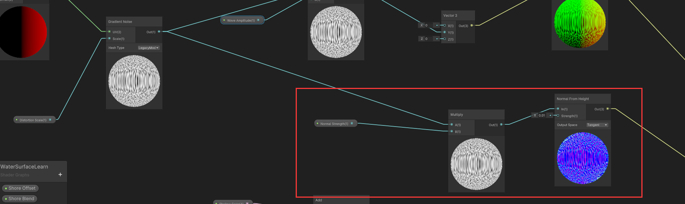

# Unity 水相关

# 一、基础程序化水+Caustics

参考Github链接：https://github.com/aniruddhahar/URP-WaterShaders?tab=readme-ov-file

## 1.水的部分

### （1）法线Normal+顶点偏移+Alpha+Smooth

这部分最终实现的效果如下图：


思路如下：

- 对于顶点偏移，取Absolute World Position的xz坐标作为UV，取（时间 * 自定义的speed值）为offset，对一张Gradient Noise进行采样，乘一个Wave Amplitude系数放大/缩小对应的幅度值，将计算的结果加到Object Space的Y值上，最终作为顶点着色器输入的Position值。**省流：对顶点着色器的顶点模型坐标的Y值进行偏移，偏移大小由噪声图决定，辅助以时间变化作为offset。**
- 对于法线Normal：核心部分如下图，其实就是对于那张Gradient Noise，有一个**Normal From Height**的节点，可以构建对应的法线贴图，作为最终Normal的输入即可。



- Alpha和Smooth：直接作为可以调节的参数值即可。


### （2）BaseColor

Screen Position：

- **Raw** - Returns the raw **Screen Position** values, which are the **Screen Position** values before the clip space position W component is divided out. Position `float2(0,0)` is at the lower left corner of the screen. This mode is useful for projection.

> 在Shader Graph中，如果选择了Screen Position节点的Raw选项，那么此时还没有进行透视除法，根据[深入理解透视矩阵 - zhyingkun](https://www.zhyingkun.com/perspective/perspective/)这篇博客的内容，我感觉这个Screen Position的w分量指的是屏幕的深度值，也就是z？


#### 如何用Shader graph做一个依据屏幕深度的深浅分层效果？

Q：`scene depth（linear01）* camera的far plane值，减去screen position节点选择Raw.a分量的值，这样做的意义是什么？常用来做什么？`

> 这个计算的意义在于获取屏幕上每个像素的深度信息，并将其与特定的屏幕位置信息结合，通常用于实现特定的视觉效果或技术。
>
> 具体来说：
>
> - **Scene Depth（linear01）**：这是一个范围在0到1之间的值，代表了每个像素在场景中的深度值，经过线性01插值（linear01）处理后的深度。
> - **Camera的far plane值**：这是相机的远裁剪平面的深度值。它决定了相机能看到的场景的最远距离。
>
> 注：下图所示的这种连线方式：
>
> 
>
> 暂时还有点难以理解，但大概是可以依据深度给出颜色深浅的不同区域，在后面的shader 学习中如果有用可以拿过来。如果把上面连连看的结果再进行smoothstep+clamp01的操作，就会得到这样的现象：如果深度靠近深度图上的深度，则值较小；若深度大于深度图上的深度，则差得越多值越大。比如下面如果加上一个水池就是这种效果：
>
> 
>
> 可以看到，水池四周，Scene Depth与深度图记录的深度相差较小，可以得到一个较小的值t，如果使用这个值t lerp 浅水区和深水区的颜色，就可以做到离岸近的区域水颜色较浅；离岸远的区域水颜色较深； `color = lerp(浅水颜色，深水颜色，t)`

至此，水表面的部分就算是完成了，接下来的重点是Caustics的实现。


## 2.Caustics

首先，建议学习这个视频：https://www.youtube.com/watch?v=uxJZghsWQ-s

### （1） Unity_Rotate_Degrees_float 函数

这个函数用于旋转二维向量 `UV`，围绕指定的中心点 `Center` 和角度 `Rotation` 进行旋转。以下是函数的具体实现和作用：

```c#
float2 Unity_Rotate_Degrees_float(float2 UV, float2 Center, float Rotation)
{
    Rotation = Rotation * (3.1415926f / 180.0f);  // 将角度转换为弧度

    UV -= Center;  // 将UV坐标转换为相对中心点的偏移量

    float s = sin(Rotation);  // 计算角度的正弦值和余弦值
    float c = cos(Rotation);

    float2x2 rMatrix = float2x2(c, -s, s, c);  // 构建旋转矩阵

    rMatrix *= 0.5;  // 缩放矩阵，将范围限制在[-0.5, 0.5]
    rMatrix += 0.5;  // 将范围映射到[0, 1]
    rMatrix = rMatrix * 2 - 1;  // 将范围映射到[-1, 1]

    UV.xy = mul(UV.xy, rMatrix);  // 应用旋转矩阵到UV坐标

    UV += Center;  // 加上中心点的偏移量，得到旋转后的UV坐标

    return UV;  // 返回旋转后的UV坐标
}
```

**解释**：

- **Rotation的单位转换**：将旋转角度从度转换为弧度，这是标准的三角函数库（sin、cos）所需的角度单位。
- **UV坐标的调整**：将UV坐标减去中心点，以便于围绕中心点进行旋转。
- **旋转矩阵的构建**：通过角度的正弦和余弦值构建旋转矩阵。
- **矩阵的缩放和映射**：将矩阵的值缩放到[-1, 1]范围内，以确保正确的旋转转换。（这段对应`rMatrix *= 0.5;rMatrix += 0.5;rMatrix = rMatrix * 2 - 1;`，但其实很怪，这段感觉并没有真正做范围映射，推导了一下感觉什么都没干，不知道为啥代码这么写，但应该不重要。）
- **应用旋转矩阵**：将旋转矩阵应用到UV坐标上，实现旋转效果。
- **恢复中心点偏移**：将旋转后的UV坐标加上中心点的偏移量，得到最终的旋转后UV坐标。


------


### （2）TriplanarProjection_float 函数

关于三平面映射的基础知识，可以参考这篇博客：https://indienova.com/indie-game-development/unity-shader-triplanar-mapping/

这个函数实现了三轴投影，根据位置、法线和纹理坐标进行纹理采样，并根据法线的绝对值和混合参数来混合三个投影方向的纹理采样结果。

```c#
void TriplanarProjection_float(
    in Texture2D Texture,
    in SamplerState Sampler,
    in float3 Position,   // world space
    in float3 Normal,   // world space
    in float Tile,
    in float Blend,
    in float Speed,
    in float Rotation,
    out float4 Out
)
{
    float3 Node_UV = Position * Tile;  // 计算基础UV坐标，根据位置和瓦片参数

    // 根据时间和速度计算UV偏移量
    float Offset_UV = _Time.y * Speed;

    // 根据法线和混合参数计算各轴方向上的权重
    float3 Node_Blend = pow(abs(Normal), Blend);
    Node_Blend /= dot(Node_Blend, 1.0);  // 归一化权重

    // 分别对三个轴进行纹理采样，并根据权重进行混合
    float4 Node_X = SAMPLE_TEXTURE2D(Texture, Sampler, Unity_Rotate_Degrees_float(Node_UV.zy, 0, Rotation) + Offset_UV);
    float4 Node_Y = SAMPLE_TEXTURE2D(Texture, Sampler, Unity_Rotate_Degrees_float(Node_UV.xz, 0, Rotation) + Offset_UV);
    float4 Node_Z = SAMPLE_TEXTURE2D(Texture, Sampler, Unity_Rotate_Degrees_float(Node_UV.xy, 0, Rotation) + Offset_UV);

    // 按权重混合三个方向的纹理结果
    Out = Node_X * Node_Blend.x + Node_Y * Node_Blend.y + Node_Z * Node_Blend.z;
}
```

**解释**：

- **Node_UV的计算**：基于顶点位置和Tile参数计算出基础的UV坐标。
- **Offset_UV的计算**：根据时间和速度调整UV坐标的偏移量，用于动画效果。
- **Node_Blend的计算**：根据法线的绝对值和混合参数Blend计算出三个轴方向上的权重。
- **纹理采样**：使用Unity_Rotate_Degrees_float函数对三个轴方向的UV坐标进行旋转，然后进行纹理采样。
- **混合结果**：根据权重Node_Blend混合三个方向上的纹理采样结果，得到最终的输出Out。

> 在当前这个参考的项目当中，Caustics是由Voronoi噪声合成得到的+三平面映射得到的，得到的结果会用一张标记水面上水面下的Mask相乘，然后与基础的材质做add操作。
>
> todo：Voronoi合成Caustics的效果实测下来一般，或许用贴图的方式来做会更好一些？

------


## 3.Water Distortion

这部分比较trick，但是效果其实挺不错，大概就是在水下的时候有一个比较强烈的屏幕扭曲，而且整体后处理的颜色会变深，体现出一种潜入深海的感觉。具体的可以看WaterDistortion这个shader。


# 正好看到的，未来有可能学习应用的内容

【1】https://news.16p.com/873200.html