# Unity——假室内效果Interior Mapping

参考链接：Interior Mapping：https://zhuanlan.zhihu.com/p/705153727

先看这个：https://zhuanlan.zhihu.com/p/376762518


# 一、Cubemap的方法

## 1.Cubemap的制作

### （1）Legacy的方法

这个在《入门精要》里有提到，大概就是准备好top、bottom、front等六个面的图，然后右键Create->Legacy->Cubemap赋值即可，如下图：

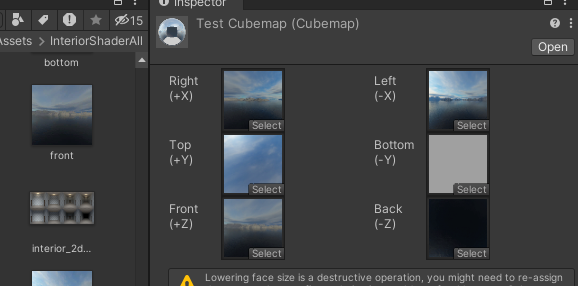


### （2）直接图像生成

把一张类似于下图的图导入到unity当中：

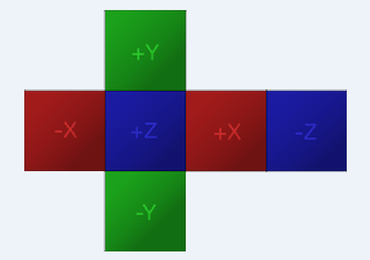

然后修改其Texture Shape为Cube即可。根据Unity的官方文档：https://docs.unity3d.com/Manual/class-Cubemap.html，一般来说上图这种Cubemap都是可以自动识别的。

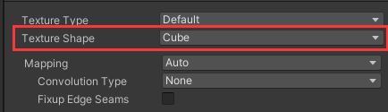


## 2.相关的Interior Mapping Shader

### （1）Object Space

以下是顶点着色器部分：

```glsl
v2f vert(appdata v)
{
    v2f o;
    o.pos = UnityObjectToClipPos(v.vertex);
    // slight scaling adjustment to work around "noisy wall" 
    // when frac() returns a 0 on surface
    o.uvw = v.vertex * _RoomCube_ST.xyx * 0.999 + _RoomCube_ST.zwz;

    // get object space camera vector
    float4 objCam = mul(unity_WorldToObject, float4(_WorldSpaceCameraPos, 1.0));
    o.viewDir = v.vertex.xyz - objCam.xyz;

    // adjust for tiling
    o.viewDir *= _RoomCube_ST.xyx;
    return o;
}
```

- o.UVW也就是该像素在模型空间的位置，我们之后会用来采样。**这里配合tilling的影响加上了ST的参数，以及为了避免极值，乘了一下0.999，调整一下UVW值。**根据相机和当前位置，计算视线方向（也就是公式推导里的$\vec{d}$，是从相机开始往物体上指）。
- 相机位置，永远是在平面的上面，可以看到平面的正面（反面就被剔除了）

以下是片元着色器部分：

```glsl
fixed4 frag(v2f i) : SV_Target
{
    // room uvws
    float3 roomUVW = frac(i.uvw); //frac保留小数部分，结果的范围是[0，1]

    // raytrace box from object view dir
    // transform object space uvw( min max corner = (0,0,0) & (+1,+1,+1))  
    // to normalized box space(min max corner = (-1,-1,-1) & (+1,+1,+1))
    float3 pos = roomUVW * 2.0 - 1.0;  //把上面的roomUVW映射到[-1，1]的范围

 
    // 这个地方说明一下，也就是预先处理了一下倒数
    // t=(1-p)/view=1/view-p/view
    float3 id = 1.0 / i.viewDir;

    // k means normalized box space depth hit per x/y/z plane seperated
    // (we dont care about near hit result here, we only want far hit result)
    float3 k = abs(id) - pos * id;
    // kmin = normalized box space real hit ray length
    float kMin = min(min(k.x, k.y), k.z);
    // normalized box Space real hit pos = rayOrigin + kmin * rayDir.
    pos += kMin * i.viewDir;

    // randomly flip & rotate cube map for some variety
    float3 flooredUV = floor(i.uvw);
    float3 r = rand3(flooredUV.x + flooredUV.y + flooredUV.z);
    float2 cubeflip = floor(r.xy * 2.0) * 2.0 - 1.0;
    pos.xz *= cubeflip;
    pos.xz = r.z > 0.5 ? pos.xz : pos.zx;


    // sample room cube map
    fixed4 room = texCUBE(_RoomCube, pos.xyz);
    return fixed4(room.rgb, 1.0);
}
```

关于这段的解读主要参考https://zhuanlan.zhihu.com/p/376762518，以下进行整理：

- （1）做Interior Mapping的核心思路在于下图。蓝色的是实际的平面，红色的是模拟采样的点，我们要用红色采样的值作为蓝色点对应像素的值，这其实就是一个类似光线与AABB求交的问题。

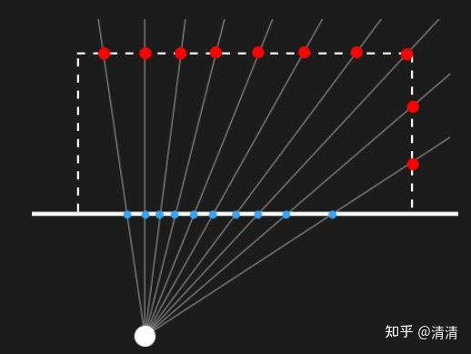

而光线与AABB求交的推导如下：

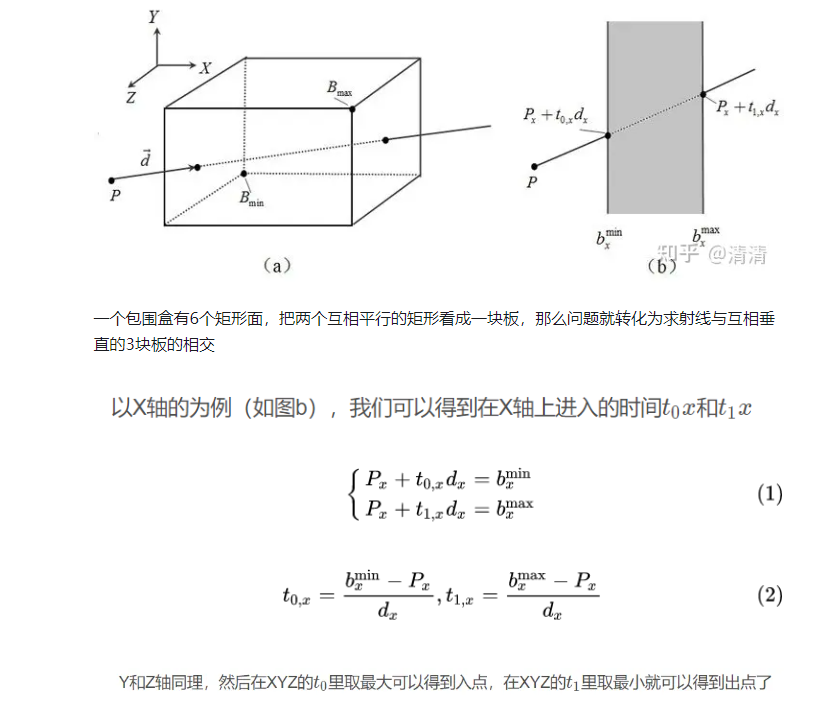

- （2）实际在做Interior Mapping的时候，要采样的点应当都是离开AABB三个面的对应t值t1x，t2x，t3x中最小的那个t值对应的采样点（这里参考一下Games101当中的光线与AABB求交部分）。
- （3）`float3 pos = roomUVW * 2.0 - 1.0;`这里的pos就相当于上图中的P，可以理解为是射线在标准化立方体空间内的位置。而我们要求的就是P到离开AABB的最小t值，这就对应`float3 id = 1.0 / i.viewDir;`和`float3 k = abs(id) - pos * id;`、`    float kMin = min(min(k.x, k.y), k.z);`、`pos += kMin * i.viewDir;`这几句。（在对应的shader代码中，这里的d并没有归一化处理，实际上应该也不需要，最终能得到`pos += kMin * i.viewDir`的正确结果就行，viewDir是否归一化应该是不影响的）

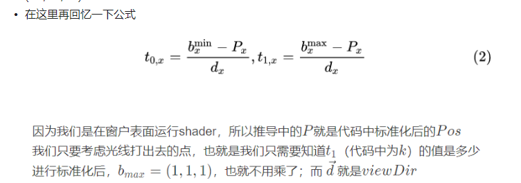

- 补充：关于`float3 k = abs(id) - pos * id`：这里为什么要取abs？

> 在片元着色器中，`float3 k = abs(id) - pos * id`; 这里取abs的原因是为了确保计算的结果是正数，从而正确地确定射线与立方体边界的交点。让我们详细解释一下：
>
> - **id** 是一个向量，表示射线的倒数方向（即每个分量分别取倒数），它可以是正数也可以是负数，取决于射线的方向。
> - **pos** 是射线在标准化立方体空间内的位置，它是通过射线在物体空间中的uvw坐标计算得到的。
> - **abs(id)** 将id的每个分量取绝对值，这样确保了无论射线的方向如何，后续的计算都能得到正确的结果。
>
> 具体来说，计算 **k = abs(id) - pos \* id** 的目的是找到射线与立方体边界的交点。在这个计算中：
>
> - **pos \* id** 计算了射线从起点到立方体边界的距离（在标准化立方体空间内）。
> - **abs(id) - pos \* id** 的结果告诉我们射线在每个轴上与立方体边界的交点距离。
>
> 通过取绝对值，我们确保无论射线是朝向立方体的内部还是外部，计算得到的距离都是正数，这样可以正确地确定射线在标准化立方体空间内的交点位置。
>
> 因此，取abs(id)的操作是确保在进行后续的计算时，不会由于射线方向的不同导致错误的交点计算，保证了片元着色器中对立方体映射的正确实现。

------

- （4）以下的代码：
  ```c#
  // randomly flip & rotate cube map for some variety
  float3 flooredUV = floor(i.uvw);
  float3 r = rand3(flooredUV.x + flooredUV.y + flooredUV.z);
  float2 cubeflip = floor(r.xy * 2.0) * 2.0 - 1.0;
  pos.xz *= cubeflip;
  pos.xz = r.z > 0.5 ? pos.xz : pos.zx;
  ```

这段代码主要是随机对Cubemap进行flip和旋转的操作，以增加多样性。下图左侧为注释掉这段代码的结果，右侧为启用这段代码的结果（这两张图设置Room Cubemap的tiling是1，offset都是0）：

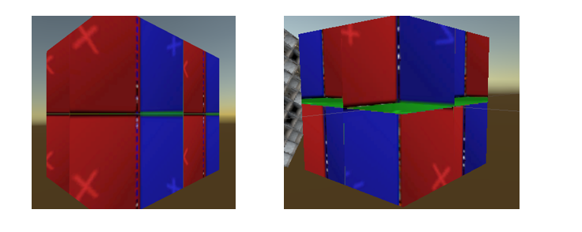

------


### （2）Tangent Space

采用Object Space实现的缺陷如下图，由于内部房间只能严格按照轴对齐排列，在曲面上显得很奇怪。

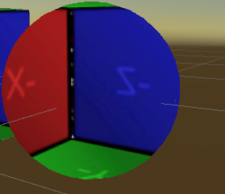

为了能让box在曲面也能表现良好，我们到切线空间中进行求交，代码整体上差不多。

首先是顶点着色器：

```glsl
v2f vert(appdata v)
{
    v2f o;
    o.pos = UnityObjectToClipPos(v.vertex);
    // uvs
    o.uv = TRANSFORM_TEX(v.uv, _RoomCube);

    // get tangent space camera vector
    float4 objCam = mul(unity_WorldToObject, float4(_WorldSpaceCameraPos, 1.0));
    float3 viewDir = v.vertex.xyz - objCam.xyz;
    //下面是多出来的部分=============================================================
    float tangentSign = v.tangent.w * unity_WorldTransformParams.w;
    float3 bitangent = cross(v.normal.xyz, v.tangent.xyz) * tangentSign;
    o.viewDir = float3(
        dot(viewDir, v.tangent.xyz),
        dot(viewDir, bitangent),
        dot(viewDir, v.normal)
        );
	//=============================================================
    // adjust for tiling
    o.viewDir *= _RoomCube_ST.xyx;
    return o;
}
```

多出来的内容是把viewDir从模型坐标系转到了切线空间，正常应该是左乘模型坐标到切线坐标的矩阵，相当于右乘切线空间到模型空间的矩阵（每一列分别是模型空间下tangent，bitangent，normal的方向）。上面这段代码新增片段是用点乘做的，比较好理解~


接下来是片元着色器的修改，只修改了以下部分：

```glsl
float2 roomUV = frac(i.uv);

// raytrace box from tangent view dir
float3 pos = float3(roomUV * 2.0 - 1.0, 1.0);
```

> 片元着色器大同小异，基本一样。在定义pos的时候，让Z=1（Z也就是TBN里的N，相当于转向外面？），朝内采样。`float3 pos = float3(roomUV * 2.0 - 1.0, 1.0);`

------


### （3）深度如何实现？

深度如何实现呢？

我们指定一个深度值，然后在片元着色器前面加上深度映射的代码，我们把深度乘上视线的Z。

```glsl
// Specify depth manually
fixed farFrac = _RoomDepth;

//remap [0,1] to [0, +inf]
//->if input _RoomDepth = 0    -> depthScale = 0      (inf depth room)
//->if input _RoomDepth = 0.5  -> depthScale = 1
//->if input _RoomDepth = 1    -> depthScale = +inf   (0 volume room)
float depthScale = 1.0 / (1.0 - farFrac) - 1.0;
i.viewDir.z *= depthScale;
```

**note：这种映射关系还是比较巧妙的，如果以后的shader需要把[0，1]的范围映射到[0，+inf]，可以用这种映射关系。**

我们如果在原本的基础上放大了视线Z的倍率，也就是视线向量更加朝着远处走了，采样的时候就好像更深了。按照上面的代码，_RoomDepth越小，效果就像是越深，不太符合美术的直觉，所以最终实现上改成了`fixed farFrac = 1.0 - _RoomDepth;`.

> 上面的做法是根据z移动的距离来进行在采样上的缩放，会导致四周的贴图失真。
>
> 也可以用偏移来表达房间的深度，也就是整体前后移动，由此造成能偏移的深度就很有限了，只能是box的深度。
>
> 可以看[这位大大的实现](https://zhuanlan.zhihu.com/p/159439811)
>
> 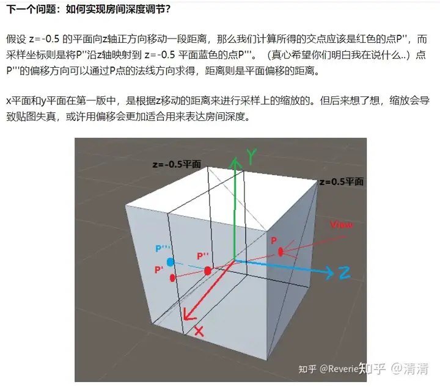
>
> **todo**：这个后面看看需不需要实现，暂时可以先搞进项目里面看看效果。


## 3.预投影2D贴图

使用Cubemap的缺陷在于，人们基本不可能人为对贴图进行绘制微调，这对艺术家构建多种的内部贴图资产不太友好。而且Cubemap不仅不好做Atlas，而且一般也会更大。

所以我们选择把三维的采样映射到二维上，然后去采样提前烘焙好的2D纹理，例如：

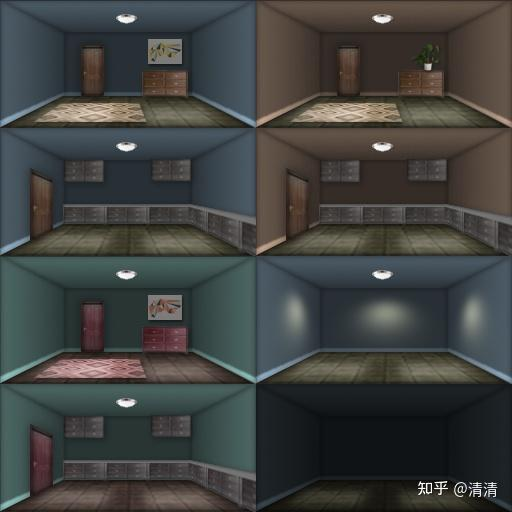

这个方式是比较好的，具有很高的创作性，易于使用，并且展示的结果仅比完整的立方体贴图差一点。

- 因为是基于一张投影图做的映射，所以只有在该图片原先渲染的角度才能获得最完美的效果。 换到其他角度或者随意改变深度映射什么的，都会造成些微的扭曲和失真

而且它可以在每个建筑物的基础上构建大量的室内图集，随机选择，达到仅使用一个纹理资源，建筑物就可以保持具有随机变化的内部场景风格。

只能说和cubemap的方法各有利弊吧。

### （1）技术原理

对于立方体形状的房间，若后壁的大小为可见瓷砖的1/2，此时如果将它们渲染出来，要使用水平FOV为53.13度从开口向后的摄像机。

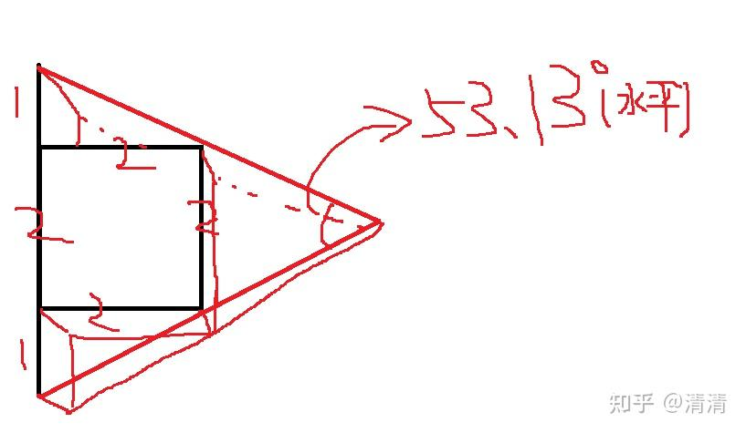

我们于是可以规定这种情况下的深度单位为标准深度，也就是_RoomDepth = 0.5 → depthScale = 1。比如下面这个图，就是用这种情况下渲染出来的：

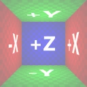

房间深度可以存储在图集纹理的Alpha通道中（标准深度也就是alpha通道为128）。当然也可以不管alpha通道，手动来自己调整深度，这两种指定方式代码会说明。也可以去[地平线4制作者的A站链接](https://link.zhihu.com/?target=https%3A//www.artstation.com/artwork/Pm2wo4)下载图集，下载完类似于下图所示：

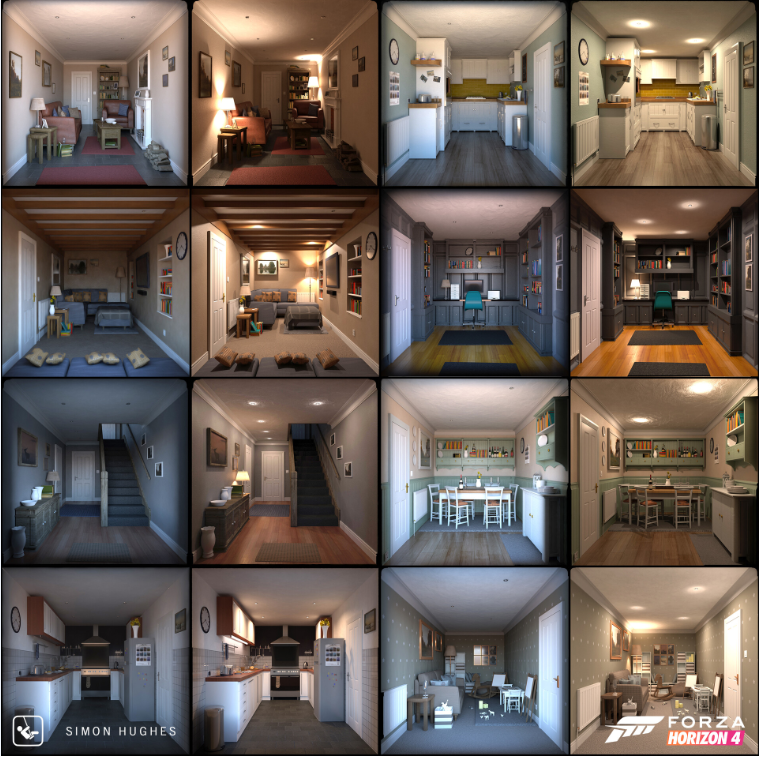

我们的整体思路不变，先在轴对齐包围盒中求交点，然后我们要把原本要采样cubemap的三维空间的交点，映射到2d图片的UV上，采样预投影2d图片。

> 注：其实和前面的Cubemap的实现方式的区别就在于，这里是采样的2D贴图。

------

