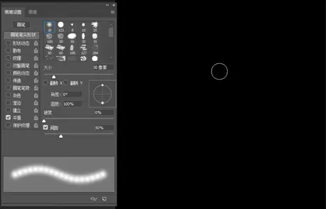
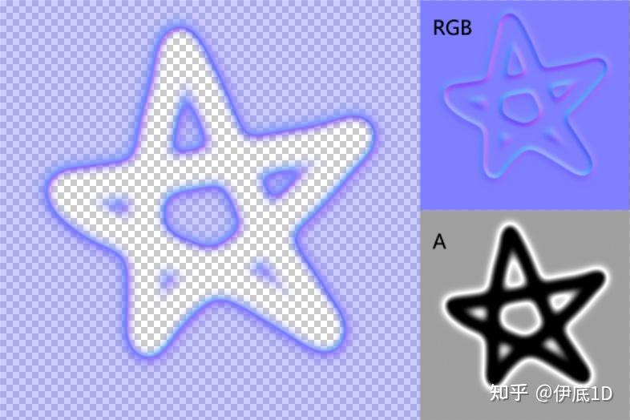
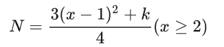
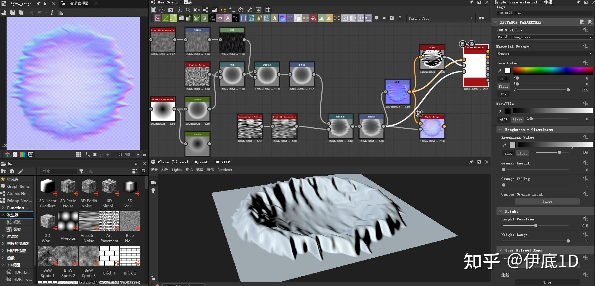
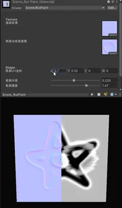
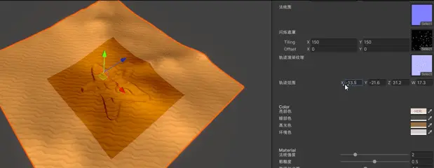
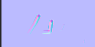

# 《原神》沙漠效果复刻

主要参考链接：https://zhuanlan.zhihu.com/p/568051545

这里除了上述链接中博客的基本内容，也加入了一些自己的理解，并争取对代码进行一定的修改，让效果更好一点。


# 一、基本原理（1）

## 1.绘制的基本原理

——对于绘制，我们可以模仿PS的绘制过程来解决这个问题。




​	这个绘制（添加新的“圆点”）的过程可以描述为一个迭代、或者说递归的过程，即用原图经过“加点”方法f(x)处理输出新图，而新图作为下次“加点”处理的原图输入，并重复这个过程。

`𝑇𝑒𝑥𝑡𝑢𝑟𝑒_{𝑛+1}=𝑓(𝑇𝑒𝑥𝑡𝑢𝑟𝑒_{𝑛})`

​	如此一来，在shader中只需计算和新加的那一个“圆点”相关的数据即可，而之前的结果都保存在了一张图像中。这个过程的实现方法也不唯一，可以用Compute shader来实现，在这篇博客中使用的是tesselation方法来实现。


## 2.轨迹体积的实现

### （1）置换贴图（displacement map）

​	一般是一张记录了表面凹凸程度（高度）的灰度图，可以用它在顶点shader中改变模型的顶点位置（实际上模型本身没变，只是最终看上去的效果变了。**最常见的套路就是下面这样沿法线方向膨胀**）。以下是两个应用displacement map需要注意的问题：

- 轨迹的形状可能存在外围比地表高，内部比地表低的情况，既可以拱出来又可以压下去，所以这里可以对displacement map做一个映射，把【0，1】的灰度值映射到【-1，1】，作为顶点沿法线偏移的量；
- 直接使用displacement map的话，阴影是错误的，解决方案是用法线贴图。虽然法线可以基于高度图在shader中实时计算，但考虑到性能开销与效果，这里还是用现成的法线贴图来做。这里可以做一个小优化，充分利用颜色通道，将法线信息存到图像的RGB通道，高度存到A通道中。

综合以上两点可以得到类似于下面的笔刷贴图：



> 需要注意的是，因为这里的法线是我们自定义的编码方式，所以U3D的图像导入设置中不能选NormalMap，shader中也不能用UnpackNormal解码。并且因为存储的是数据不是颜色，所以不能勾选sRGB。（原因可以参考我的[这篇文章](https://link.zhihu.com/?target=https%3A//www.bilibili.com/read/cv18385963%3Fspm_id_from%3D333.999.0.0)中末尾关于线性和Gamma空间的陈述）。**也就是说这张图需要取消勾选sRGB。**

如果只是用上面的displacement map和法线贴图，则效果还是不会太好，这是因为mesh的”分辨率“太低了，**解决方案是对其进行曲面细分。**

------


### （2）曲面细分

曲面细分和几何shader是渲染管线中的两个可选阶段。一般我们写的shader，尤其是移动端shader只会用到顶点和片段shader，而完整的流程则是顶点->曲面细分->几何->片段。

按博客作者的理解（注：我个人觉得也差不多，反正能把代码写明白就行），曲面细分阶段又可以进一步分成【顶点阶段数据接收】、【细分规则配置】、【计算插值权重】和【细分后的顶点属性计算】四部分。若要使用曲面细分shader，首先需要在Pass内的开头补上以下内容（类似于顶点着色器和片元着色器的声明）：

```glsl
#pragma hull hs
#pragma domain ds
```

下面对各阶段的解析只讨论图元是三角形时的情况。

#### （a）顶点阶段数据接收

曲面细分的位置在顶点阶段后。参照顶点与片段之间利用结构体及对应的方法传递数据的方式（后面几个阶段的数据交换也都类似），曲面细分也需要定义一个结构体来接收顶点阶段的数据，比如下面这个样子：

```glsl
//顶点shader
struct a2v
{
    float4 posOS	: POSITION;
    float3 nDirOS : NORMAL;
    float4 tDirOS : TANGENT;
    float2 uv0  : TEXCOORD0;
};
struct v2t  //曲面细分结构体
{
    float3 posWS	: TEXCOORD0;
    float3 nDirWS : TEXCOORD1;
    float3 tDirWS : TEXCOORD2;
    float3 bDirWS    : TEXCOORD3;
    float2 uv0  : TEXCOORD4;
    float2 uv_Rut : TEXCOORD5; //先忽略这个，后面会说
};
```

此时顶点着色器是这样的：

```glsl
v2t vert(a2v i)
{
    v2t o;

    //坐标
    o.posWS = TransformObjectToWorld(i.posOS.xyz);

    //向量
    o.nDirWS = TransformObjectToWorldNormal(i.nDirOS);
    o.tDirWS = TransformObjectToWorldDir(i.tDirOS.xyz);
    o.bDirWS = cross(o.nDirWS, o.tDirWS) * i.tDirOS.w;

    //UV
    o.uv0 = i.uv0; 
    o.uv_Rut = float2(Remap(_PaintRect.x, _PaintRect.z, o.posWS.x), Remap(_PaintRect.y, _PaintRect.w, o.posWS.z)); //先忽略这个，后面会说

    return o;
}
```

------


#### （b）细分规则配置

即如何对一个三角面进行细分。在曲面细分的流程中，我们需要设置三角形各边要分成几段，以及三角形内部有几个新加的点（实际上不是点的数量。内部点的细分数并不直观）。首先，我们需要声明下面这么个结构体用来存储细分配置：

```glsl
//对三角面或其他形式图元进行细分的配置
struct TessParam
{
    float EdgeTess[3]	: SV_TessFactor;//各边细分数
    float InsideTess	    : SV_InsideTessFactor;//内部点细分数
};
```

紧接着这个结构体下面写这么个方法来算具体怎么分，后面几个阶段也是类似的格式：

```glsl
TessParam ConstantHS(InputPatch<v2t, 3> i, uint id : SV_PrimitiveID)
{
  TessParam o;

  o.EdgeTess[0] = 第1条边的细分段数;
  o.EdgeTess[1] = 第2条边的细分段数;
  o.EdgeTess[2] = 第3条边的细分段数;
  o.InsideTess = 内部细分点系数;

  return o;
}
```

上面这个方法在运行时会在原模型的每个三角面上跑一遍。参数列表中的`i`可以获得之前在顶点阶段传到曲面细分结构体里的数据，并且是三份（一个三角面上的三个顶点）。如果需要做一些局部细分的优化，可能就需要用到它。

> 注意：这里可以想到一个优化点，即在需要足迹的地方使用tessellation，而在比如离角色脚印很远的位置则不需要进行tessellation，这个优化策略会在后面的具体代码分析部分进行分析。

我们先来看一下这两种参数对模型的实际影响：


- 右边参数的xyz分量对应边的细分段数，w对应内部细分点系数。

  > 需要特别说明的是这里有个坑，如果把三条边的细分段数公开成三个不同的参数来控制会出问题，网格会完全消失（或闪烁），但博客作者不清楚原因。以防万一如果后面需要对每个参数单独控制的话给个`float3`吧，而不是三个float。

- 对于这几个参数，其中的EdgeTess很直观，给多少，对应的边就会被分成几段；而对于InsideTess，经观察可以发现它只会影响内层三角形的细分点排列方式，也就是说EdgeTess与InsideTess是互相独立的。
- 以一些简单的等差数列知识可以算出来，InsideTess系数与内部的细分点个数间的关系如下（注：不过这个在实际写代码的时候也不是那么需要关心）：
  - ——其中N是三角形内部增加的点的个数；x是InsideTess给的数；k在x是奇数时为0，偶数时为1。

------


#### （c）计算插值权重

​	这个阶段是**不可编程的**。他会根据我们之前和下面的细分配置在硬件内部进行计算，并得到每个新顶点的插值权重，或者说所谓的“重心空间坐标”（其实某种层面上类似于片段shader前的光栅化线性插值阶段，只不过这里插值计算的是顶点而不是像素。并且这一步只是得到每个顶点的插值权重，真正的混合需要我们在下一个阶段手动计算）。但是在此之前，还需要写一些配置方面的东西：

```glsl
//将原模型顶点属性按指定图元打包？
struct TessOut
{
    float3 posWS	: TEXCOORD0;
    float3 nDirWS : TEXCOORD1;
    float3 tDirWS : TEXCOORD2;
    float3 bDirWS    : TEXCOORD3;
    float2 uv0  : TEXCOORD4;
    float2 uv_Rut : TEXCOORD5;
};
[domain("tri")]//图元类型
[partitioning("integer")]//曲面细分的过渡方式是整数还是小数
[outputtopology("triangle_cw")]//三角面正方向是顺时针还是逆时针
[outputcontrolpoints(3)]//输出的控制点数
[patchconstantfunc("ConstantHS")]//对应之前的细分因子配置阶段的方法名
[maxtessfactor(64.0)]//最大可能的细分段数
TessOut hs(InputPatch<v2t, 3> i, uint idx : SV_OutputControlPointID)//在此处进行的操作是对原模型的操作，而非细分后
    //目前来说就是直接赋值就好，没看出来具体有什么用，不影响写代码
{
    TessOut o;
    o.posWS = i[idx].posWS;
    o.nDirWS = i[idx].nDirWS;
    o.tDirWS = i[idx].tDirWS;
    o.bDirWS = i[idx].bDirWS;
    o.uv0 = i[idx].uv0;
    o.uv_Rut = i[idx].uv_Rut;
    return o;
}
```

> 这段中间的那几行中括号【】括起来的配置还是有一定影响的，但一般需要动的可能也就第二行。除了integer，可选的字段还有fractional_odd和fractional_even两种。后两种的效果类似，都是有个平滑过渡的过程。针对`[partitioning("integer")]`不同参数的区别可以看下面的链接：
>
> https://vdn6.vzuu.com/SD/58b4f3f6-3cd2-11ed-b64d-1636829a506b.mp4?pkey=AAUW9DHw1MLquNX-oQaPDlfL_qemBqxumJsW_uwud3zq8DauwmH7oi_6Ng5DM00-pleWWHeAS5PmCizCRWAn1jm1&bu=078babd7&c=avc.1.1&expiration=1721230816&f=mp4&pu=078babd7&v=ks6


#### （d）**细分后的顶点属性计算**

​	到这里就是细分着色器的最后一步了。这一步的方法其实相当于一般顶点-片段shader中的顶点阶段，像是2.1中的置换贴图法线膨胀算法或是其他常见的写在顶点阶段的算法就可以写在这里。只不过经过了前面的细分处理，**这里所处理的顶点不是原模型的顶点，而是细分后的所有顶点。**看代码：
```glsl
struct t2f
{
    float4 posCS	       : SV_POSITION;
    float3 posWS            : TEXCOORD7;
    float3 nDirWS       : TEXCOORD0;
    float3 tDirWS       : TEXCOORD1;
    float3 bDirWS       : TEXCOORD2;
    float3 vDirWS       : TEXCOORD3;
	//...后面代码分析中具体会说
};
[domain("tri")]
t2f ds(TessParam tessParam, float3 bary : SV_DomainLocation, const OutputPatch<TessOut, 3> i)
{
    t2f o;   

    //线性转换
    o.posWS = i[0].posWS * bary.x + i[1].posWS * bary.y + i[2].posWS * bary.z;
    o.nDirWS = i[0].nDirWS * bary.x + i[1].nDirWS * bary.y + i[2].nDirWS * bary.z;
    o.tDirWS = i[0].tDirWS * bary.x + i[1].tDirWS * bary.y + i[2].tDirWS * bary.z;
    o.bDirWS = i[0].bDirWS * bary.x + i[1].bDirWS * bary.y + i[2].bDirWS * bary.z;
    //...后面代码分析中具体会说

    return o;
}
```

其实这里的`ds`函数的传入参数之一`bary`指的就是重心坐标，而下面函数体内暂时展示的部分就是重心插值的思路。最终再把`t2f`作为片元着色器的输入参数即可：
```glsl
float4 frag(t2f i) : SV_Target
{
	//像素处理
}
```


#### （e）曲面细分着色器的其他参考资料

【1】https://blog.csdn.net/suixinger_lmh/article/details/125140224

【2】https://blog.csdn.net/ifenghua135792468/article/details/106851708/

【3】https://blog.csdn.net/WINDGRIN23313/article/details/120128498

------


### （3）Displacement map + tessellation

基于之前做的[沙漠材质球](https://link.zhihu.com/?target=https%3A//www.bilibili.com/read/cv18488420%3Fspm_id_from%3D333.999.0.0)，将上述两种技术加进去。首先是对normal+displacement的应用，这个写在domain shader当中即可：

```glsl
t2f ds(TessParam tessParam, float3 bary : SV_DomainLocation, const OutputPatch<TessOut, 3> i)
{
    t2f o;   

    //线性转换
    o.posWS = i[0].posWS * bary.x + i[1].posWS * bary.y + i[2].posWS * bary.z;
    o.nDirWS = i[0].nDirWS * bary.x + i[1].nDirWS * bary.y + i[2].nDirWS * bary.z;
    o.tDirWS = i[0].tDirWS * bary.x + i[1].tDirWS * bary.y + i[2].tDirWS * bary.z;
    o.bDirWS = i[0].bDirWS * bary.x + i[1].bDirWS * bary.y + i[2].bDirWS * bary.z;
    float2 uv0 = i[0].uv0 * bary.x + i[1].uv0 * bary.y + i[2].uv0 * bary.z;
    o.uv_Rut = i[0].uv_Rut * bary.x + i[1].uv_Rut * bary.y + i[2].uv_Rut * bary.z;  //这里的uv_Rut暂时是将物体世界空间下的坐标x和z remap到0-1之间的UV值

    //痕迹变形
    float height = tex2Dlod(_RutRTTex, float4(o.uv_Rut, 0, 0)).a;
    height = abs(height - 0.5) < minError ? 0.5 : height;//误差截断，防止在平坦区域产生变形
    o.posWS += _RutHeight * (2.0 * height - 1.0) * o.nDirWS;

    //坐标
    o.posCS = TransformWorldToHClip(o.posWS);

    //向量
    o.vDirWS = GetCameraPositionWS() - o.posWS;

    //UV
    o.uv_Main = TRANSFORM_TEX(uv0, _MainTex);
    o.uv_Flash.xy = TRANSFORM_TEX(uv0, _FlashTex);

    //闪烁内层UV偏移
    float3x3 TBN = float3x3(normalize(o.tDirWS), normalize(o.bDirWS), normalize(o.nDirWS));
    float3 vDirTS = TransformWorldToTangent(o.vDirWS, TBN);
    o.uv_Flash.zw = GetPosAnyPlaneCrossDir(float3(0, 0, _FlashOffset), float3(o.uv_Flash.xy, 0), float3(0,0,1), vDirTS).xy;

    return o;
}
```

片元着色器则负责做沙漠沙子的闪烁效果，以及应用法线贴图和计算光照，代码如下（代码中有一些细节，例如小误差截断，会在后面的部分中进行介绍）：

```glsl
float4 frag(t2f i) : SV_Target
{
    //轨迹图采样
    float4 var_RutTex = tex2D(_RutRTTex, i.uv_Rut);
    var_RutTex.xyw = abs(var_RutTex.xyw - 0.5) < minError ? 0.5 : var_RutTex.xyw;//误差截断，防止在平坦区域应用法线贴图

    //地形法线
    float3 nDirTS = UnpackNormal(tex2D(_NormalMap, i.uv_Main));
    nDirTS.xy *= _NormalInt;

    //轨迹法线
    float3 nDirTS_Rut = (2.0 * var_RutTex.xyz - 1.0);
    nDirTS_Rut.xy *= _RutHeight * _RutNormalInt;

    //法线混合
    nDirTS = normalize(float3(nDirTS.xy / nDirTS.z + nDirTS_Rut.xy / nDirTS_Rut.z, 1.0));
    float3x3 TBN = float3x3(normalize(i.tDirWS), normalize(i.bDirWS), normalize(i.nDirWS));

    //todo:可以用更好的法线混合方案：https://www.gameres.com/896279.html

    //向量
    Light light = GetMainLight(TransformWorldToShadowCoord(i.posWS));
    float3 nDirWS = normalize(mul(nDirTS, TBN));
    float3 lDirWS = light.direction;
    float3 vDirWS = normalize(i.vDirWS);
    float3 hDirWS = normalize(lDirWS + vDirWS);

    //光照
    float lambert = saturate(dot(nDirWS, lDirWS));
    float blinn = lambert * pow(saturate(dot(nDirWS, hDirWS)), 1.0 / (_Rough*_Rough));
    float3 baseCol = tex2D(_MainTex, i.uv_Main).rgb;
    float3 diffuseCol = baseCol * lerp(_DarkCol, _BrightCol, lambert);
    float3 specularCol = _SpecularCol * blinn;

    //环境光
    float nv = saturate(dot(nDirWS, vDirWS));
    float fresnel = _F0 + (1.0-_F0) * pow(1.0 - nv, _FresnelPow);
    float3 ambCol = fresnel * _AmbCol * baseCol;

    //闪烁
    float flashMask = Remap(_FlashRange_Max, _FlashRange_Min, length(i.vDirWS));
    float mask0 = tex2D(_FlashTex, i.uv_Flash.xy).r;
    float mask1 = tex2D(_FlashTex, i.uv_Flash.zw).r;
    float flashCol = _FlashInt * flashMask * mask0 * mask1;

    //混合
    float3 finalCol = (diffuseCol + specularCol + flashCol) * light.shadowAttenuation + ambCol;
    return float4(finalCol, 1.0);
}    
```


------


## 3.轨迹的动态绘制

### （1）`Graphics.Blit`

这部分是在C#脚本当中去写的。（注：我以前以为`Graphics.Blit`是不能在URP中写的，看起来应该是可以！！），核心部分是下面的代码：
```c#
public RenderTexture paintRT;//轨迹渲染纹理 RGB法线 A高度
Material paintMat;//绘制处理用的材质
void Paint(Texture2D brushTex/*其他参数*/)
{
  //其他计算
  
  //绘制材质参数配置
  paintMat.SetTexture("_BrushTex", brushTex);//笔刷贴图
  /*其他参数设置···*/
  
  //纹理交换
  RenderTexture tempRT = RenderTexture.GetTemporary(paintRT.descriptor);
  Graphics.Blit(paintRT, tempRT, paintMat, 0);
  Graphics.Blit(tempRT, paintRT);
  RenderTexture.ReleaseTemporary(tempRT);
}
```

> 对上述代码的解读：
>
> - 定义一个Paint方法。其中，paintRT是旧的轨迹图，同时也是地形使用的displacement map+normal map； paintMat是我们一会要写的绘制用的shader实例化出来的一个材质；brushTex是在本次绘制中使用的笔刷贴图（一个法线高度混合图，可以看原博客的2.1部分，就是一个有displacement map和normal map的笔刷贴图）。
> - 完成材质的参数传递后，我们先用`RenderTexture.GetTemporary`方法创建一个交换用的临时RT（说是用这个方法的性能比较好）；
> - 然后`Graphics.Blit(paintRT, tempRT, paintMat, 0)`这句的意思是：【把paintRT用paintMat处理一次后的图像传给tempRT】（0的意思是使用shader中的第几个pass，一般就用第一个，尤其本文的URP管线）。**需要注意的是，Blit会默认把paintRT传给shader中名为_MainTex的变量，所以写shader时名字要对应；**
> - 接着，`Graphics.Blit(tempRT, paintRT)`是将tempRT的结果传回paintRT，完成一次迭代过程；最后一定要用`ReleaseTemporary`手动释放临时RT的内存！（否则就等着内存爆炸吧，不要问我怎么知道的）


### （2）笔刷绘制shader

​	上面的Blit方法需要以一个paintMat作为处理材质，其对应的便是接下来的绘制shader。 结合前面的分析与上述过程，我们绘制用的shader其实只需要关注“单步操作”即可，即“如何把一张笔刷图贴到旧的轨迹图上去”。

先考虑一下，这个shader可能需要用到什么参数。

- 首先，旧的轨迹图和笔刷图是必须的；
- 然后是“在哪画”，即笔刷的UV坐标（这里需要补充一下，Graphics.Blit方法实际上是在一个UV范围是0~1的方形网格上进行相关计算的，所以UV坐标也就相当于贴图归一化的像素坐标）；
- 还有“画多大”，即笔刷在UV空间中的半径；
- 最后还可以加个强度，或者说透明度。

​	显然，如果要把”笔刷“绘制在地形上，这里一定需要一步**法线贴图混合的操作**。**法线贴图混合的操作强烈建议阅读这个文章：https://www.gameres.com/896279.html**（具体的数学暂时不需要了解，但要做到拿来即用）。

​	法线采用之前一篇文中说过的[偏导数](https://link.zhihu.com/?target=https%3A//www.bilibili.com/read/cv18524352%3Fspm_id_from%3D333.999.0.0)的混合方式，高度直接在解码后相加，最后编码（特别说明，原神中的高度混合显然不是这种方式。经过我尝试，它应该是一种比较后取最大/最小的算法，这个后面的博客好像有说。==todo：后面看到的话再回来补充吧==）。

```c#
//地形法线
float3 nDirTS = UnpackNormal(tex2D(_NormalMap, i.uv_Main)); //这个指的是沙子自身的法线贴图
nDirTS.xy *= _NormalInt;

//轨迹法线
float4 var_RutTex = tex2D(_RutRTTex, i.uv_Rut); //这个指的是笔刷，即轨迹渲染纹理，从上面C#脚本的paintRT参数传入
float3 nDirTS_Rut = (2.0 * var_RutTex.xyz - 1.0); //自己做的法线+displacement map，拆出RGB通道（代表法线）并自行unpack
nDirTS_Rut.xy *= _RutHeight * _RutNormalInt;

//法线混合
nDirTS = normalize(float3(nDirTS.xy / nDirTS.z + nDirTS_Rut.xy / nDirTS_Rut.z, 1.0)); //参考https://www.gameres.com/896279.html里面的Partial Derivative Blending
```

> 注：本篇参考的复刻沙漠足迹的知乎文章在这句`nDirTS = normalize(float3(nDirTS.xy / nDirTS.z + nDirTS_Rut.xy / nDirTS_Rut.z, 1.0));`中并没有normalize的操作，不过在后面TBN矩阵相乘的时候有做normalize操作，所以应该也没啥问题，这里提前normalize一下，保证跟Partial Derivative Blending方法保持一致。（补充：在`RutPaint.shader`文件中，作者的法线混合有进行normalize操作）

参考博客中，作者用SD做了一个简易笔刷：



> 注：SD用的还不是很熟，但是感觉应该不难，也是连连看连出来的。

输入后可以得到下面的效果（为方便演示，左半边显示法线，右半边显示高度），可以看到混合的效果还是可以的：



​	至于笔刷局部绘制的实现，可以参考以下伪代码（即在原本的UV0中挖出一块方形来做局部UV），并且相同的思路在之后的地形绘制范围跟随中也会再次用到：

```glsl
float Remap(float min, float max, float input)  //remap函数就是把input映射到min到max之间
{
  float k = 1.0 / (max - min);
  float b = -min * k;
  return k * input + b;
}

float2 _BrushPosTS;//笔刷中心UV坐标
float _BrushRadius;//笔刷归一化半径
float2 uv00 = _BrushPosTS - _BrushRadius;
float2 uv11 = _BrushPosTS + _BrushRadius;
float2 uv_Brush = float2(Remap(uv00.x, uv11.x, i.uv0.x), Remap(uv00.y, uv11.y, i.uv0.y));
```


------

### （3）与地形的联动

​	参照《原神》中的效果，在沙漠中可能产生轨迹的物体可能不止一个。他们的位置会实时发生变化（即对应shader的位置参数），并且轨迹的深浅和大小也可能产生变化（即对应shader的强度与半径参数）。

​	所以Paint方法（上面C#脚本中写的方法）中除了原本的笔刷贴图，还至少应当包含【当前的物体位置】、【当前的绘制强度】与【当前的绘制半径】这三个参数。**倘若其中的位置和半径参数还是世界空间下的尺度，在方法中还需要进行世界空间到UV空间的转化。**


#### （a）局部轨迹绘制

​	根据（3）中的分析，有一个问题需要解决，即如何进行世界空间到UV空间的转化？考虑到像是沙漠之类的地形多是近似于`z=F(x,y)`形式的高度场（即没有洞穴结构那样的纵向层次），所以可以参考3.（2）末尾构造局部UV的思路，在世界空间的俯视投影视角（即XZ平面）下规定一个方形区域，然后将这个区域内世界坐标的xz分量归一化后当作UV（这也是shader中一种常用套路），以此对轨迹图进行采样即可。（但这也就意味着轨迹雕刻仅局限在XZ平面上，而不像zbrush中那样是任意角度的）。

> todo：也就是说如果这个沙漠的坡面比较斜的话画上去的效果可能没那么好，这一点看看后续有没有什么优化思路吧。

​	再参考的知乎文章中，作者定义方形区域的方式是取其左下与右上点的世界坐标构成一个四维向量，效果如下：




#### （b）绘制区域动态跟随

​	因为绘制轨迹的方形范围只是地形中的一个局部，并且玩家控制的角色是运动的，所以这个区域的位置也应当是动态变化的。作者考虑到了两种可能可行的方案（最终采用的是第二种，比较简单）：

- （1）绘制范围相对于地形不动，把地图按一定大小的方格分配，当玩家到达一个新地块时，启动玩家所在地块及周围8个地块的绘制方法，离开时再关闭并卸载区域外的RenderTexture等动态资源（有点像是大地图分区块动态加载的意思）；
- （2）绘制范围的中心实时跟随玩家；

​	采用方法2的话，每当玩家发生移动时，还需要额外向shader传一个UV偏移向量来使整张轨迹图发生偏移。参考的知乎文章将该偏移量与之前的笔刷位置参数`_BrushPosTS`（笔刷中心的UV坐标）合并为`_BrushPosTS_Offset`四维向量。汇总上面的思路，完善后的Paint方法如下（需要同时考虑玩家和NPC对沙漠的绘制，玩家一般处于绘制的中心，而NPC比如怪的绘制范围则需要看离角色多远）：

```c#
public void Paint(Transform tfIN, Texture2D brushTex, float brushRadius, float brushInt)
{
  Vector4 pos_Offset;

  //如果输入对象是玩家，则额外计算纹理偏移与地形材质的范围参数
  if (tfIN == playerTf)
  {
    //位移向量计算
    Vector3 deltaDir01 = (playerTf.position - playerOldPos) / paintSize;
    pos_Offset = new Vector4(0.5f, 0.5f, deltaDir01.x, deltaDir01.z);

    //地形材质范围更新
    playerOldPos = playerTf.position;
    float halfSize = paintSize / 2;
    Vector3 pos00 = playerOldPos - new Vector3(halfSize, 0, halfSize);
    Vector3 pos11 = playerOldPos + new Vector3(halfSize, 0, halfSize);
    groundMat.SetVector("_PaintRect", new Vector4(pos00.x, pos00.z, pos11.x, pos11.z));
  }

  //非玩家，计算当前对象相对玩家的归一化位置
  else
  {
    Vector3 deltaDir01 = (tfIN.position - playerTf.position) / paintSize;
    pos_Offset = new Vector4(0.5f + deltaDir01.x, 0.5f + deltaDir01.z, 0, 0);
  }

  //绘制材质参数配置
  paintMat.SetTexture("_BrushTex", brushTex);
  paintMat.SetVector("_BrushPosTS_Offset", pos_Offset);
  paintMat.SetFloat("_BrushRadius", brushRadius / paintSize);
  paintMat.SetFloat("_BrushInt", brushInt);

  //刷新渲染纹理，之前已经说过了
  RenderTexture tempRT = RenderTexture.GetTemporary(paintRT.descriptor);
  Graphics.Blit(paintRT, tempRT, paintMat, 0);
  Graphics.Blit(tempRT, paintRT);
  RenderTexture.ReleaseTemporary(tempRT);
}
```

> 补充：在`RutPaint.shader`文件中，传入shader`_BrushPosTS_Offset`参数的pos_Offset是这样用的：
>
> ```glsl
> v2f vert(a2v i)
> {
>     v2f o;
>     //坐标
>     o.posCS = TransformObjectToHClip(i.posOS.xyz);
>     //UV
>     o.uv0 = i.uv0;
>     o.uv_Main = i.uv0 + _BrushPosTS_Offset.zw;  //在后续片元着色器中，uv_Main用于采样_MainTex，即每次叠加解算后的法线+displacement值构成的贴图，所以对于player来说，_BrushPosTS_Offset.zw等于运动方向（因为角色在移动，如果运动的话这帧所在的UV坐标跟上一帧肯定不一样，需要考虑运动带来的影响）；对NPC来说则是（0，0）
>     //笔刷局部UV计算
>     float2 uv00 = _BrushPosTS_Offset.xy - _BrushRadius;	
>     float2 uv11 = _BrushPosTS_Offset.xy + _BrushRadius;//对于player来说，_BrushPosTS_Offset.xy=（0.5，0.5），对于NPC来说，_BrushPosTS_Offset.xy = （0.5f + deltaDir01.x, 0.5f + deltaDir01.z），这样映射的范围就包含了离角色的远近
>     o.uv_Brush = float2(Remap(uv00.x, uv11.x, i.uv0.x), Remap(uv00.y, uv11.y, i.uv0.y));
>     return o;
> }
> static float4 _Zero = float4(0.5, 0.5, 1.0, 0.5);
> float4 frag(v2f i) : SV_Target
> {
>     //轨迹
>     float4 rutParams = tex2D(_MainTex, i.uv_Main);
> 
>     //笔刷
>     float4 var_BrushTex = tex2D(_BrushTex, i.uv_Brush);
>     float brushMask = step(0.0, i.uv_Brush.x) * step(i.uv_Brush.x, 1.0) * step(0.0, i.uv_Brush.y) * step(i.uv_Brush.y, 1.0);
> 
>     //法线混合
>     float3 nDirTS_OLD = 2.0 * rutParams.xyz - 1.0;
>     float3 nDirTS_Brush = 2.0 * var_BrushTex.xyz - 1.0;
>     nDirTS_Brush.xy *= _BrushInt * brushMask;
>     float3 nDirTS_NEW = float3(nDirTS_OLD.xy / nDirTS_OLD.z + nDirTS_Brush.xy / nDirTS_Brush.z, 1.0);
>     nDirTS_NEW = 0.5 * normalize(nDirTS_NEW) + 0.5;
> 
>     //高度混合
>     float h_OLD = 2.0 * rutParams.a - 1.0;
>     float h_Brush = 2.0 * var_BrushTex.a - 1.0;
>     h_Brush *= _BrushInt * brushMask;
>     float h_NEW = saturate(0.5 * (h_OLD + h_Brush) + 0.5);
> 
>     //边缘遮罩 
>     float edgeMask = saturate(Remap(0.5, 0.4, length(i.uv0 - float2(0.5, 0.5))));
> 
>     //混合
>     float4 finalRGBA = edgeMask * float4(nDirTS_NEW, h_NEW) + (1.0 - edgeMask) * _Zero;
>     return finalRGBA;
> }
> ```
>
> 补充：
>
> 【1】在运行程序的时候，shader的_MainTex是这样的：
>
> 
>
> RGB通道是法线，A通道是displacement 的值，并且这张图是实时更新的。
>
> 【2】**==这部分确实比较绕，理解清楚后需要记住，下次如果想要实现以A为中心，同时B，C，D等物体也要对某张贴图进行采样/修改时，UV的变化，仿照上面的`Paint`函数抄就行。==**

​	仿照之前说到的PS中的”绘制间距“参数，我们也可以给每个物体附加一个类似的属性stepLength，即当物体的位移（本文中使用XZ面的投影距离）超过stepLength时才调用一次Paint方法，大致是如下过程：

```c#
public Texture2D brushTex;//笔刷法线高度纹理
public float brushRadius;//笔刷半径
public float brushInt;//笔刷强度
public float stepLength;//绘制间隔

private Vector2 oldPosXZ;//上次绘制的XZ面投影位置
void Start()
{
  oldPosXZ = this.transform.position;
}

public void Update()
{
  Vector2 newPosXZ = new Vector2(transform.position.x, transform.position.z);
  if (transform.hasChanged && (newPosXZ - oldPosXZ).sqrMagnitude >= stepLength * stepLength)
  {
    Paint(this.transform, brushTex, brushRadius, brushInt);
    oldPosXZ = newPosXZ;
    transform.hasChanged = false; //这个transform.hasChanged用来表示自从上次transform.hasChanged被置成false之后，transform是否被修改了，参考https://docs.unity3d.com/ScriptReference/Transform-hasChanged.html
  }
}
```

> 补充：这也是一种优化的思想。


## 4.Trouble Shooting

这一部分比较杂，直接参考原博客第四部分的处理即可。不过还是总结一些可能有收获的内容：

### （1）精度问题

​	假设我们在大世界中以玩家为中心要绘制的正方形区域的边长为64单位长度（米），那么将这64m的区域渲染到一张1024*1024分辨率的RT图上时，每像素对应的单位长度为64/1024 = 0.0625m，这种情况下由于浮点数计算精度的问题带来的误差是不可忽略的。作者的解决方案是**”将位移向量的各分量按RT分辨率对应的最小单位长度进行离散化截断“**，修改后的代码如下所示：

```c#
//如果输入对象是玩家，则额外计算纹理偏移与地形材质的范围参数
if (tfIN == playerTf)
{
    //位移向量按纹理尺寸离散化，抵消采样时的抖动
    Vector3 deltaDir01 = (playerTf.position - playerOldPos) / paintSize;
    int tempRtSize = (int)rtSize;
    deltaDir01 = deltaDir01 * tempRtSize;
    deltaDir01.x = Mathf.Floor(deltaDir01.x) / tempRtSize;
    deltaDir01.z = Mathf.Floor(deltaDir01.z) / tempRtSize;
    pos_Offset = new Vector4(0.5f, 0.5f, deltaDir01.x, deltaDir01.z);

    //地形材质范围更新
    playerOldPos += deltaDir01 * paintSize;
    playerOldPos.y = playerTf.position.y;
    float halfSize = paintSize / 2;
    Vector3 pos00 = playerOldPos - new Vector3(halfSize, 0, halfSize);
    Vector3 pos11 = playerOldPos + new Vector3(halfSize, 0, halfSize);
    groundMat.SetVector("_PaintRect", new Vector4(pos00.x, pos00.z, pos11.x, pos11.z));
}

//非玩家，计算当前对象相对玩家的归一化位置
else
{
    Vector3 deltaDir01 = (tfIN.position - playerTf.position) / paintSize;
    pos_Offset = new Vector4(0.5f + deltaDir01.x, 0.5f + deltaDir01.z, 0, 0);
}
```

> todo：这里的精度误差以及如何消除其带来的影响感觉还是没太懂，但应该就是消除了一下误差的影响。


### （2）边缘遮罩

​	针对前面的部分，RT的WrapMode设置为Clamp，而在shader里暂时又没有做范围截断，这就会导致当图像的平铺模式设为Clamp，所有在采样时UV<0的分量会按0进行采样；UV>1的分量会按1进行采样，视觉上就是在边缘拉长的效果。一种解决方案是可以在笔刷绘制shader最后加一个圆形的淡化遮罩乘上去，或者不是圆形，保证UV在0和1的像素值都是”0“值且视觉上过渡自然不会穿帮即可：

- 需要注意的是，因为轨迹图的色值经过编码，所以其原本在物理含义上对应的0值（法线（0，0，1）高度0）经编码后是(0.5, 0.5, 1.0, 0.5)。

这部分的核心代码如下：

```glsl
float4 frag(v2f i) : SV_Target
{
    //轨迹
    float4 rutParams = tex2D(_MainTex, i.uv_Main);

    //笔刷
    float4 var_BrushTex = tex2D(_BrushTex, i.uv_Brush);
    float brushMask = step(0.0, i.uv_Brush.x) * step(i.uv_Brush.x, 1.0) * step(0.0, i.uv_Brush.y) * step(i.uv_Brush.y, 1.0);

    //法线混合
    float3 nDirTS_OLD = 2.0 * rutParams.xyz - 1.0;
    float3 nDirTS_Brush = 2.0 * var_BrushTex.xyz - 1.0;
    nDirTS_Brush.xy *= _BrushInt * brushMask;
    float3 nDirTS_NEW = float3(nDirTS_OLD.xy / nDirTS_OLD.z + nDirTS_Brush.xy / nDirTS_Brush.z, 1.0);
    nDirTS_NEW = 0.5 * normalize(nDirTS_NEW) + 0.5;

    //高度混合
    float h_OLD = 2.0 * rutParams.a - 1.0;
    float h_Brush = 2.0 * var_BrushTex.a - 1.0;
    h_Brush *= _BrushInt * brushMask;
    float h_NEW = saturate(0.5 * (h_OLD + h_Brush) + 0.5);

    //=======================边缘遮罩，这部分和下面的混合部分是重点内容==========
    float edgeMask = saturate(Remap(0.5, 0.4, length(i.uv0 - float2(0.5, 0.5))));  //这个0.5，0.4的值是自定义的，取决于下面lerp的幅度怎么样，我调整了一下到0.9，0.1效果也没有变差很多

    //混合
    float4 finalRGBA = edgeMask * float4(nDirTS_NEW, h_NEW) + (1.0 - edgeMask) * _Zero;
    return finalRGBA;
}
```


### （3）小误差截断

https://vdn6.vzuu.com/SD/585ae618-3cd2-11ed-8629-625c1b512dc7.mp4?pkey=AAWYFfuGhzAhtox-_w6-pWd3F7qmLu2PuoMs1_CtCZu-LT-W8lECfN-PneJZGKOQ-qfbolWZ2scaY829xW4eEZh4&bu=078babd7&c=avc.1.1&expiration=1721299942&f=mp4&pu=078babd7&v=ks6

​	看一下上面的视频，当把轨迹的高度缩放或法线强度参数拉的特别高时就会出现上面的情况，这是由0值不完全是0导致的。可以用类似下面的方法来抹平微小误差：

```glsl
float height = tex2Dlod(_RutRTTex, float4(o.uv_Rut, 0, 0)).a;

float minError = 1.5 / 255;
//···
height = abs(height - 0.5) < minError ? 0.5 : height; //height非常接近于0.5的值，就按照0.5来算
//···
float4 var_RutTex = tex2D(_RutRTTex, i.uv_Rut);
var_RutTex.xyw = abs(var_RutTex.xyw - 0.5) < minError ? 0.5 : var_RutTex.xyw;
```


------


## 5.时间淡化

这部分的一些尝试可以看一下原博客文章：https://zhuanlan.zhihu.com/p/568051545。作者最后提出了一种比较简单的淡化实现方案：

- 不管一个点当前的高度或是其他属性如何，只要不是0（编码后0.5），就让它匀速向着0变化，在shader中的写法如下：

```glsl
height_NEW = height_OLD - sign(height_OLD) * unity_DeltaTime.x / _AttenTime;
```

- 其中，sign方法返回输入值的符号（大于0返回1；小于0返回-1，等于0返回0）；unity_DeltaTime.x是渲染当前帧所消耗的时间；_AttenTime是高度为1的点完全衰减到0所需的时间。
- 对于法线衰减，其实在任意点的高度都按上述规则变化时，相当于整个曲面都在匀速下降，所以只要没有降到0，法线在数学上是不会变的。但若是直接用：`if (height == 0) nDirTS = float3(0, 0, 1);`的方式将法线截断就会有十分锐利的淡化效果。所以最后实现的法线淡化代码如下（跟高度是类似的，不过总感觉可能有更好的实现方式）：

```glsl
nDirTS_NEW.xy = nDirTS_OLD.xy - normalize(nDirTS_OLD.xy) * unity_DeltaTime.x / _AttenTime;
nDirTS_NEW = normalize(nDirTS_NEW);
```


### （1）**ARGB64**

上面的算法逻辑看上去很完美，但运行就会发现没啥变化，导致这个bug的原因还是精度。更进一步说，是RenderTexture的颜色格式。

- 参考4.1中RenderTexture的默认设置，其颜色格式默认是R8G8B8A8_UNORM，即对应C#代码中的RenderTextureFormat.ARGB32，但对于衰减的高度计算来说，8位浮点数（即对应2^8=256阶灰度，最低的有效小数大概0.0039）的精度是不够用的。
- 参考上面的高度衰减算法，假如_AttenTime给到10，而unity_DeltaTime.x一般可能也就十几甚至几毫秒，一除直接小于0.0039，在程序中可能直接自动截断为0，所以导致没有衰减。
- 解决方案也很简单，采用RenderTextureFormat.ARGB64或更高精度的颜色格式即可。


## 6.一些细节

这里原文（https://zhuanlan.zhihu.com/p/568051545）提到了两个额外细节上的问题：

- （1）性能优化：做tessellation的时候，可以基于归一化XZ面投影距离（即绘制框内构造的局部UV空间中的距离）进行优化。该优化发生在2细分规则配置阶段。实现上大致分为两步：判断当前三角形的XZ面投影是否存在某一顶点在绘制矩形的范围内；满足上一条件时，根据边的中点到玩家的距离做lerp计算该边的细分段数，根据三角形重心到玩家的距离做lerp计算内部的细分系数。
  - 需要注意的是顶点索引和边索引的对应方式。在细分配置按文档上面所写的内容进行配置时，边0两端的顶点索引是1，2；边1两端的顶点索引是2，0；边2两端的顶点索引是0，1。该对应方式可能会因部分配置更改而变化（如[outputtopology("triangle_cw")]）

优化完的代码如下：
```c#
//对三角面或其他形式图元进行细分的配置
struct TessParam
{
    float EdgeTess[3]	: SV_TessFactor;//各边细分数
    float InsideTess	    : SV_InsideTessFactor;//内部点细分数
};

//三角是否存在顶点包含在矩形内
bool IsTriRectCross2D(float2 triVert[3], float4 rect)
{
    for (uint idx = 0; idx < 3; idx++)
    {
        if (triVert[idx].x >= rect.x && triVert[idx].x <= rect.z && triVert[idx].y >= rect.y && triVert[idx].y <= rect.w)
        {
            return true;
        }
    }
    return false;
}

TessParam ConstantHS(InputPatch<v2t, 3> i, uint id : SV_PrimitiveID)
{
    TessParam o;

     //判断当前三角面与轨迹的矩形范围是否存在交集
     float2 triVert[3] = { i[0].posWS.xz, i[1].posWS.xz, i[2].posWS.xz };
     if (IsTriRectCross2D(triVert, _PaintRect))
     {
         //计算边与图元的中心
         float2 edgeUV_Rut[3] = { 
             0.5 * (i[1].uv_Rut + i[2].uv_Rut),
             0.5 * (i[2].uv_Rut + i[0].uv_Rut),
             0.5 * (i[0].uv_Rut + i[1].uv_Rut)
         };
         float2 centerUV_Rut = (i[0].uv_Rut + i[1].uv_Rut + i[2].uv_Rut) / 3.0;

         //基于UV距离进行细分段数判断
         for (uint idx = 0; idx < 3; idx++)
         {
             float lerpT = 2.0 * length(edgeUV_Rut[idx] - float2(0.5, 0.5));
             lerpT = pow(saturate(lerpT), _TessPow);
             o.EdgeTess[idx] = lerp(_TessStep, 1.0, lerpT);
         }
         float lerpT = 2.0 * length(centerUV_Rut - float2(0.5, 0.5));
         lerpT = pow(saturate(lerpT), _TessPow);
         o.InsideTess = lerp(_TessStep, 1.0, lerpT);
     }
     else
     {
         o.EdgeTess[0] = 1;
         o.EdgeTess[1] = 1;
         o.EdgeTess[2] = 1;
         o.InsideTess = 1;
     }

    return o;
}
```


- （2）视差映射的尝试：考虑到tessellation移动端应该用不了，可以考虑用视差映射来实现轨迹，具体可以看知乎对应的参考文章，这里就不贴了。


# 二、代码


# 三、Take Away

- 【1】Tessellation shader的具体应用，这里的沙地使用了Tessellation shader，具体的写法在前文有进行介绍。
- 【2】

