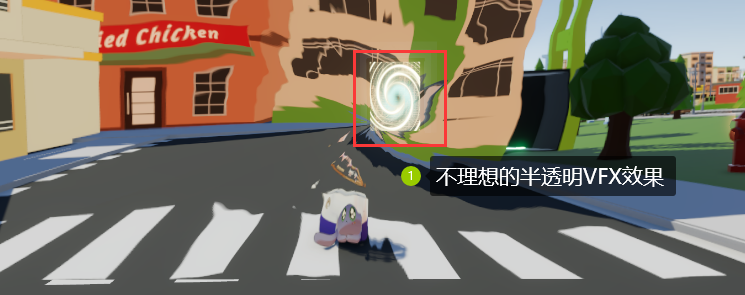

# 一些Unity实现的效果技术总结（1）

# 一、Shock wave distortion

https://www.youtube.com/watch?v=ZnpnTn30Q-w

## 1.热浪效果

首先，先来看一下热浪的效果是如何实现的：

> 在项目当中这个Shader名字叫做HeatDistortionEffect，基于Shader Graph制作，主要原理就是对Screen Position节点进行偏移（利用噪声进行偏移），核心的Shader Graph连线如下：
>
> 

**这个Shader本身很简单，接下来的Shock wave Distortion就是基于基础的热浪效果的原理制作的。**

## 2.Shock wave Distortion

**对应项目当中的ShockWaveSimple这个Shader。**

【经验1】生成一种放射状的noise效果，如下图：

> 这种放射状的图案是由于UV坐标的normalize操作导致的。UV坐标通常在0到1之间，normalize操作将其映射到一个单位长度的向量，从而形成一个以(0.5, 0.5)为中心的圆形区域。对这种区域进行简单噪声采样，例如使用Simplex Noise，会导致噪声从中心向外扩散，形成放射状的图案。这种效果常用于创建自然纹理、扩散效果或类似于辐射的视觉效果。

与上面热浪效果的区别在于，这个Shader采用这种放射状的感觉对屏幕的UV坐标进行偏移，呈现在视觉效果上如下：

------

## 3.Fix problem：渲染顺序问题

直接把Shader用进项目，放在plane上（如果放在plane上可以设置双面渲染）或者放在Quad，会发现效果看上去还可以，但是在这个plane之后的透明物体就不渲染了。用Frame Debugger查看一下原因，**发现是这种shock wave distortion的渲染事件发生于半透明VFX效果之后，而这会导致本来渲染的半透明VFX效果消失**。例如下图这个错误的现象：

> **尝试对此进行解释：**
>
> - （1）不确定是否是下图的原因：
>   - ①是应该渲染shock wave distortion效果的pass；
>   - ②的意思是这个效果需要拿到`_CameraOpaqueTexture`（感觉应该来自于https://docs.unity3d.com/Packages/com.unity.shadergraph@6.9/manual/Scene-Color-Node.html shader当中有scene color节点），但是`_CameraOpaqueTexture`并不包含半透明的VFX渲染的结果，因此就把半透明的VFX的效果给覆盖掉了。
>
> 

一般来说遇到这种问题，解决方案就是把shock wave distortion的渲染次序提到半透明VFX效果之前，具体如下：

- （1）新建一个Layer：TransEffectBeforeVFX
- （2）进入到Settings文件夹->URP-HighFidelity-Renderer->Add Renderer Feature->Renderer Object，然后这样设置：

- （3）然后再修改URP-HighFidelity-Renderer的Opaque Layer Mask和Transparent Layer Mask，两个都取消勾选TransEffectBeforeVFX。

完成上面的步骤之后，Shock Wave Distortion就不会覆盖掉半透明的VFX，但是由于屏幕会发生扭曲，而透明的VFX不会发生扭曲，因此就会出现穿帮的现象，如下图所示：

> **所以这里其实需要一个平衡关系，因为Shock Wave Distortion效果也只会持续1s左右，有可能玩家看不出来，这就看权衡是否要更改渲染顺序了。**

------

