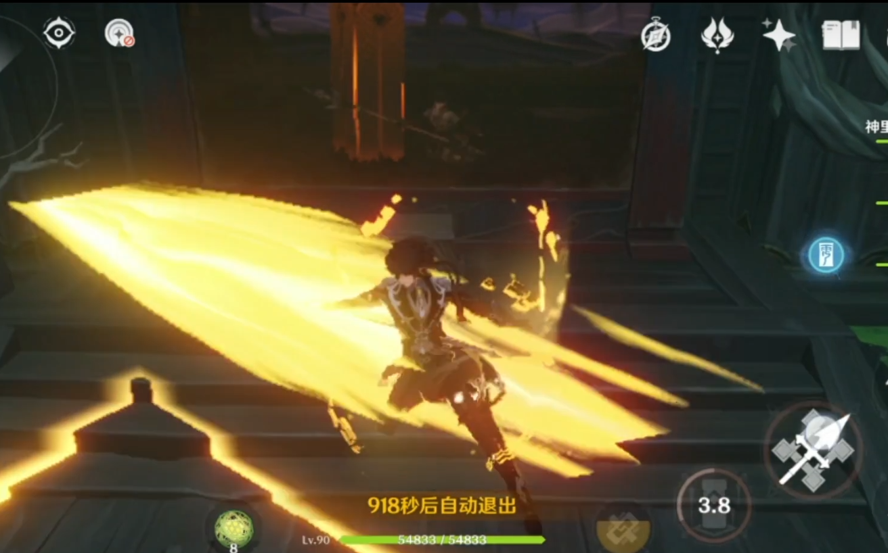

#### 1、需要在透明物体之前渲染

SSPR踩的坑

SSPR需要在透明物体之前渲染

否则UI和粒子特效，比如开枪的子弹等等，都会在SSPR之前被绘制，然后SSPR就会覆盖他们，看不见UI和特效

因此在大表哥，原神等游戏的镜面效果中，我们都是看不见特效的。




#### 2、urp不透明物体 shader early-z 注意 提前写入深度 法线等

修正后：


没修正前这个瑞早六和会被体积雾覆盖很奇怪的效果


需要在shader中手动加入类似以下：（可参考OutlineSurfaceShader.shader）

```GLSL
Pass
        {
            Name "DepthOnly"
            Tags
            {
                "LightMode" = "DepthOnly"
            }

            // -------------------------------------
            // Render State Commands
            ZWrite On
            ColorMask R
            Cull Back

            HLSLPROGRAM
            #pragma target 2.0

            // -------------------------------------
            // Shader Stages
            #pragma vertex DepthOnlyVertex
            #pragma fragment DepthOnlyFragment

            // -------------------------------------
            // Material Keywords
            #pragma shader_feature_local_fragment _ALPHATEST_ON
            #pragma shader_feature_local_fragment _SMOOTHNESS_TEXTURE_ALBEDO_CHANNEL_A

            // -------------------------------------
            // Unity defined keywords
            #pragma multi_compile_fragment _ LOD_FADE_CROSSFADE

            //--------------------------------------
            // GPU Instancing
            #pragma multi_compile_instancing
            #include_with_pragmas "Packages/com.unity.render-pipelines.universal/ShaderLibrary/DOTS.hlsl"

            // -------------------------------------
            // Includes
            #include "Packages/com.unity.render-pipelines.universal/Shaders/LitInput.hlsl"
            #include "Packages/com.unity.render-pipelines.universal/Shaders/DepthOnlyPass.hlsl"
            ENDHLSL
        }

        // This pass is used when drawing to a _CameraNormalsTexture texture
        Pass
        {
            Name "DepthNormals"
            Tags
            {
                "LightMode" = "DepthNormals"
            }

            // -------------------------------------
            // Render State Commands
            ZWrite On
            Cull Back

            HLSLPROGRAM
            #pragma target 2.0

            // -------------------------------------
            // Shader Stages
            #pragma vertex DepthNormalsVertex
            #pragma fragment DepthNormalsFragment

            // -------------------------------------
            // Material Keywords
            #pragma shader_feature_local _NORMALMAP
            #pragma shader_feature_local _PARALLAXMAP
            #pragma shader_feature_local _ _DETAIL_MULX2 _DETAIL_SCALED
            #pragma shader_feature_local_fragment _ALPHATEST_ON
            #pragma shader_feature_local_fragment _SMOOTHNESS_TEXTURE_ALBEDO_CHANNEL_A

            // -------------------------------------
            // Unity defined keywords
            #pragma multi_compile_fragment _ LOD_FADE_CROSSFADE

            // -------------------------------------
            // Universal Pipeline keywords
            #include_with_pragmas "Packages/com.unity.render-pipelines.universal/ShaderLibrary/RenderingLayers.hlsl"

            //--------------------------------------
            // GPU Instancing
            #pragma multi_compile_instancing
            #include_with_pragmas "Packages/com.unity.render-pipelines.universal/ShaderLibrary/DOTS.hlsl"

            // -------------------------------------
            // Includes
            #include "Packages/com.unity.render-pipelines.universal/Shaders/LitInput.hlsl"
            #include "Packages/com.unity.render-pipelines.universal/Shaders/LitDepthNormalsPass.hlsl"
            ENDHLSL
        }
```

